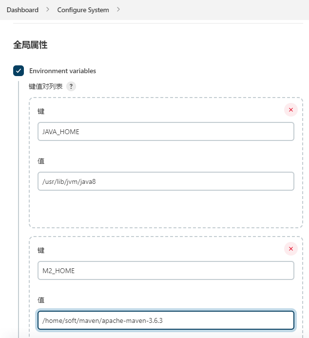
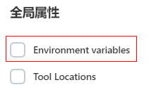

### mvn: 未找到命令

如果jenkins全局工具中 `Manage Jenkins` -> `Global Tool Configuration`

配置好了maven，重启jenkins再试试看 | 检查Linux系统中的mvn环境变量是否配置

---

如果还不行的话，看看 `Manage Jenkins` -> `Configure System` -> `全局属性` 中的环境变量是否配置正确

或 不配置，使用Linux上的环境配置即可

