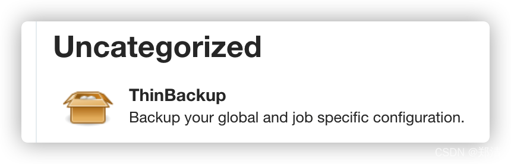
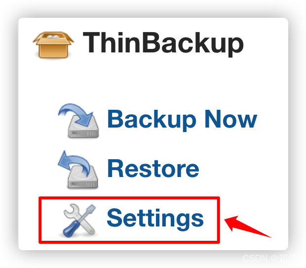
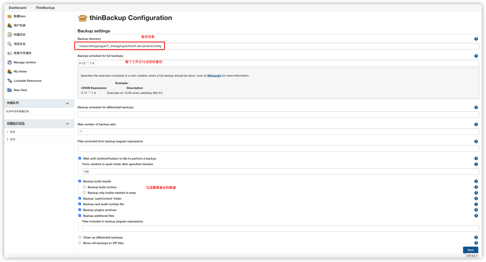
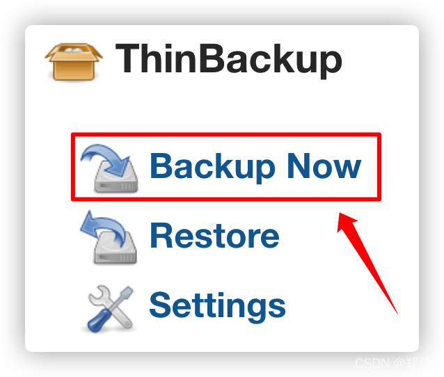
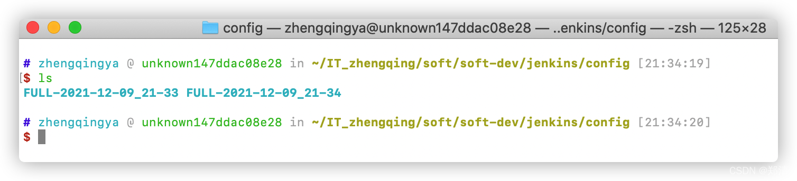
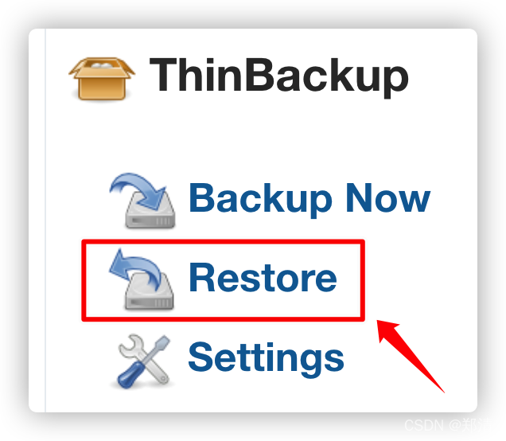
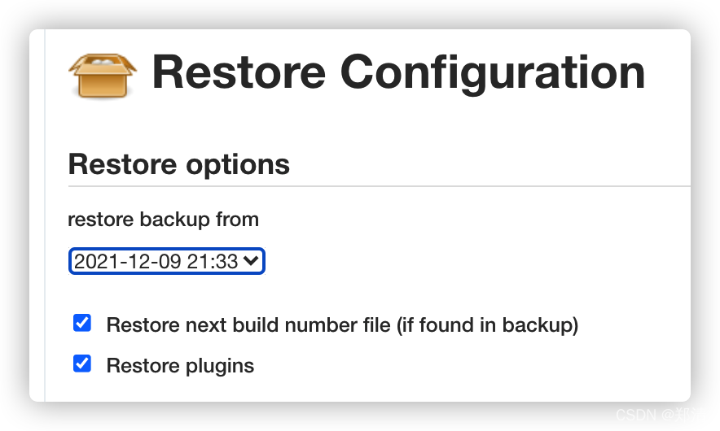

@[TOC](文章目录)

### 一、前言

本文将基于`Jenkins 2.289.2`备份配置信息及恢复配置

### 二、下载插件`ThinBackup`

`Manage Jenkins` -> `Manage Plugins`


> 安装之后重启jenkins

### 三、配置备份目录

`Manage Jenkins` -> `ThinBackup`  设置备份目录信息




### 四、备份配置



点击`Backup Now`之后，到设置的备份目录下可查看备份信息


### 五、恢复配置






> tips: 恢复配置之后需重启jenkins [http://127.0.0.1:10000/jenkins/restart](http://127.0.0.1:10000/jenkins/restart)

---

恢复配置也可以将`FULL-2023-xx`中的配置拷贝到`/root/.jenkins`中，再启动jenkins，这个时候相关插件需要重新安装...


等重启jenkins完成之后，可以再通过`ThinBackup`还原之前的配置。
这种方式适用于迁移jenkins到新服务器时使用...

---

### 六、手动备份配置到云空间存储

```shell
# 进入jenkins存储的配置目录
cd /home/soft/jenkins/config
# 打包&压缩
tar -cvf jenkins_config_20221229.tar  ./FULL-2022-12-29_01-00
# 下次还原的时候解压
tar -xvf jenkins_config_20221229.tar
```

---

> 今日分享语句：
> 学会宽容，要有一颗宽容的爱心！
