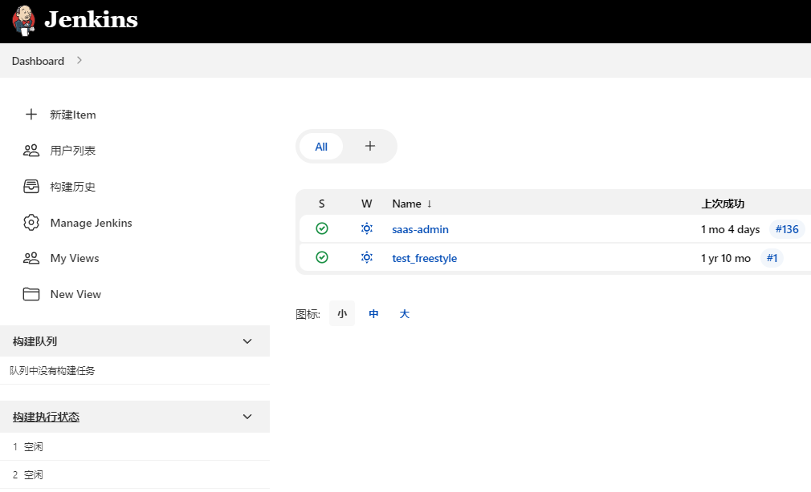
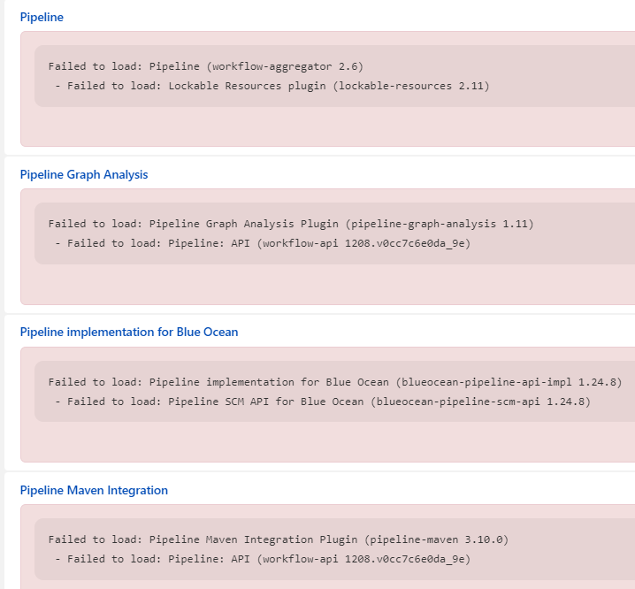

# 问题 - jenkins重启导致/root/.jenkins/jobs下的任务部分丢失



重启jenkins之后，不知道为什么突然任务无法查看了...

# 解决

网上给的解决方案有如下：

1. 用户权限问题，即jenkins启动时的用户不同，eg：root
2. 启动jenkins.war时指定的存储目录有变更 `-DJENKINS_HOME=/var/lib/jenkins`；
   这时需要去 `/etc/profile` 中配置 `export JENKINS_HOME=/var/lib/jenkins` & 让配置生效 `source /etc/profile`；
   最后重启jenkins
3. 插件升级问题，还原
4. `/root/.jenkins/war/WEB-INF/web.xml`中配置

```
<env-entry>
    <env-entry-name>HUDSON_HOME</env-entry-name>
    <env-entry-type>java.lang.String</env-entry-type>
    <env-entry-value>/root/.jenkins</env-entry-value>
</env-entry>
```

最后都无法解决我的问题...

---

下面来到我的解决之路吧~

通过新建任务，发现流水线，maven等很多插件没了...

那么解决插件的问题，是否可以恢复jobs显示问题呢？？？

接着查看插件发现如下


重装jenkins & 手动重装插件 & 导入之前的备份配置，不要直接导入备份中的插件，估计就是插件冲突问题
