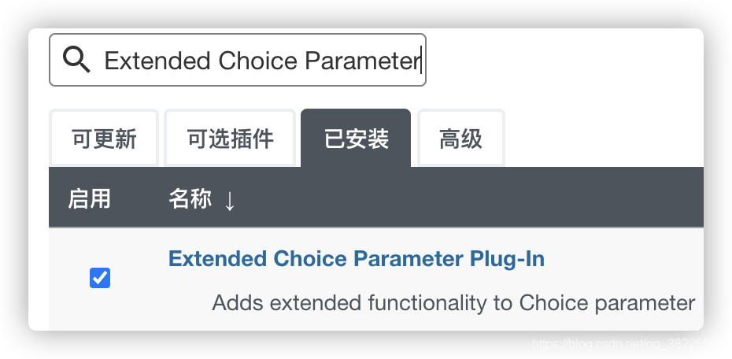
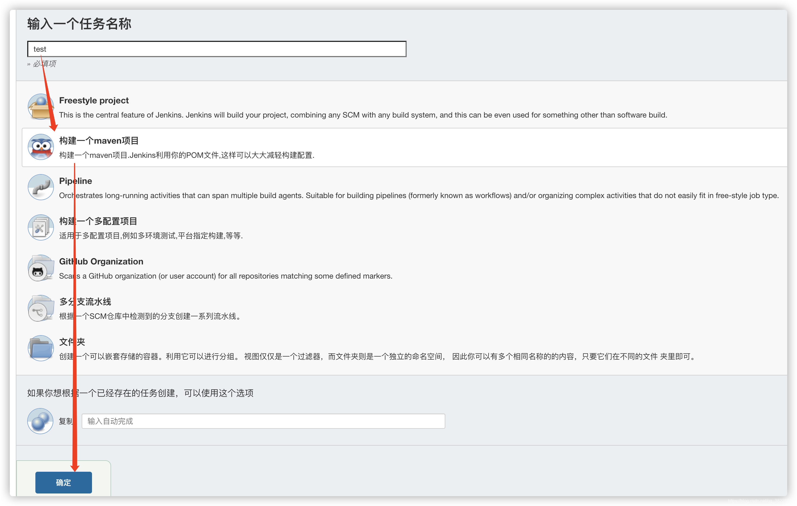
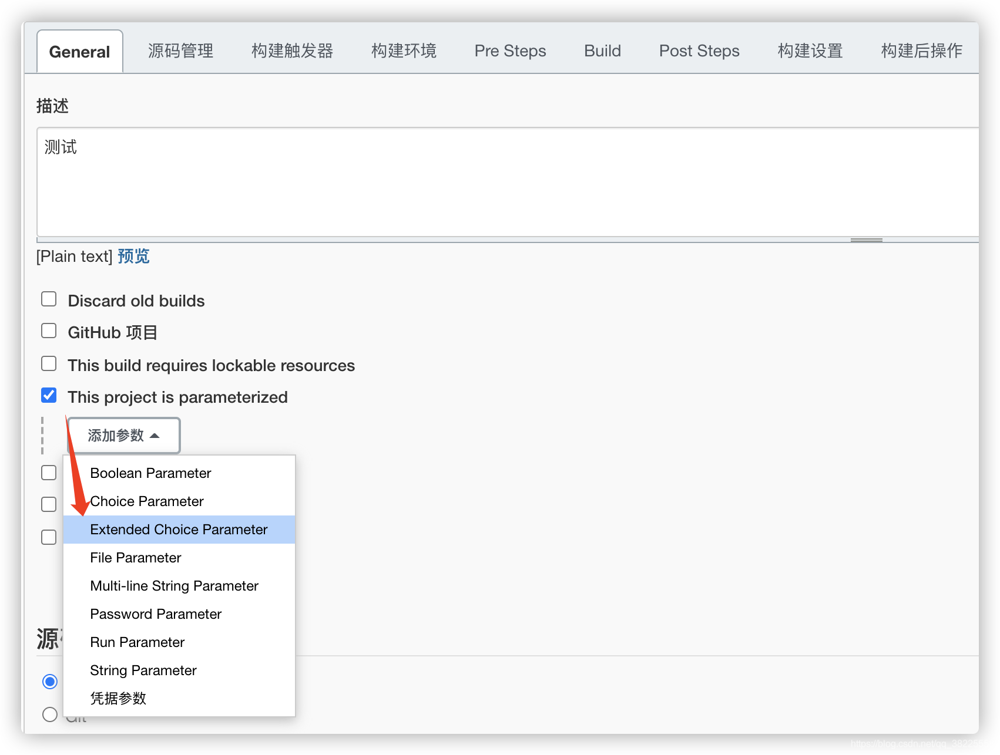
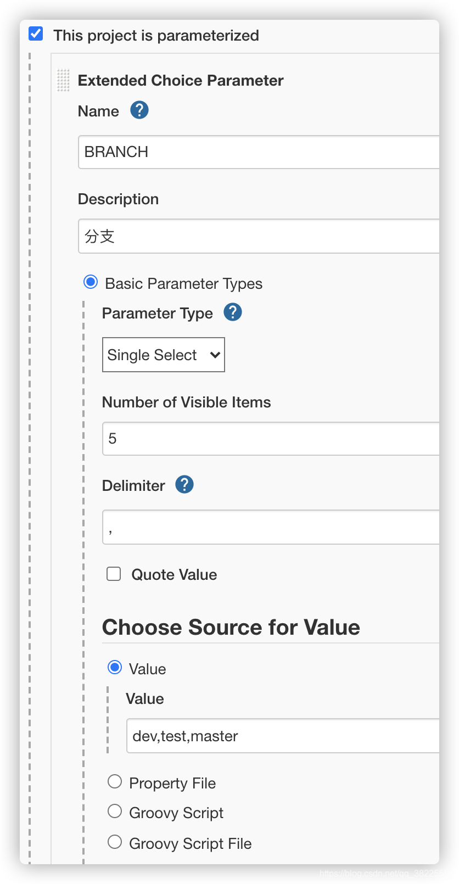
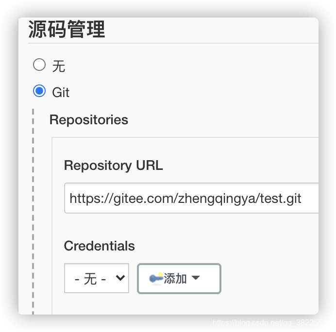
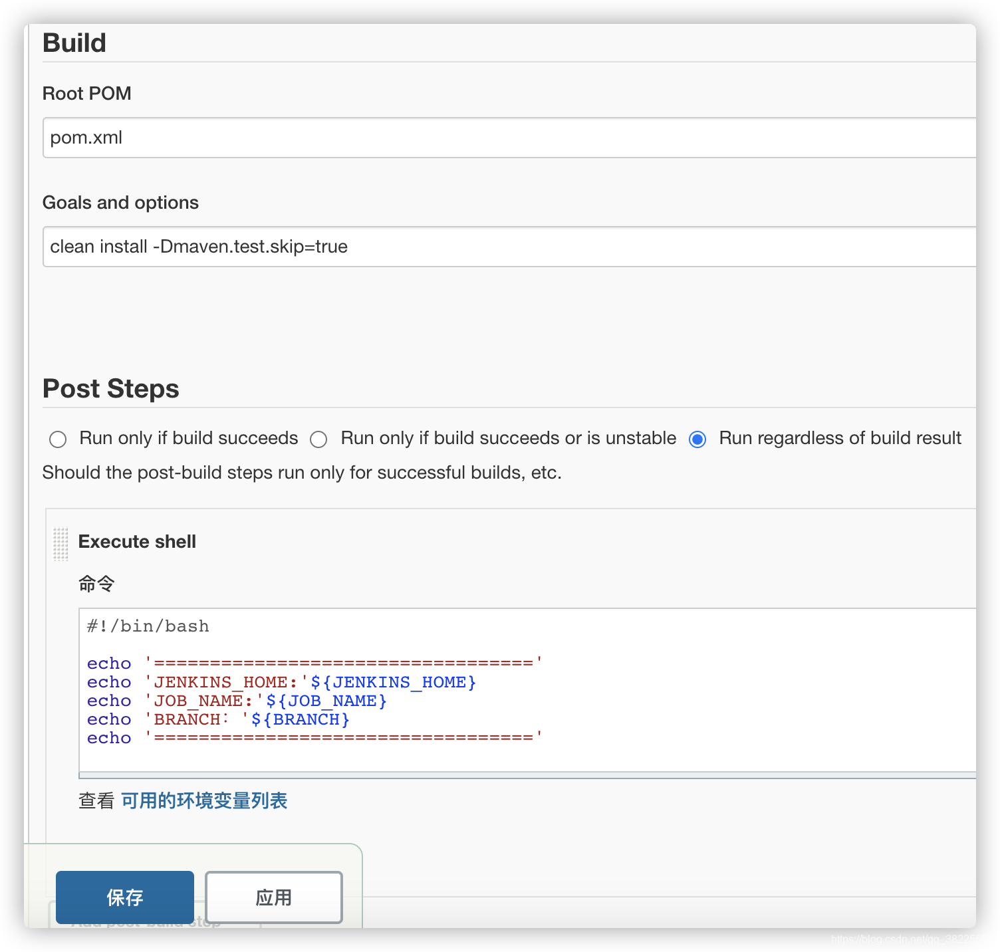
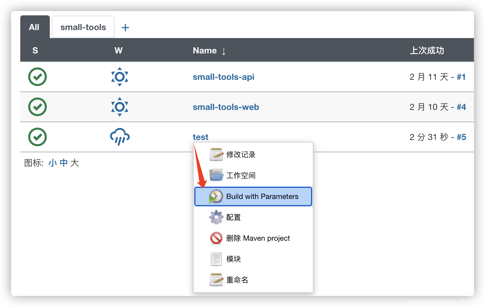
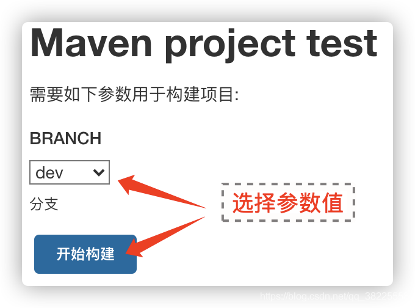
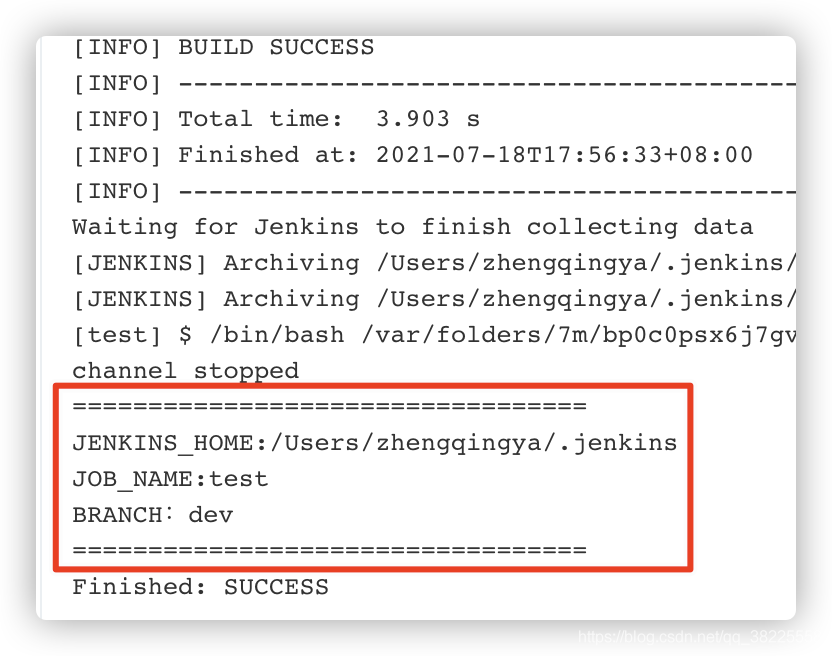

### 一、前言

本文主要实现jenkins的参数化构建配置

> 温馨小提示：本文只是简单示例如何配置和获取参数值，其它可根据自己的需求进行操作...

### 二、安装插件`Extended Choice Parameter`

### 三、参数化构建配置

新建test任务

勾选`This project is parameterized` -> 添加`Extended Choice Parameter`

添加一个关于项目分支的参数，单选，以`,`分隔参数值`dev,test,master`

下面简单拉取一个测试项目

在`Execute shell`中可以通过`${BRANCH}`获取参数值

保存后构建`Build with Parameters`

可查看输出日志获取的参数内容

--- 

> 今日分享语句：
> 能坚持别人不能坚持的,才能拥有别人不能拥有的。
