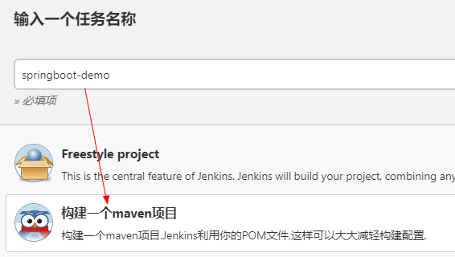
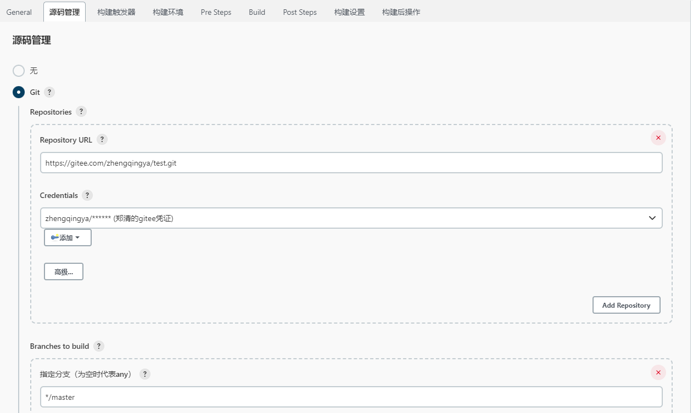
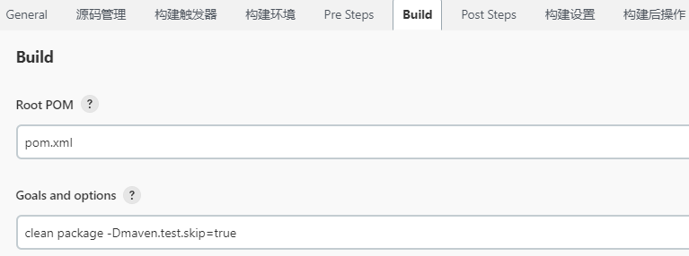
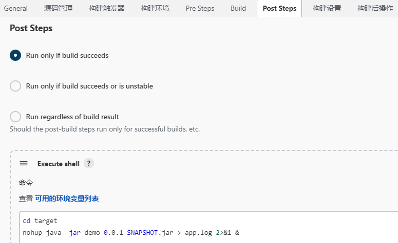
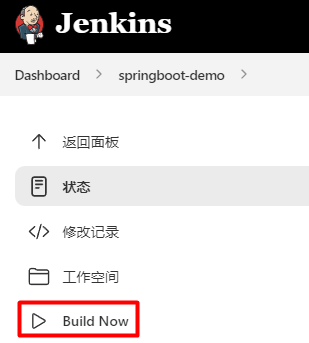
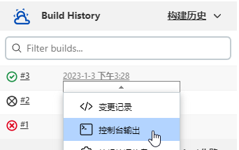
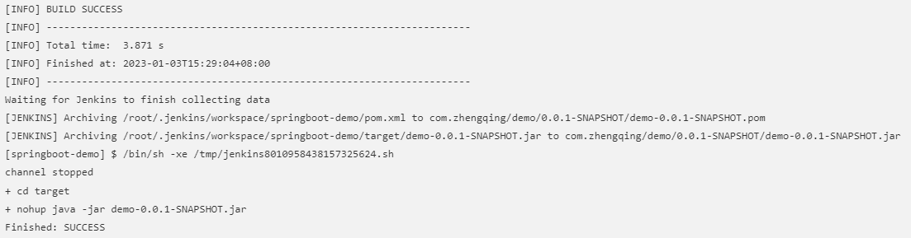

# 01-部署一个简单的SpringBoot项目

### 新建任务



#### 源码管理 -> Git -> 填写项目地址与拉取认证信息



#### Build

```shell
clean package -Dmaven.test.skip=true
```



#### Post Steps

构建成功后执行shell命令运行项目



```shell
cd target
nohup java -jar demo-0.0.1-SNAPSHOT.jar > app.log 2>&1 &
```

保存配置

### Build Now



#### 查看日志





### 问题

如果重复构建部署会出现如下端口占用问题

```
Caused by: java.net.BindException: 地址已在使用
```

因此需要我们在部署之前停掉旧服务

将`Post Steps`中shell运行命令修改为如下：

```shell
# 解决jenkins默认自动终止shell产生的进程问题
BUILD_ID=dontKillMe
cd target
# 先停掉旧服务
ps -ef | grep demo-0.0.1-SNAPSHOT.jar | grep -v grep | awk '{print "kill -15 "$2}' | sh
# 再运行新服务
nohup java -jar demo-0.0.1-SNAPSHOT.jar > app.log 2>&1 &
```