### 一、前言

本文将通过`Publish Over SSH`插件实现一个简单的与远程服务器交互的demo，主要是先连接远程服务器，然后在远程服务器上执行操作命令和传输文件，其它操作可自行研究。

### 二、安装插件`Publish Over SSH`

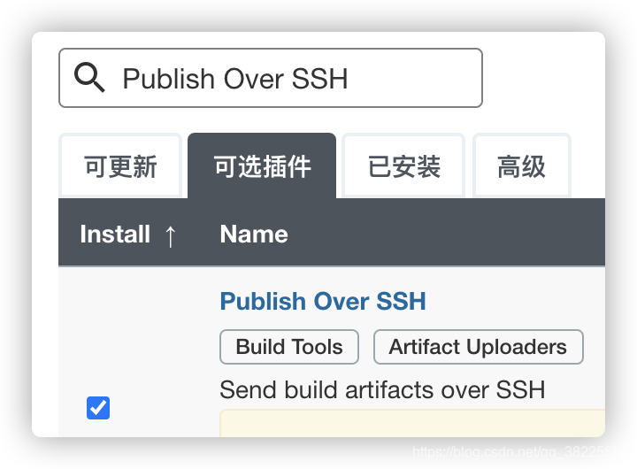

### 三、远程服务器部署

`Manage Jenkins` -> `Configure System`
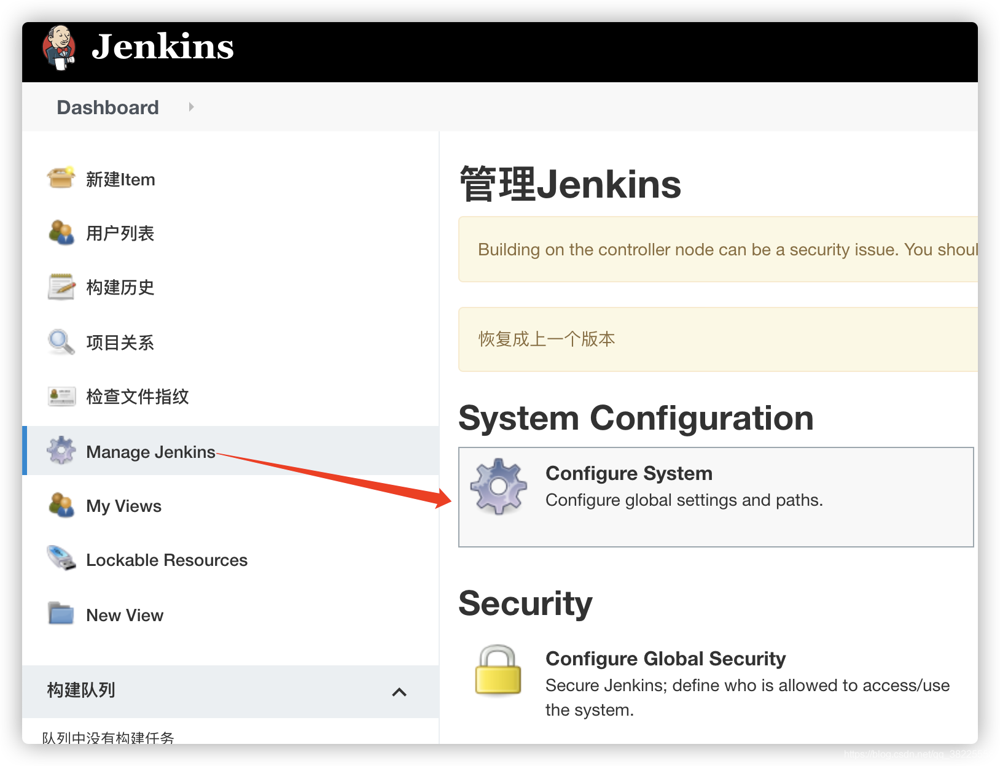
`Publish over SSH`配置
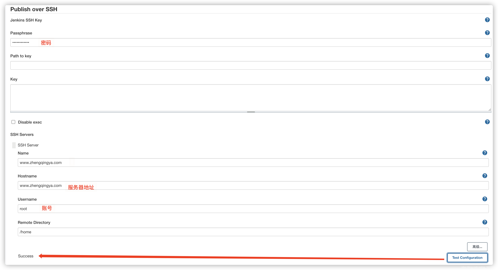
新建任务配置一下

> 温馨小提示：小编存在之前的一个test任务，直接修改配置。没有的话，自己新建一个即可，很简单。

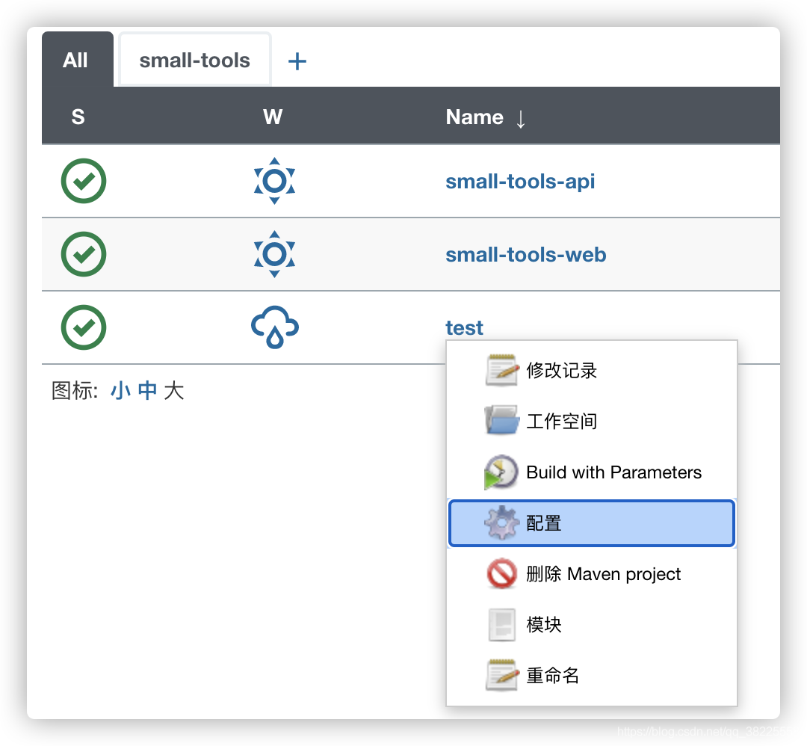
`Add post-build step` -> `Send files or execute commands over SSH`
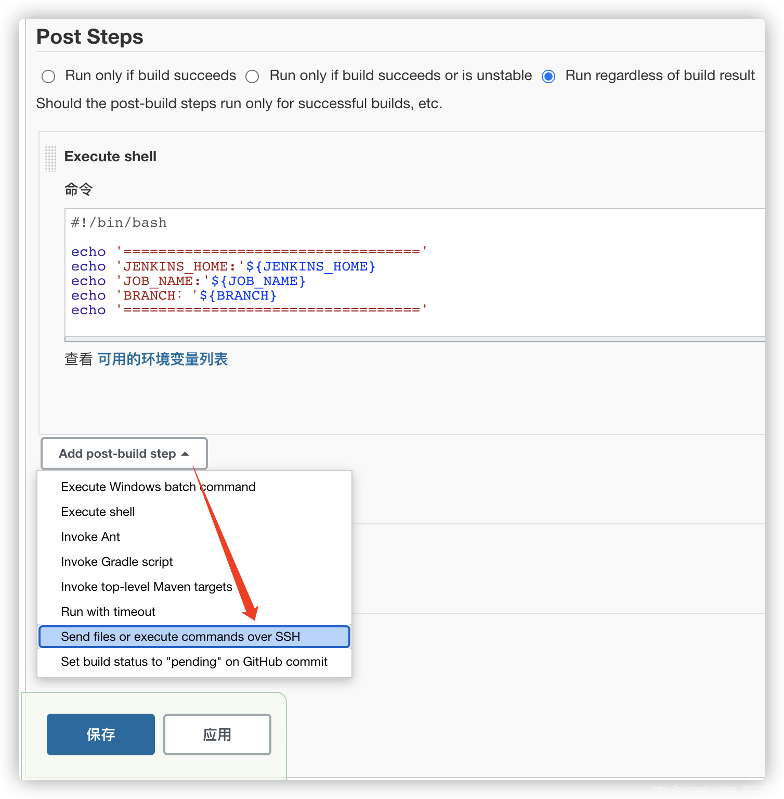

###### 配置执行命令

> 注：小编这里直接执行简单的命令。进入home目录，创建一个`test.txt`文件，再输入一个`hello world`

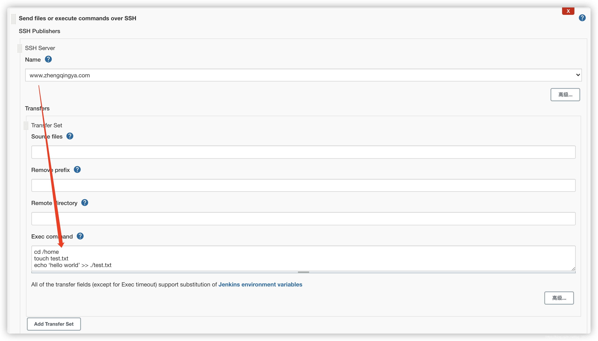
配置好，保存完成后，重新Build一下，查看输出日志如下

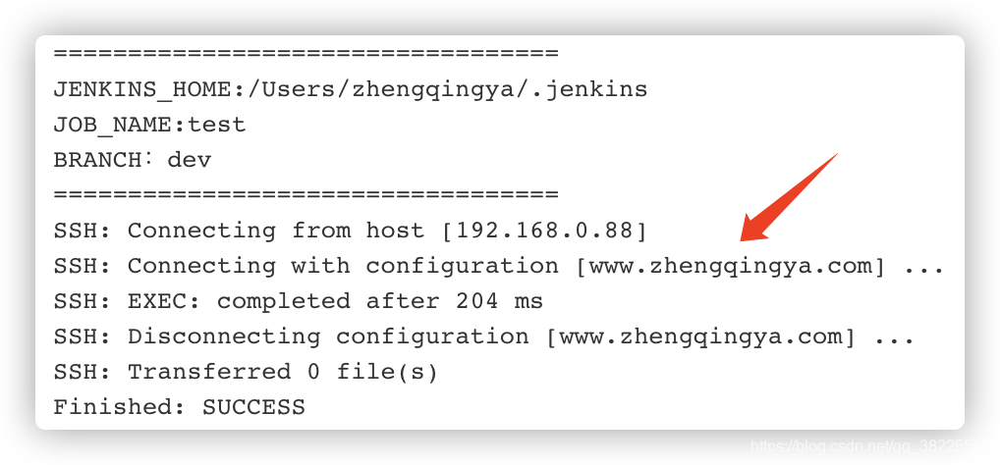
再查看远程服务器该文件内容
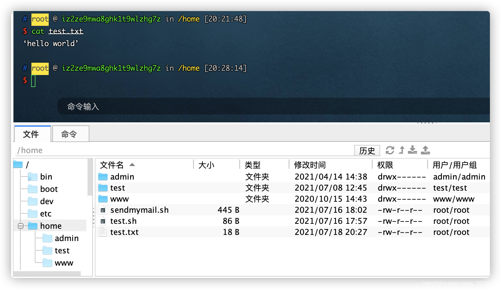

###### 配置传输文件

1. `Souce files`：源文件，以jenkins下该任务路径作为根目录，即`/Users/zhengqingya/.jenkins/workspace/test`
2. `Remove prefix`: 要移除的前缀，如果不移除，最后传输到远程服务就会有target目录存在
   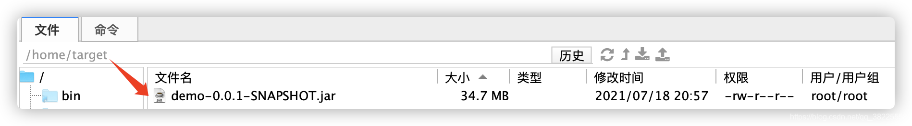

4. `Remote directory`：远程目录，该前缀目录为我们之前在`Manage Jenkins` -> `Configure System` -> `Publish over SSH`配置中`Remote Directory`
   对应的`/home`。示例，下面配置`/`，那最后远程目录即`/home/`

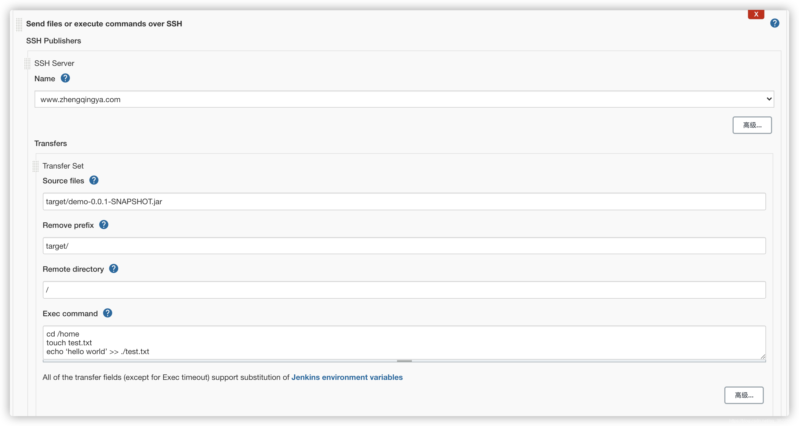
保存并Build查看远程服务器便会发现我们传输的文件了
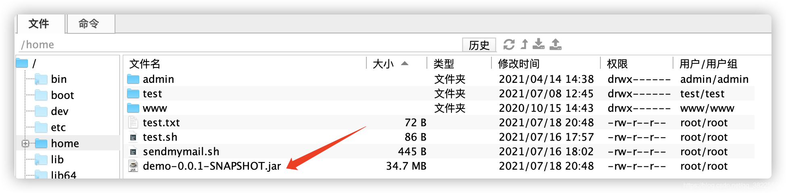

---

> 今日分享语句：
> 只有创造，才是真正的享受；
> 只有拼搏，才是充实的生活。
