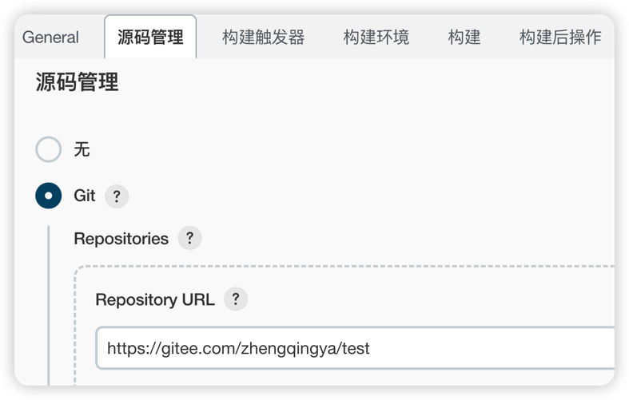

# 部署前端Vue - Dockerfile方式

### 一、环境准备

项目中新增Docker文件夹


#### 1、Dockerfile

```
# 拉取nginx基础镜像
FROM nginx:1.21.1

# 维护者信息
MAINTAINER zhengqingya

# 将dist文件中的内容复制到 `/usr/share/nginx/html/` 这个目录下面
COPY dist/  /usr/share/nginx/html/
# 用本地配置文件来替换nginx镜像里的默认配置
COPY nginx/nginx.conf /etc/nginx/nginx.conf

# 对外暴漏的端口号
# [注：EXPOSE指令只是声明容器运行时提供的服务端口，给读者看有哪些端口，在运行时只会开启程序自身的端口！！]
EXPOSE 80

# 启动nginx容器
CMD ["nginx", "-g", "daemon off;"]
```

#### 2、.dockerignore

```
node_modules
```

#### 3、nginx.conf

```
user  nginx;
worker_processes  1;

error_log  /var/log/nginx/error.log warn;
pid        /var/run/nginx.pid;

events {
    worker_connections  1024;
}

http {
    include       /etc/nginx/mime.types;
    default_type  application/octet-stream;

    log_format  main  '$remote_addr - $remote_user [$time_local] "$request" '
                      '$status $body_bytes_sent "$http_referer" '
                      '"$http_user_agent" "$http_x_forwarded_for"';

    access_log  /var/log/nginx/access.log  main;

    sendfile        on;
    #tcp_nopush     on;

    keepalive_timeout  65;

    #gzip  on;

    # include /etc/nginx/conf.d/*.conf;

    server {
        listen       80;
        server_name  localhost; # 服务器地址或绑定域名

        #charset koi8-r;
        #access_log  /var/log/nginx/host.access.log  main;

        # =========================================================
        # ================== ↓↓↓↓↓↓ start ↓↓↓↓↓↓ ==================
        # =========================================================

        location / {
            root   /usr/share/nginx/html;
            index  index.html index.htm;
            try_files $uri $uri/ /index.html;
        }

        # =========================================================
        # ================== ↑↑↑↑↑↑ end ↑↑↑↑↑↑ ==================
        # =========================================================

        #error_page  404              /404.html;

        # redirect server error pages to the static page /50x.html
        #
        error_page   500 502 503 504  /50x.html;
        location = /50x.html {
            root   /usr/share/nginx/html;
        }

    }
}
```

### 二、Jenkins部署

#### 1、新建任务


#### 2、填写项目Git代码地址



#### 3、构建shell脚本

```shell
cnpm i
cnpm run build:prod
cp -r dist/ Docker/
cd Docker
docker build -f Dockerfile -t ruoyi . --no-cache
docker ps -a | grep ruoyi | awk '{print $1}' | xargs -i docker stop {} | xargs -i docker rm {}
docker run -d -p 81:80 --restart=always --name ruoyi ruoyi
```

#### 4、`Build Now` 构建 & 访问

`ip:81`
