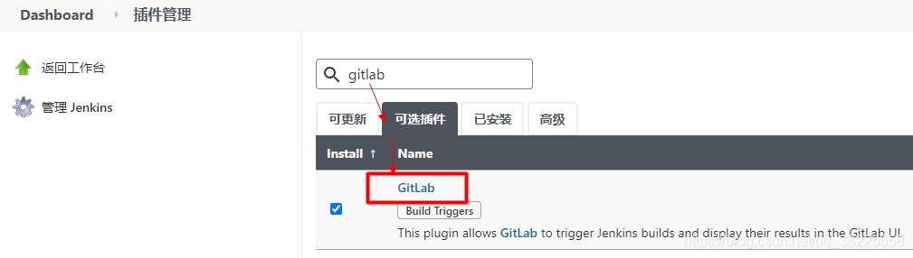
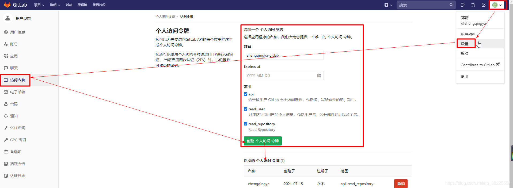
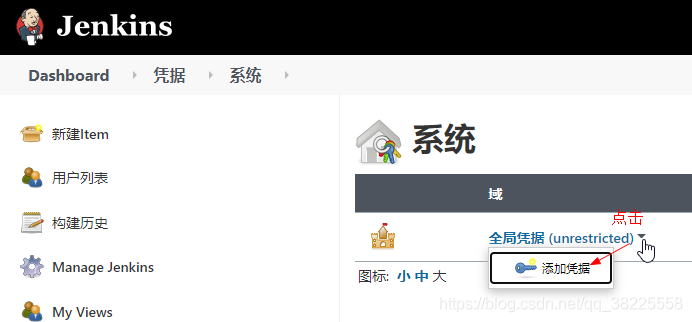
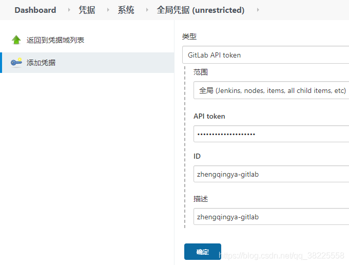
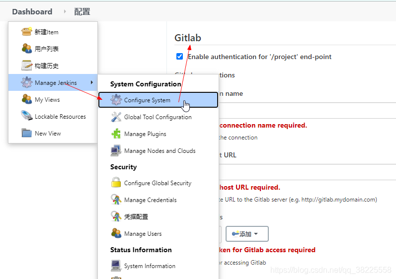
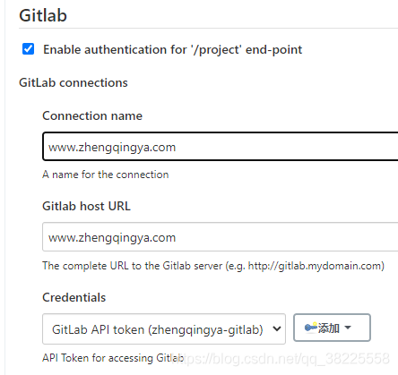
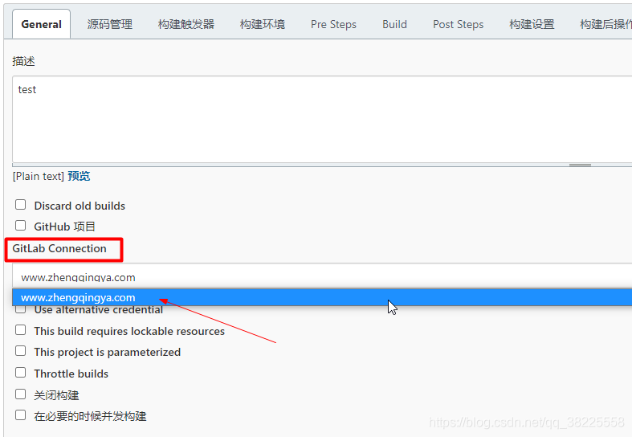

### 一、前言

本文将通过jenkins配置GitLab连接

### 二、安装插件`GitLab`

`Dashboard` -> `Manage Jenkins` -> `Manage Plugins` -> 搜索`GitLab`，安装重启jenkins

### 三、创建GitLab个人访问令牌

> 温馨小提示：创建后，请保存好，后面会用到！

### 四、添加全局凭据

`API token`：即上面我们创建的GitLab个人访问令牌

### 五、GitLab配置

### 六、测试

> 新建一个任务即可选择连接我们的GitLab

--- 

> 今日分享语句：
> 虽然我走得很慢,但我从不后退!

