@[TOC](文章目录)

### 一、前言

本文将通过jenkins配置简单的QQ邮件通知，适合快速体验效果`^_^`
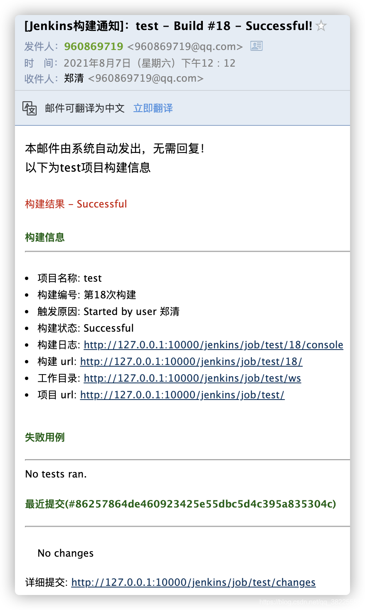

### 二、安装插件`Email Extension Plugin`

`Dashboard` -> `Manage Jenkins` -> `Manage Plugins` -> 搜索`Email Extension Plugin`，安装重启jenkins

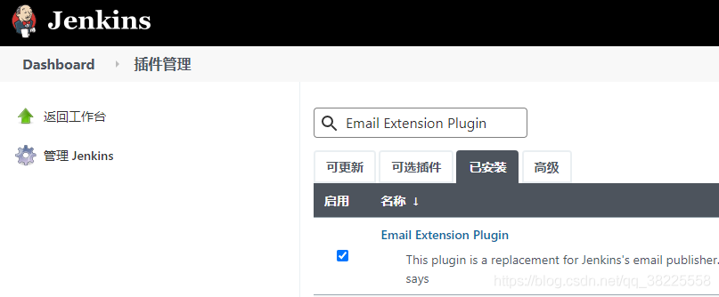

### 三、配置邮件通知

`Dashboard` -> `Manage Jenkins` -> `Configure System`

###### 1、设置系统管理员邮件地址

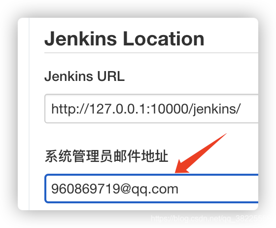

###### 2、配置邮件通知`Extended E-mail Notification`

> 温馨小提示：`
> 1. SMTP Password`填写在QQ邮箱`设置` -> `账号` 里面开启`POP3/SMTP服务`生成的`授权码` !
     > 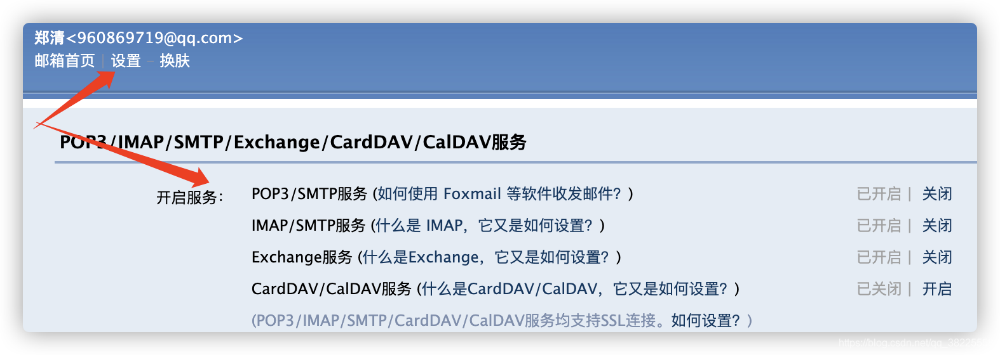
> 2. `Default Content Type`可选择发送内容为纯文本/富文本
> 3. `Default Recipients`默认收件人

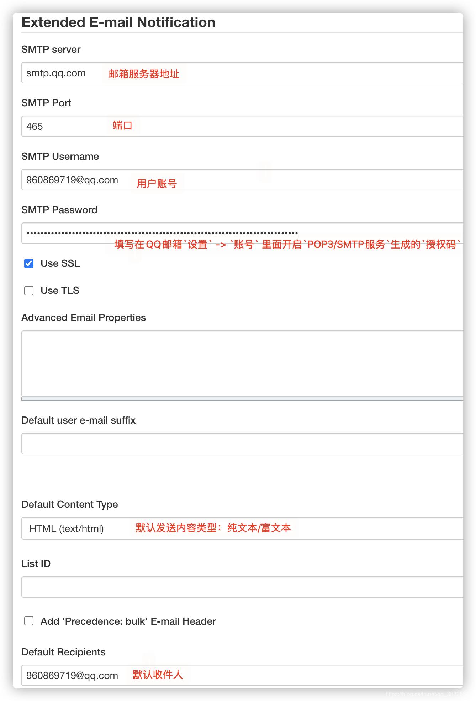
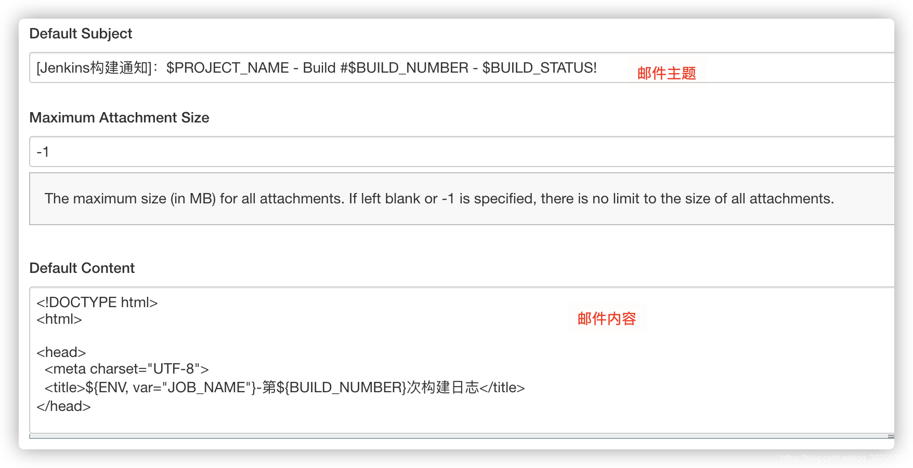
`Default Subject`邮件主题

```
[Jenkins构建通知]：$PROJECT_NAME - Build #$BUILD_NUMBER - $BUILD_STATUS!
```

`Default Content`邮件内容

> 温馨小提示：邮件内容是在网上看见，感觉还ok的模板，这里分享给大家`^_^`

```html
<!DOCTYPE html>
<html>

<head>
    <meta charset="UTF-8">
    <title>${ENV, var="JOB_NAME"}-第${BUILD_NUMBER}次构建日志</title>
</head>

<body leftmargin="8" marginwidth="0" topmargin="8" marginheight="4" offset="0">
<table width="95%" cellpadding="0" cellspacing="0"
       style="font-size: 11pt; font-family: Tahoma, Arial, Helvetica, sans-serif">
    <tr>
        本邮件由系统自动发出，无需回复！<br/>
        以下为${PROJECT_NAME }项目构建信息</br>
        <td>
            <font color="#CC0000">构建结果 - ${BUILD_STATUS}</font>
        </td>
    </tr>
    <tr>
        <td><br/>
            <b>
                <font color="#0B610B">构建信息</font>
            </b>
            <hr size="2" width="100%" align="center"/>
        </td>
    </tr>
    <tr>
        <td>
            <ul>
                <li>项目名称: ${PROJECT_NAME}</li>
                <li>构建编号: 第${BUILD_NUMBER}次构建</li>
                <li>触发原因: ${CAUSE}</li>
                <li>构建状态: ${BUILD_STATUS}</li>
                <li>构建日志: <a href="${BUILD_URL}console">${BUILD_URL}console</a></li>
                <li>构建 url: <a href="${BUILD_URL}">${BUILD_URL}</a></li>
                <li>工作目录: <a href="${PROJECT_URL}ws">${PROJECT_URL}ws</a></li>
                <li>项目 url: <a href="${PROJECT_URL}">${PROJECT_URL}</a></li>
            </ul>

            <h4>
                <font color="#0B610B">失败用例</font>
            </h4>
            <hr size="2" width="100%"/>
            $FAILED_TESTS<br/>

            <h4>
                <font color="#0B610B">最近提交(#$GIT_REVISION)</font>
            </h4>
            <hr size="2" width="100%"/>
            <ul>
                ${CHANGES_SINCE_LAST_SUCCESS, reverse=true, format="%c", changesFormat="
                <li>%d [%a] %m</li>
                "}
            </ul>
            详细提交: <a href="${PROJECT_URL}changes">${PROJECT_URL}changes</a><br/>

        </td>
    </tr>
</table>
</body>

</html>
```

### 四、项目配置

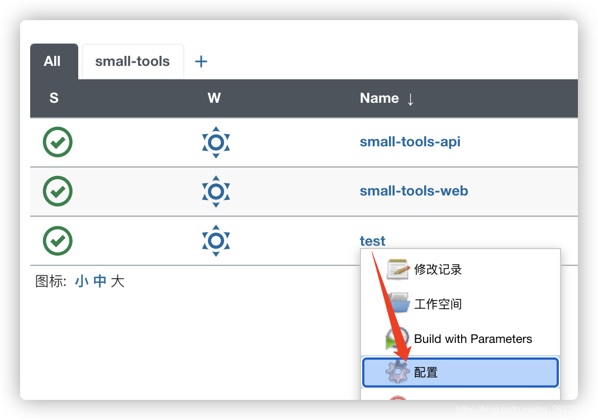

添加构建后操作
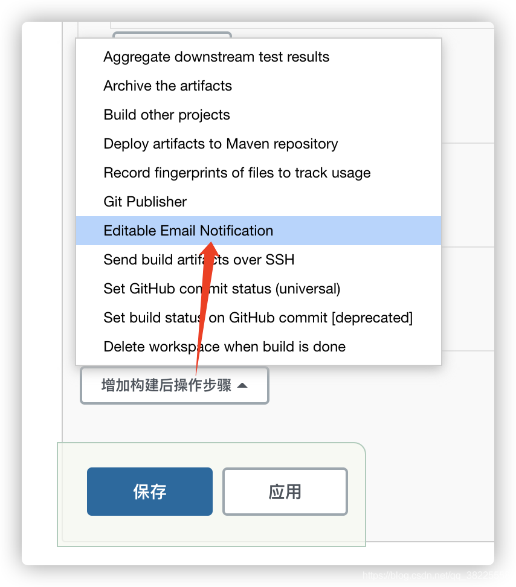
配置信息默认即可
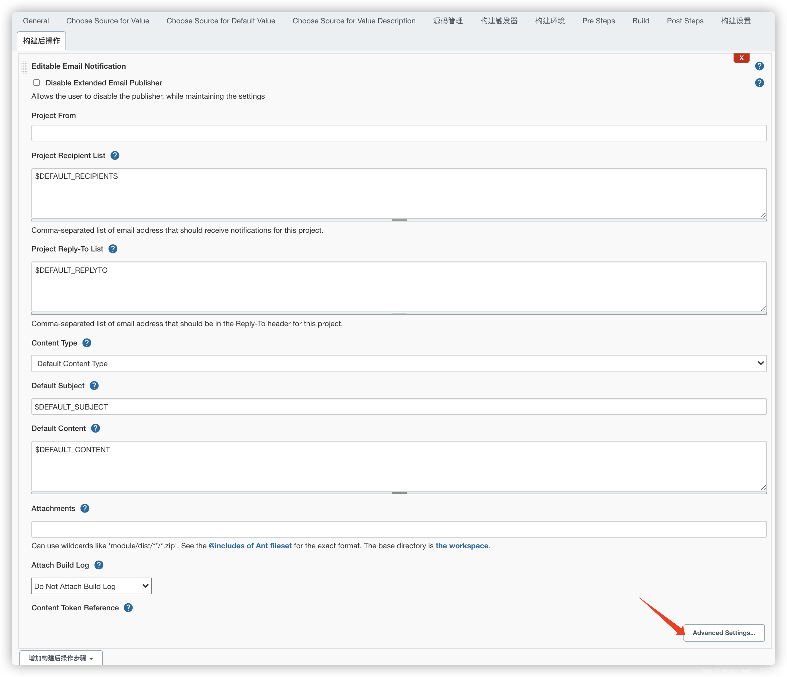
这里添加触发条件为总是
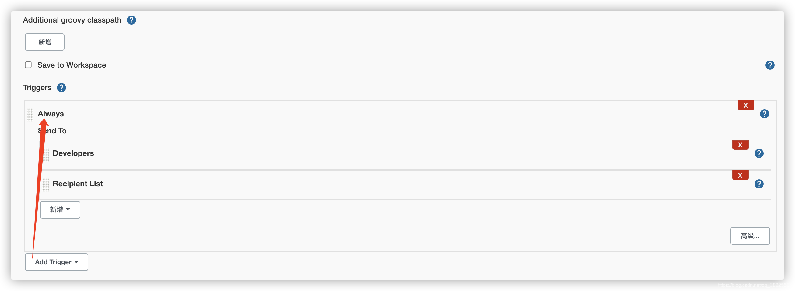
保存配置后，Build
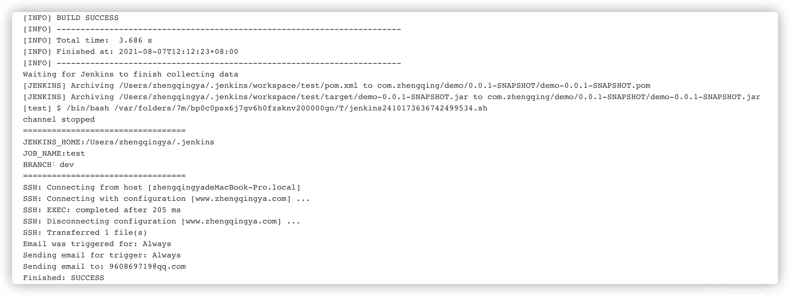
查看邮件
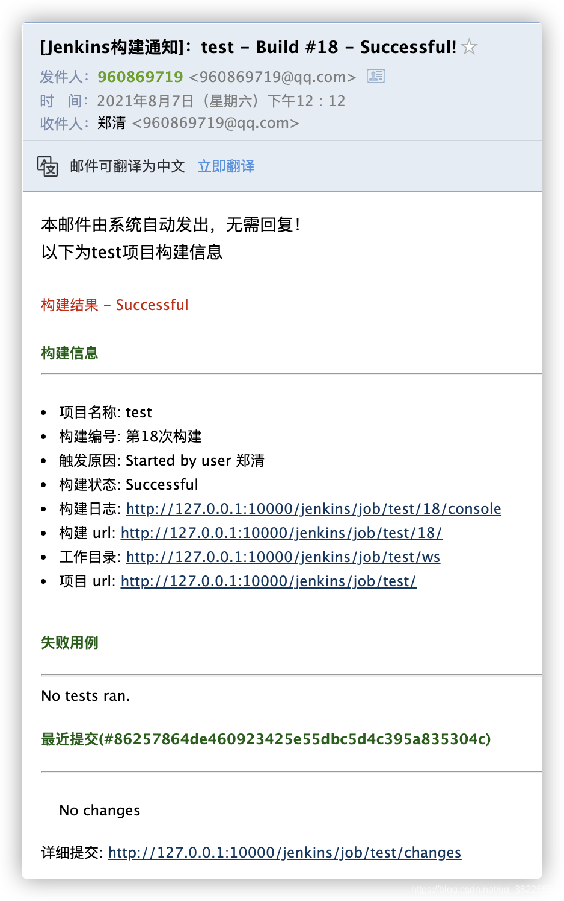

---

> 今日分享语句：
> 不要皱眉,即使在伤心的时刻,因为你从不知道有谁会醉心于你的笑容。
