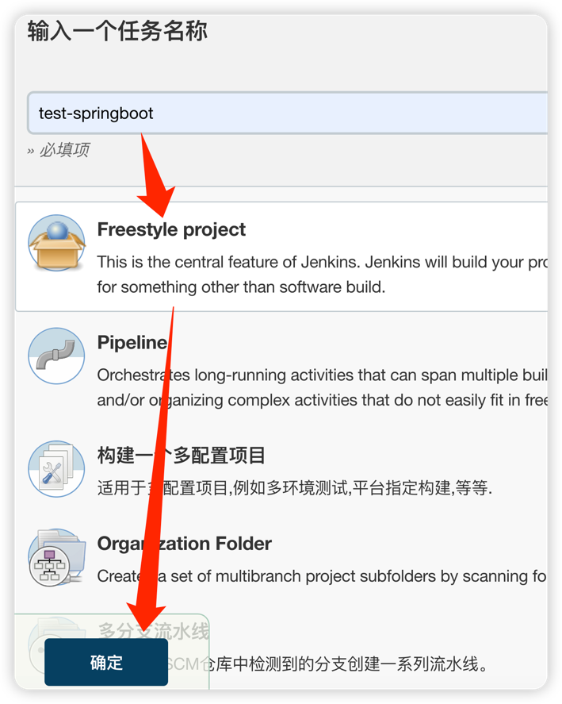
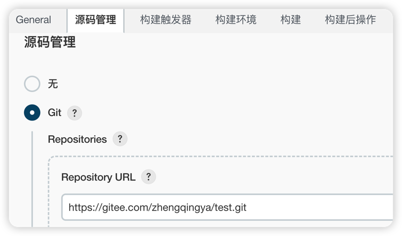
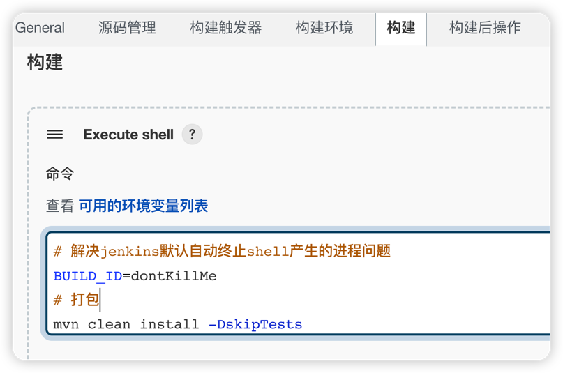
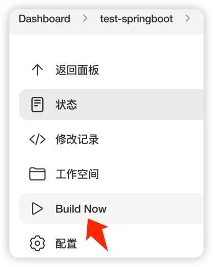
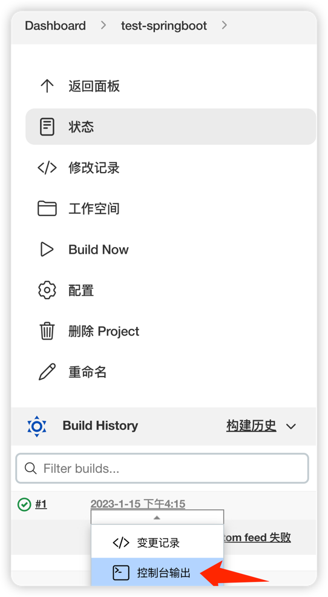
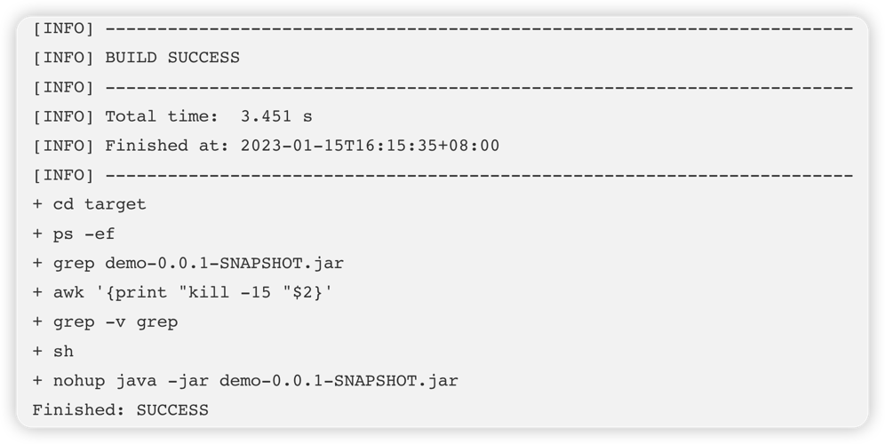
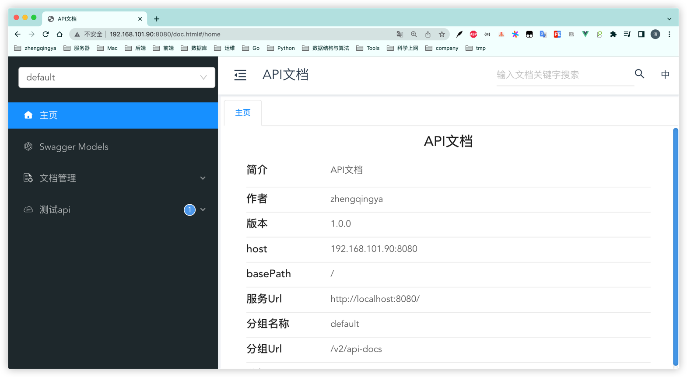

# 部署一个简单的SpringBoot项目

#### 1、新建任务



#### 2、源码管理 -> Git -> 填写项目地址与拉取认证信息



#### 3、构建



shell脚本

```shell
# 解决jenkins默认自动终止shell产生的进程问题
BUILD_ID=dontKillMe
# 打包
mvn clean install -DskipTests
cd target
# 先停掉旧服务
ps -ef | grep demo-0.0.1-SNAPSHOT.jar | grep -v grep | awk '{print "kill -15 "$2}' | sh
# 再运行新服务
nohup java -jar demo-0.0.1-SNAPSHOT.jar > app.log 2>&1 &
```

保存配置

#### 4、Build Now



#### 5、查看日志 & 访问项目




访问 `ip:8080/doc.html`

