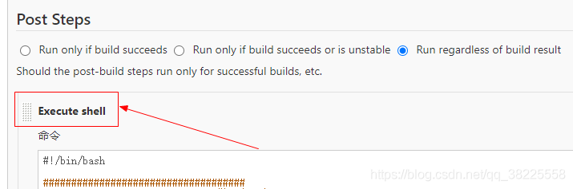
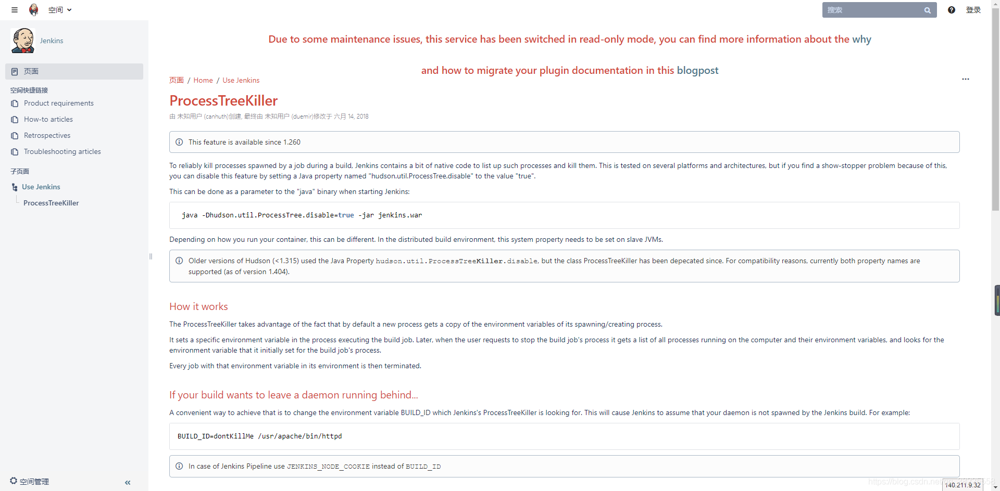
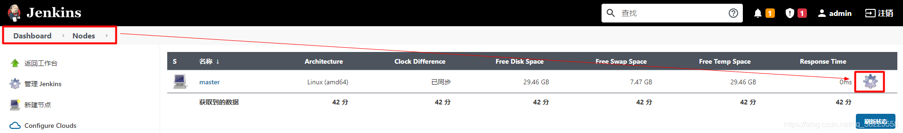
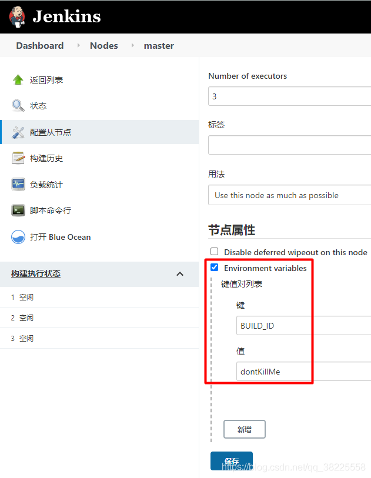
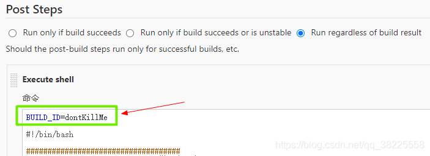

@[TOC](文章目录)

### 一、前言

本文基于`Jenkins 2.289.2`环境

### 二、问题

jenkins在`Execute shell`中执行如下命令启动jar失败

```shell
nohup java -jar app.jar >> /home/logs/app.log  2>&1 &
```



问题原因：shell脚本运行时会产生进程，而jenkins默认会自动终止产生进程！

>
可参考: [https://wiki.jenkins.io/display/JENKINS/ProcessTreeKiller](https://wiki.jenkins.io/display/JENKINS/ProcessTreeKiller)


### 三、解决

###### 法一：全局

`Manage Jenkins` -> `Manage Nodes and Clouds` -> `master` -> 设置



`节点属性`添加环境变量：`BUILD_ID` -> `dontKillMe`



###### 法二：局部

在shell脚本前加上`BUILD_ID=dontKillMe`参数



---

> 今日分享语句：
> 只有登上山顶,才能看到那边的风光。
