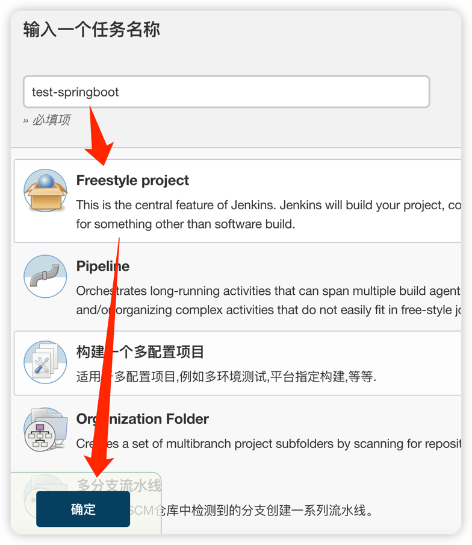
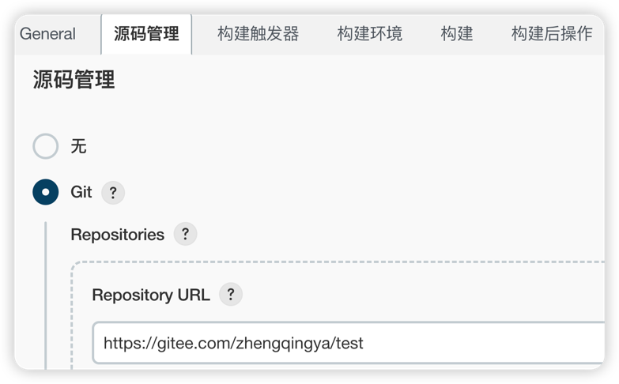

# 部署SpringBoot项目 - Dockerfile方式

### 一、环境准备

在项目目录在新建docker目录 & 在docker目录下新建`Dockerfile`文件

```
# jre基础环境
FROM openjdk:8-jre-alpine

# 维护者信息
MAINTAINER zhengqingya

# 设置环境变量-运行时也可传参进来耍哈
ENV JAVA_OPTS ""

# 添加jar包到容器中 -- tips: xx.jar 和 Dockerfile 在同一级
ADD *.jar /home/app.jar

# 对外暴漏的端口号
# [注：EXPOSE指令只是声明容器运行时提供的服务端口，给读者看有哪些端口，在运行时只会开启程序自身的端口！！]
EXPOSE 8080

# 以exec格式的CMD指令 -- 可实现优雅停止容器服务
# "sh", "-c" : 可通过exec模式执行shell  =》 获得环境变量
CMD ["sh", "-c", "echo \"****** 运行命令：java -jar ${JAVA_OPTS} /home/app.jar\"   &   java -jar ${JAVA_OPTS} /home/app.jar"]
```

### 二、Jenkins配置

#### 1、新建任务



#### 2、源码管理 -> Git -> 填写项目地址与拉取认证信息



#### 3、构建

shell脚本

```shell
mvn clean install -DskipTests
cp target/demo-0.0.1-SNAPSHOT.jar docker
cd docker
docker build -f Dockerfile -t "springboot:dev" . --no-cache
docker ps -a | grep springboot | awk '{print $1}' | xargs -i docker stop {} | xargs -i docker rm {}
docker run -d -p 666:8080 --name springboot springboot:dev
```

保存配置

#### 4、Build Now

访问 `ip:666/doc.html`