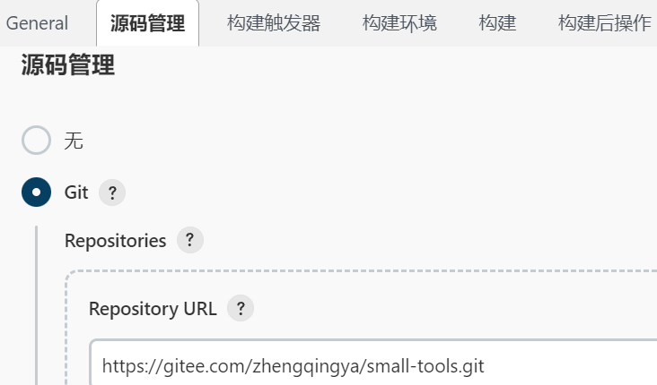
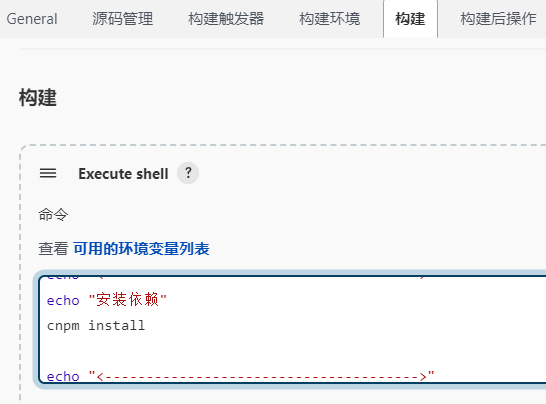
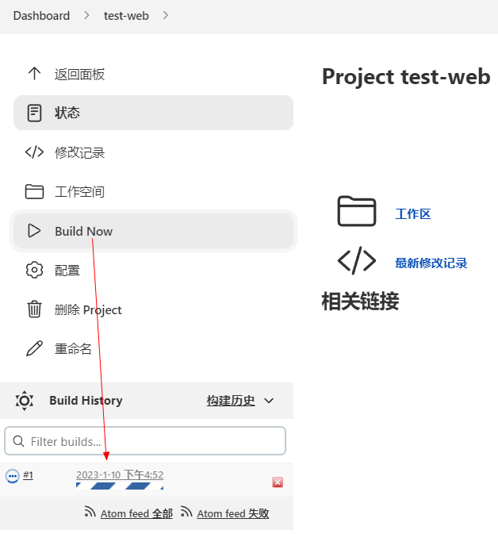

# 部署前端Vue

### 一、部署nginx

存放目录：`/home/soft/docker-compose/nginx-666`

nginx部署可参考 https://gitee.com/zhengqingya/docker-compose

### 二、jenkins配置

#### 1、新建任务


#### 2、源码管理 -> 拉取代码



#### 3、构建 -> 打包部署



```shell
# 在执行过程中若遇到使用了未定义的变量或命令返回值为非零，将直接报错退出
set -eu
echo "<-------------------------------------->"
echo "安装依赖"
cnpm install

echo "<-------------------------------------->"
echo "打包出dist文件夹"
cnpm run build:prod

# 先删除nginx下的旧数据
rm -rf /home/soft/docker-compose/nginx-666/nginx/html/*
# 再将新数据拷贝到nginx下
cp -r dist/* /home/soft/docker-compose/nginx-666/nginx/html/
```

#### 4、应用 & 保存

#### 5、Build Now



