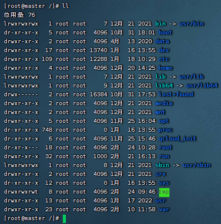

# Linux目录

- `bin目录`：binary 二进制，该目录中存储的是一些二进制文件，文件都可以被运行
- `dev目录`：该目录中主要存放的是外接设备，例如盘、其他的光盘等。在其中的外接设备是不能直接被使用的，需要挂载（类似windows下的分配盘符）
- `etc目录`：该目录主要存储一些配置文件
- `home目录`：表示除了root用户以外，其他用户的家目录（类似windows下的user用户目录）
- `proc目录`：process进程，该目录中存储的是linux运行时候的进程（一般不要打开，容易卡屏）
- `root目录`：该目录是root用户自己的家目录
- `sbin目录`：super binary，该目录也是存储一些可以被执行的二进制文件，但是必须得有super权限的用户才能执行
- `tmp目录`：temporary临时的，当系统运行时产生的临时文件会在这个目录下
- `usr目录`：存放的是用户自己安装的软件（类似windows下的program files）
- `var目录`：存放的程序/系统的日志文件的目录
- `mnt目录`：当外接设备需要挂载的时候，就需要挂载到mnt目录下

