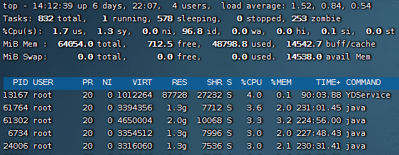

# top

> top（整机），vmstat（CPU），free（内存），df（硬盘），iostat （磁盘IO），ifstat（网咯IO）等...

```shell
# 查看进程占用资源 （退出：按q）  
top
# 按下大写M：结果按照内存占用从高到低排序  
# 按下大写P：结果按照CPU占用率从高到低排序  
# 按下数字1：当服务器含有多个CPU的时候，可以切换显示各个CPU的详细信息  
```



- zombie：僵尸进程个数
- PID：进程id
- USER：该进程对应的用户
- PR：优先级
- NI：用户进程空间内改变过优先级的进程占用CPU百分比
- VIRT：虚拟内存
- RES：常驻内存
- SHR：共享内存 -- 计算一个进程实际使用的内存 = 常驻内存 - 共享内存
- `s`：表示进程的状态，sleep，running
- `%CPU`：表示CPU的占用百分比
- `%MEM`：表示内存的占用百分比
- TIME：执行的时间
- `COMMAND`：进程的名称或者路径

其它

```shell
top -c 
top -d 5                # 每隔 5 秒刷新一次，默认 1 秒
top -p 4360,4358        # 监控指定进程
top -U root             # ‘U’为 真实/有效/保存/文件系统用户名。
top -u 500              # ‘u’为有效用户标识
top -bn 1               # 显示所有进程信息，top -n 1 只显示一屏信息，供管道调用
top -M                  #  memory summary in megabytes not kilobytes
top -p 25097 -n 1 -b    # -b 避免输出控制字符，管道调用出现乱码
top -bn1 | less         # top翻页

# 增强版的 top：htop ，一个更加强大的交互式进程管理器：
```
