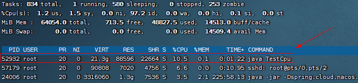
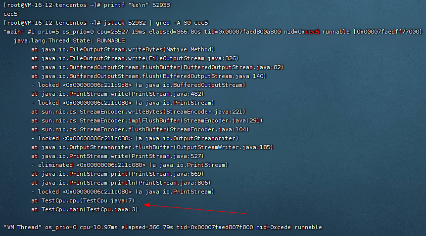
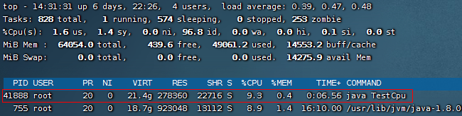
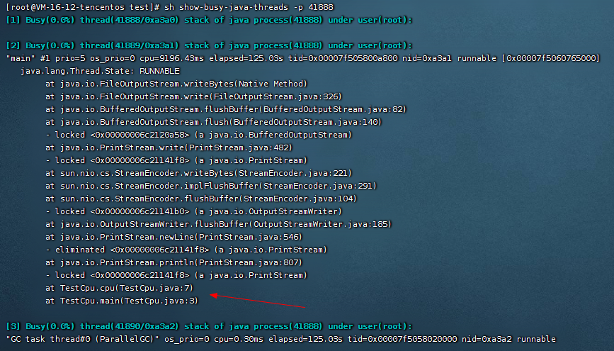

# 线上服务 CPU 100% 占用高问题 - 定位解决

实战：定位异常线程及具体代码行

准备环境进行测试

```shell
cat> ./TestCpu.java <<EOF
public class TestCpu {
    public static void main(String[] args) {
        cpu();
    }
    private static void cpu() {
        while (true) {
            System.out.println("666");
        }
    }
}
EOF

javac TestCpu.java
java TestCpu
```

诊断cpu过高原因

### 一、传统方式

```shell
# 1、查看是哪个进程占用CPU过高
top -c

# 2、查看是哪个线程占用CPU过高  tid（线程id） -- 查询出来的为10进制的线程id
ps H -eo pid,tid,%cpu | grep 指定进程pid
# 输出指定进程的所有线程的运行堆栈 -- 这个内容太多，不方便查看
# jstack 进程pid

# 3、将10进制线程id转换为16进制格式  eg：52933 -> cec5
printf "%x\n" 52933
# 查找指定进程的指定线程堆栈信息  -A：查看后n行
# jstack [进程pid]| grep -A 10 [线程的16进制]
jstack 52932 | grep -A 30 cec5
```





### 二、show-busy-java-threads 脚本使用

- https://github.com/oldratlee/useful-scripts
- https://github.com/superhj1987/awesome-scripts

```shell
# 下载
wget --no-check-certificate https://raw.github.com/oldratlee/useful-scripts/release-2.x/bin/show-busy-java-threads
chmod +x show-busy-java-threads

# 使用可参考 https://github.com/oldratlee/useful-scripts/blob/dev-2.x/docs/java.md#-show-busy-java-threads
# 查找指定进程占用CPU最高的5条线程
sh show-busy-java-threads -p pid
```




### 三、Arthas

见 [Arthas定位cpu过高问题](../../../Java/11-JVM/03-监控工具/02-GUI/05-Arthas/doc/11-cpu过高.md)
