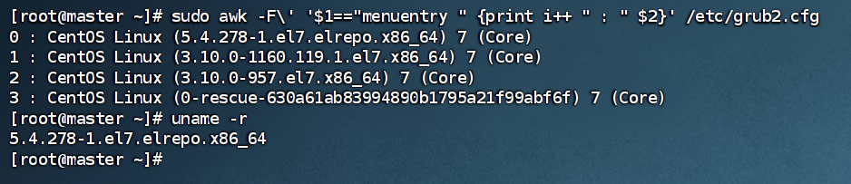
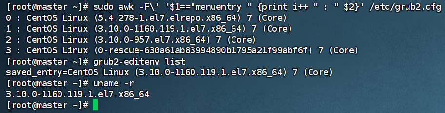

# CentOS 升级内核

ELRepo仓库提供两种主要的内核版本：

- kernel-ml：主线稳定版本，包含最新特性。
- kernel-lt：长期支持版本，通常更稳定，适合生产环境。

建议根据你的需求选择，如果追求稳定性，推荐安装kernel-lt。

### 一、升级内核

```shell
# 查看目前内核版本
uname -r
# 3.10.0-1160.119.1.el7.x86_64


# 查看最新内核包 -- 要升级的内核包。浏览器访问&找一个自己需要的 https://mirrors.coreix.net/elrepo-archive-archive/kernel/el7/x86_64/RPMS/
# 通过rpm方式安装新内核 eg：
rpm -ivh https://mirrors.coreix.net/elrepo-archive-archive/kernel/el7/x86_64/RPMS/kernel-lt-5.4.278-1.el7.elrepo.x86_64.rpm
# 查看已安装内核列表
sudo awk -F\' '$1=="menuentry " {print i++ " : " $2}' /etc/grub2.cfg
# 0 : CentOS Linux (5.4.278-1.el7.elrepo.x86_64) 7 (Core)
# 1 : CentOS Linux (3.10.0-1160.119.1.el7.x86_64) 7 (Core)
# 2 : CentOS Linux (3.10.0-957.el7.x86_64) 7 (Core)
# 3 : CentOS Linux (0-rescue-630a61ab83994890b1795a21f99abf6f) 7 (Core)

# 升级内核 -- 将新内核设置为默认启动项，假设新内核索引是0，使用以下命令设置
sudo grub2-set-default 0
# 查看GRUB2引导加载器的环境变量列表
grub2-editenv list
# saved_entry=0

# 重启系统以使新内核生效
reboot
# 重启后，使用以下命令检查当前运行的内核版本：
uname -r
# 5.4.278-1.el7.elrepo.x86_64
```



### 二、回退内核

1. `grub2-set-default`设置对应的内核索引或版本名
2. 重启

```shell
# 查看已安装内核列表
sudo awk -F\' '$1=="menuentry " {print i++ " : " $2}' /etc/grub2.cfg
# 0 : CentOS Linux (5.4.278-1.el7.elrepo.x86_64) 7 (Core)
# 1 : CentOS Linux (3.10.0-1160.119.1.el7.x86_64) 7 (Core)
# 2 : CentOS Linux (3.10.0-957.el7.x86_64) 7 (Core)
# 3 : CentOS Linux (0-rescue-630a61ab83994890b1795a21f99abf6f) 7 (Core)

# 设置默认启动内核
# sudo grub2-set-default 1
sudo grub2-set-default "CentOS Linux (3.10.0-1160.119.1.el7.x86_64) 7 (Core)"

reboot
uname -r
```


