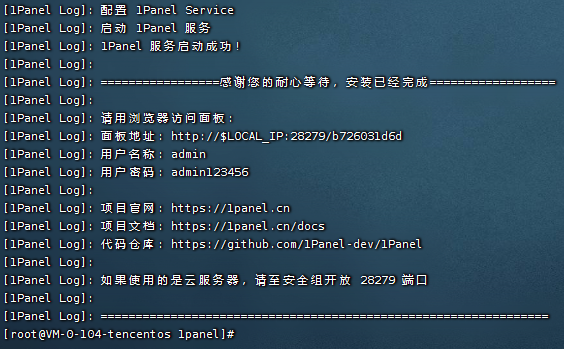
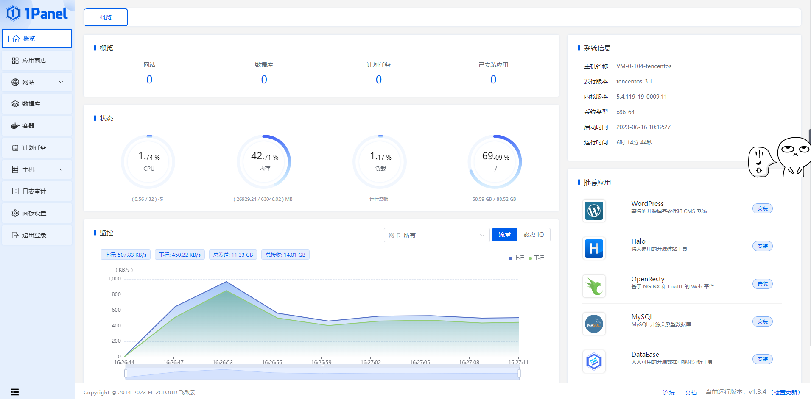

# 1Panel

- https://github.com/1Panel-dev/1Panel
- https://1panel.cn/docs/installation/online_installation/

🔥 🔥 🔥 现代化、开源的 Linux 服务器运维管理面板。

### 安装

```shell
curl -sSL https://resource.fit2cloud.com/1panel/package/quick_start.sh -o quick_start.sh && sh quick_start.sh
```



登录访问




---

1Panel 默认内置了命令行运维工具 1pctl，通过执行 1pctl help，可以查看相关的命令说明。

```shell
Usage:
  ./1pctl [COMMAND] [ARGS...]
  ./1pctl --help

Commands: 
  status              查看 1Panel 服务运行状态
  start               启动 1Panel 服务
  stop                停止 1Panel 服务
  restart             重启 1Panel 服务
  uninstall           卸载 1Panel 服务
  user-info           获取 1Panel 用户信息
  reset-entrance      取消 1Panel 安全入口
  reset-mfa           关闭 1Panel 两步验证
  reset-https         取消 1Panel https 方式登录
  version             查看 1Panel 版本信息

# eg: 卸载
1pctl uninstall
```
