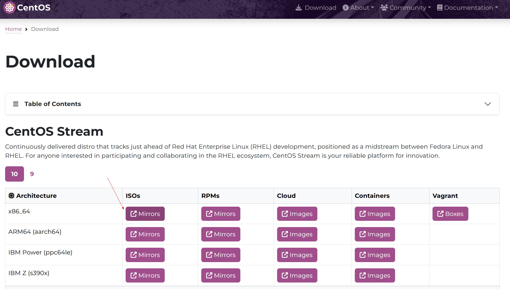
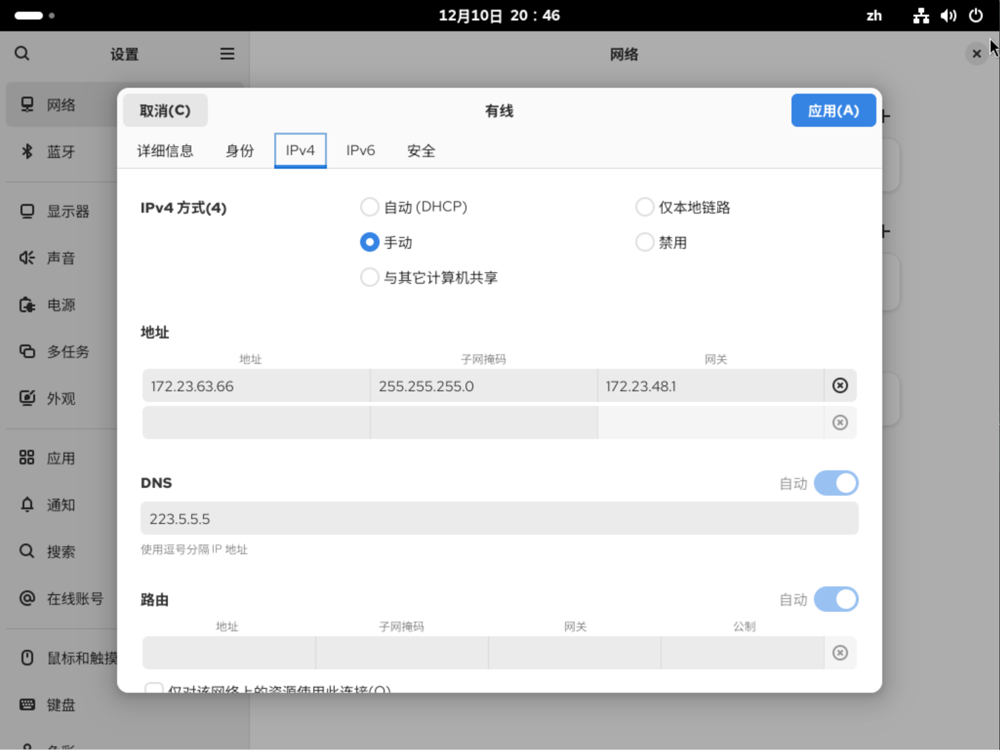

# CentOS-Stream-10安装

### 一、下载ISO & 安装

https://www.centos.org/download/

eg: CentOS-Stream-10-latest-x86_64-dvd1.iso


### 二、配置系列

#### 固定ip

先通过DHCP自动获取ip，查看对应配置。

```shell
[root@master ~]# ip route
default via 172.23.48.1 dev eth0 proto dhcp src 172.23.63.66 metric 100 
172.17.0.0/16 dev docker0 proto kernel scope link src 172.17.0.1 linkdown 
172.23.48.0/20 dev eth0 proto kernel scope link src 172.23.63.66 metric 100
```

默认路由配置：

- 默认网关: 172.23.48.1
- 出站接口: eth0
- 协议: 通过 DHCP 获取
- 源 IP: 172.23.63.66
- 路由优先级: metric 100

##### 修改固定ip配置

###### 方式1：图形化



###### 方式2：命令

```shell
cat> /etc/NetworkManager/system-connections/eth0.nmconnection <<EOF

[connection]
id=eth0
uuid=ec716921-8a35-3179-9742-aa64bcd72055
type=ethernet
autoconnect-priority=-999
interface-name=eth0
timestamp=1765369193

[ethernet]

[ipv4]
address1=172.23.63.68/24
dns=223.5.5.5;
gateway=172.23.48.1
method=manual

[ipv6]
addr-gen-mode=eui64
method=auto

[proxy]

EOF


# 让配置生效
# 1. 重新加载配置文件，使NetworkManager识别磁盘上的更改
sudo nmcli connection reload
# 2. 重新激活（启动）名为"eth0"的连接，以应用新配置
sudo nmcli connection up eth0


# 查看ip
ip addr show eth0
# 2: eth0: <BROADCAST,MULTICAST,UP,LOWER_UP> mtu 1500 qdisc mq state UP group default qlen 1000
#     link/ether 00:15:5d:65:26:19 brd ff:ff:ff:ff:ff:ff
#     altname enx00155d652619
#     inet 172.23.63.68/24 brd 172.23.63.255 scope global noprefixroute eth0
#        valid_lft forever preferred_lft forever
#     inet6 fe80::215:5dff:fe65:2619/64 scope link noprefixroute 
#        valid_lft forever preferred_lft forever

# 查看路由
ip route
# default via 172.23.48.1 dev eth0 proto static metric 100 
# 172.17.0.0/16 dev docker0 proto kernel scope link src 172.17.0.1 linkdown 
# 172.23.48.1 dev eth0 proto static scope link metric 100 
# 172.23.63.0/24 dev eth0 proto kernel scope link src 172.23.63.68 metric 100
```
