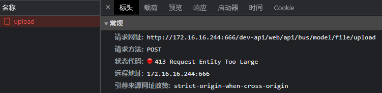

# 上传文件大小限制问题

报错： `413 Request Entity Too Large`，nginx默认上传文件的大小限制是1M



### 解决

修改配置`nginx.conf`

> 可以在http、server、location三个区域里配置 `client_max_body_size 100m;`

```
# 示例：
http {
    client_max_body_size 100m;         # 限制上传文件大小

    server {
        listen       80;
        server_name  localhost; # 服务器地址或绑定域名
        location / {
            root   /usr/share/nginx/html;
            index  index.html index.htm;
            try_files $uri $uri/ /index.html;
        }
    }
}
```