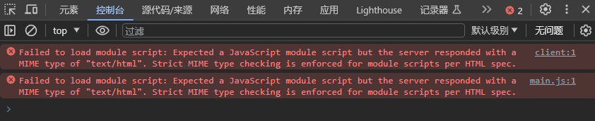

# 反向代理访问本地vue3项目

### 报错




```shell
Failed to load module script: Expected a JavaScript module script but the server responded with a MIME type of "text/html". Strict MIME type checking is enforced for module scripts per HTML spec.
main.js:1 Failed to load module script: Expected a JavaScript module script but the server responded with a MIME type of "text/html". Strict MIME type checking is enforced for module scripts per HTML spec.
```

### 正确配置

```

```

好像无法访问本地运行的项目，除非是直接代理，eg: `natapp`