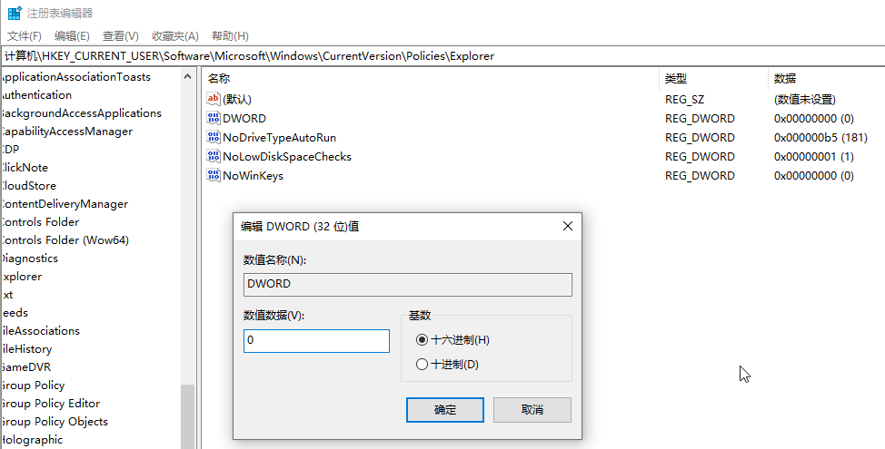
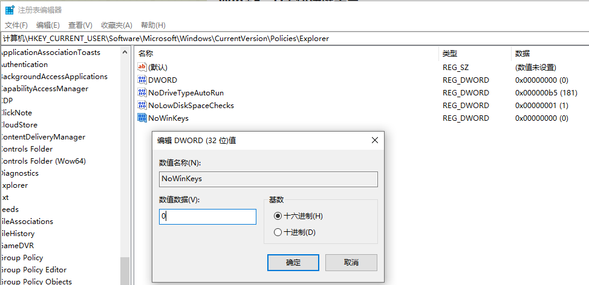

### 问题

win+r win+d win+e 等快捷键失效

### 解决

`cmd` -> `regedit` 修改注册表

```
计算机\HKEY_CURRENT_USER\Software\Microsoft\Windows\CurrentVersion\Policies\Explorer
```

新建`DWORD` 32位 值：0


新建`NoWinKeys` 32位 值：0


然后重启电脑！
