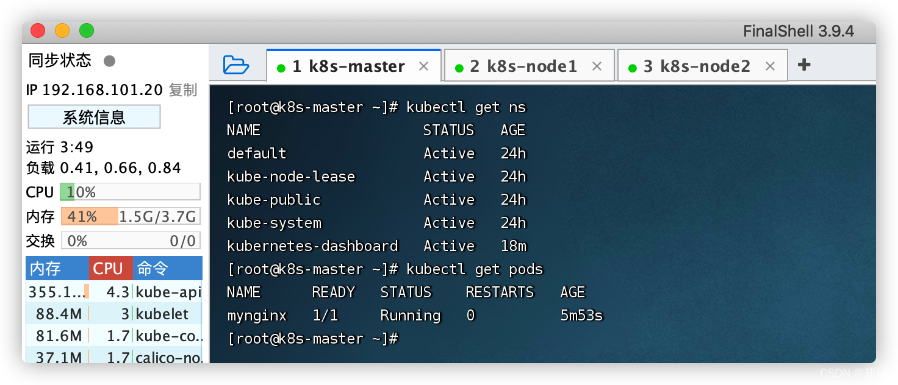

# 二、命名空间

> 隔离资源

#### 1、命令行

```shell
# 查看命名空间
kubectl get ns

# 查看默认命名空间`default`下的应用 -- 如果操作不指定命名空间，默认都是放在`default`命名空间下
kubectl get pods
# 查看所有命名空间下的应用
kubectl get pods -A
# 查看指定命名空间`xxx`下的应用
kubectl get pods -n xxx

# 创建命名空间 `zhengqingya`
kubectl create ns zhengqingya
# 删除 -- 会将其下所有应用删除
kubectl delete ns zhengqingya
```



#### 2、配置文件

```shell
cat <<EOF | sudo tee ./zhengqingya.yaml

apiVersion: v1
kind: Namespace
metadata:
  name: zhengqingya
  
EOF


# 创建资源
kubectl apply -f zhengqingya.yaml
# 删除
kubectl delete -f zhengqingya.yaml
```
