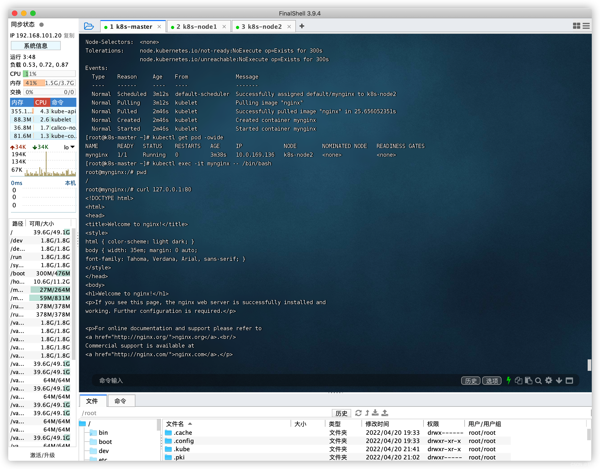
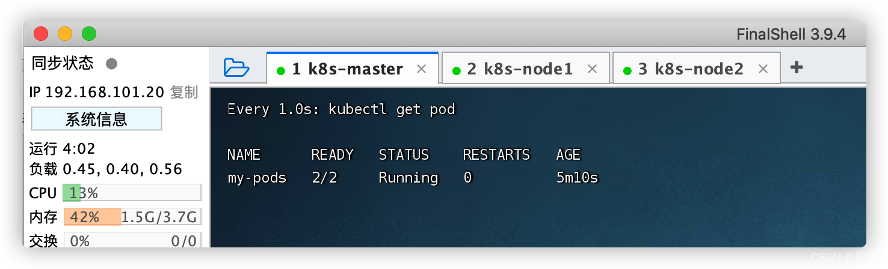
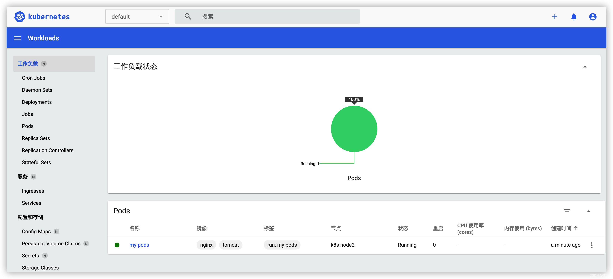
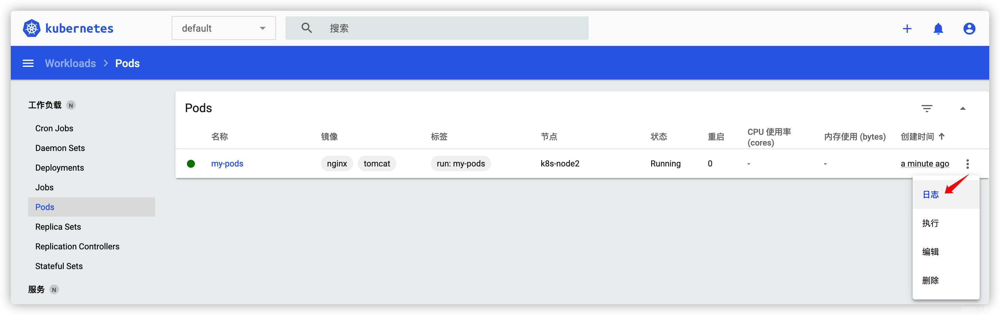
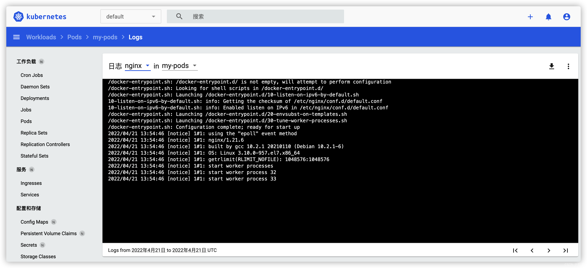

# 三、Pod

> 运行中的一组容器，Pod是kubernetes中应用的最小单位。

#### 1、命令行

```shell
# 创建一个叫 `mynginx` 的 `nginx` 容器
kubectl run mynginx --image=nginx

# 查看`default`空间的Pod
kubectl get pod

# 如果应用未运行，可查看描述信息，看看应用执行相关事件处理
# kubectl describe pod Pod名
kubectl describe pod mynginx

# 删除
kubectl delete pod mynginx

# 查看运行日志
kubectl logs -f mynginx

# 输出更完善的信息 -- 每个Pod，k8s都会分配一个ip   集群中的任意机器都能访问
kubectl get pod -owide

# 查看
curl 10.0.169.136:80

# 进入容器
kubectl exec -it mynginx -- /bin/bash
```



#### 2、配置文件

```shell
cat <<EOF | sudo tee ./mynginx.yaml

apiVersion: v1
kind: Pod
metadata:
  labels:
    run: mynginx
  name: mynginx
  namespace: default
spec:
  containers:
  - image: nginx
    name: mynginx
  
EOF


# 创建
kubectl apply -f mynginx.yaml
# 删除
kubectl delete -f mynginx.yaml
```

一个Pod部署多个容器

> tips: 无法部署多个相同容器，会出现端口占用问题！

```shell
cat <<EOF | sudo tee ./my-pods.yaml

apiVersion: v1
kind: Pod
metadata:
  labels:
    run: my-pods
  name: my-pods
spec:
  containers:
  - image: nginx
    name: nginx
  - image: tomcat
    name: tomcat
    
EOF


# 创建
kubectl apply -f my-pods.yaml
# 删除
kubectl delete -f my-pods.yaml


# 每隔1秒运行 查看数据
watch -n 1 kubectl get pod
```



#### 3、`Kubernetes Dashboard`可视化界面中操作

切换到指定命名空间下 -> `＋` -> `输入并创建`



查看日志


