# 四、Deployment

> 控制Pod，使Pod拥有多副本，自愈，扩缩容等能力

```shell
kubectl create deployment my-dep-nginx --image=nginx


# 新开一个窗口：每隔1秒运行 查看数据
watch -n 1 kubectl get pod


# 删除应用
kubectl delete pod my-dep-nginx-xxx

# 然后在新开的窗口查看应用会自己在删除后 再次启动   =>   自愈能力
# 下面方式创建的应用删除后不会自自启动
kubectl run mynginx --image=nginx
kubectl delete pod mynginx


# 查看部署
kubectl get deploy
# 删除部署`my-dep-nginx`
kubectl delete deploy my-dep-nginx
```

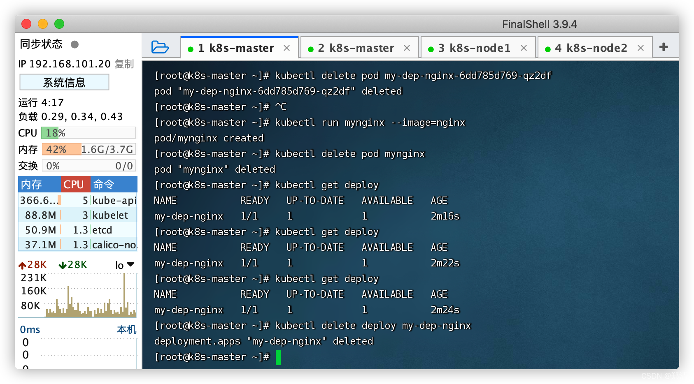

#### 1、多副本

##### a、命令行

```shell
# 启动3份副本，会在工作机器中随机部署      ex: 机器1部署2份  机器2部署1份  如果其中一个应用蹦了，会再随机启动一个，保证存在3个副本
kubectl create deployment my-dep-nginx --image=nginx --replicas=3
```

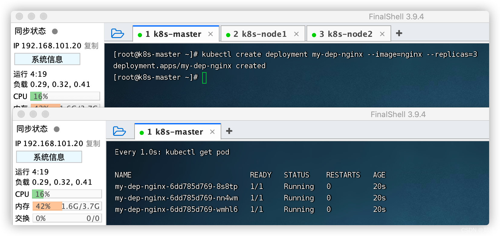

##### b、配置文件

```shell
# 删除命令行部署的`my-dep-nginx`
kubectl delete deploy my-dep-nginx


cat <<EOF | sudo tee ./my-dep-nginx.yaml

apiVersion: apps/v1
kind: Deployment
metadata:
  labels:
    app: my-dep-nginx
  name: my-dep-nginx
spec:
  replicas: 3
  selector:
    matchLabels:
      app: my-dep-nginx
  template:
    metadata:
      labels:
        app: my-dep-nginx
    spec:
      containers:
      - image: nginx
        name: nginx
        
EOF


# 创建
kubectl apply -f my-dep-nginx.yaml
# 删除
kubectl delete -f my-dep-nginx.yaml
```

##### c、`Kubernetes Dashboard`可视化界面中操作

切换到指定命名空间下 -> `＋` -> `从表单创建`
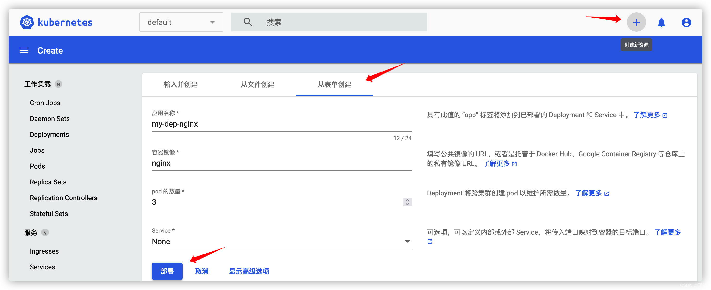

#### 2、扩缩容

##### 方式1

```shell
# 将之前部署的3份 扩展到 5份
kubectl scale deploy/my-dep-nginx --replicas=5
# 缩容
kubectl scale deploy/my-dep-nginx --replicas=2

# 查看
kubectl get pod
```

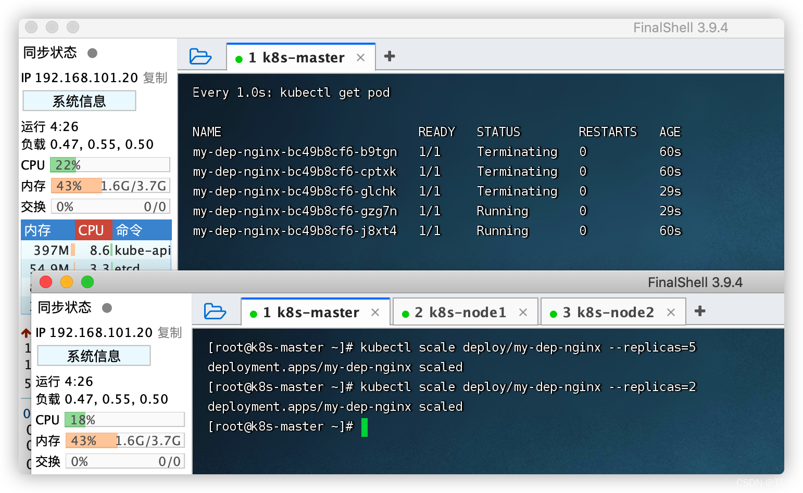

##### 方式2

```shell
# 修改 `replicas` 值 即可
kubectl edit deploy my-dep-nginx

# 查看
kubectl get pod
```

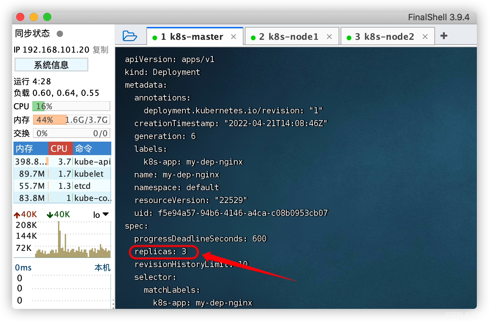

##### 方式3

`Kubernetes Dashboard`可视化界面中操作
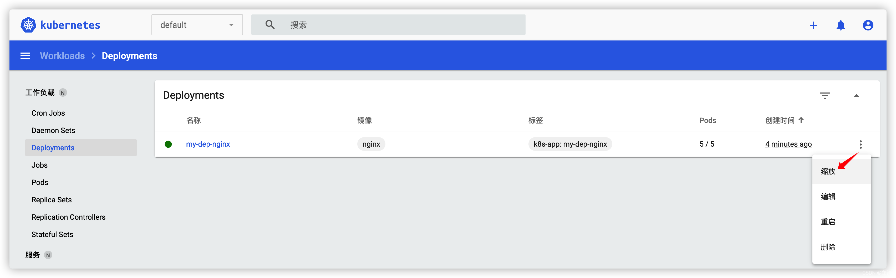
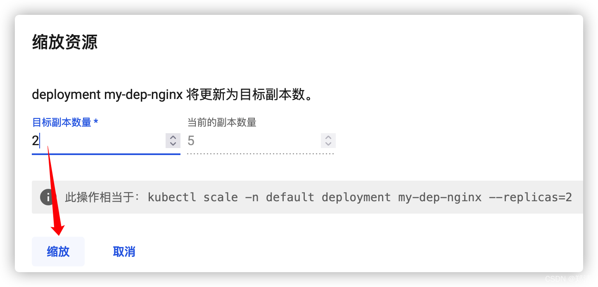

#### 3、自愈&故障转移

以下情况

1. 停止容器
2. 删除Pod
3. 容器崩溃
4. 宕机
5. ...

其下的应用会再自启动一份到集群下任意工作机器 => 自愈&故障转移

```shell
# 模拟：在工作机器上停掉应用
docker stop xxx

# 监控 -- 展示应用的状态变化过程
kubectl get pod -w
```

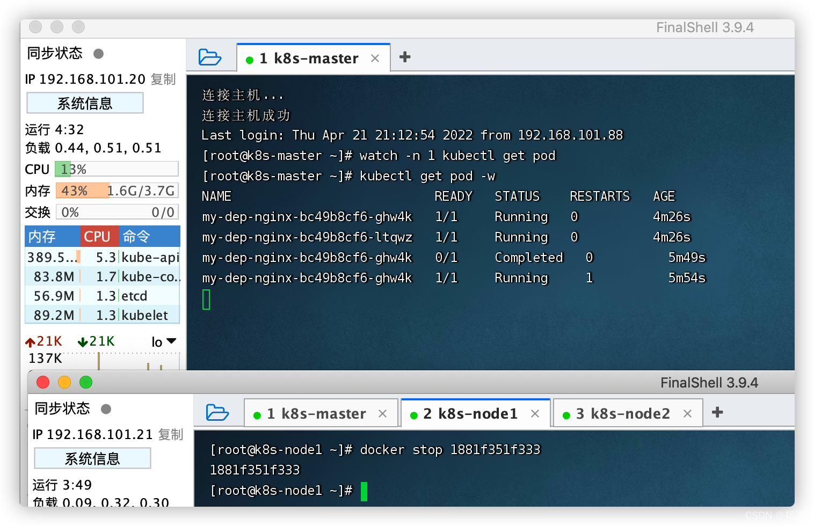

#### 4、滚动更新

> 上次部署版本v1；这次部署版本v2，会先启动v2版本的新应用，等新应用启动成功之后，再杀死旧应用v1。

```shell
kubectl create deployment my-dep-nginx --image=nginx --replicas=2

# 部署新版本
kubectl set image deploy/my-dep-nginx nginx=nginx:1.21.6 --record

# 查看变更进度
kubectl rollout status deploy/my-dep-nginx
```

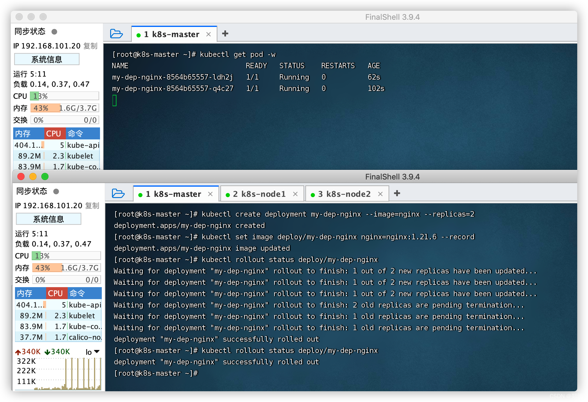

#### 5、版本回退

> v2版本回退到v1版本

```shell
# 历史记录
kubectl rollout history deployment/my-dep-nginx
# 查看某个历史详情
kubectl rollout history deployment/my-dep-nginx --revision=2

# 回滚 -- 上次
kubectl rollout undo deploy/my-dep-nginx
# 回滚 -- 指定版本
kubectl rollout undo deploy/my-dep-nginx --to-revision=1

# 监控 -- 展示应用的状态变化过程
kubectl get pod -w

# 查看是否回退到之前版本 -- 看image镜像版本确认
kubectl get deploy/my-dep-nginx -oyaml | grep image
```

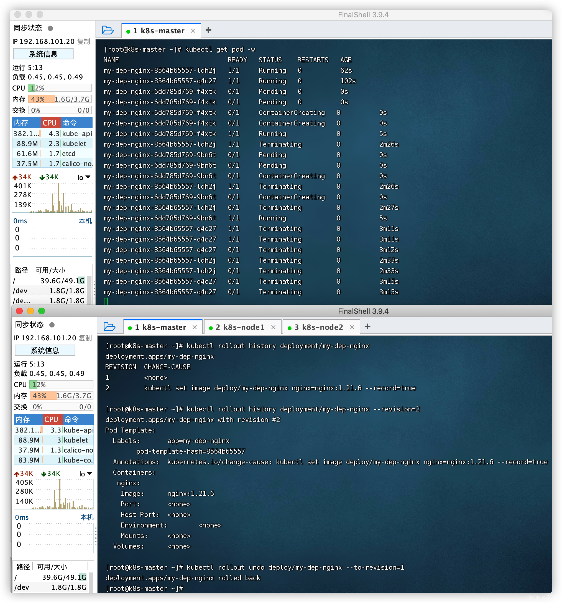
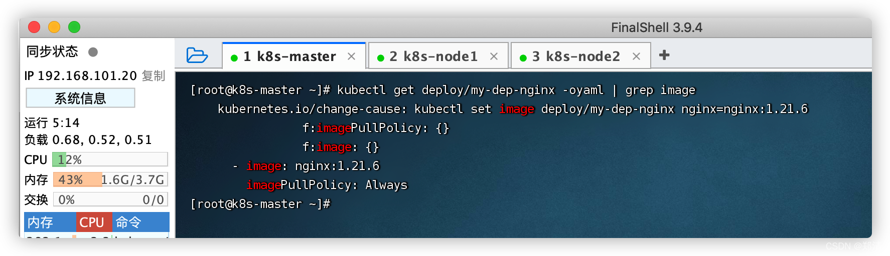

#### 6、其它工作负载

> [https://kubernetes.io/zh/docs/concepts/workloads/controllers](https://kubernetes.io/zh/docs/concepts/workloads/controllers)

1. `Deployment`: 无状态应用部署 ex: 微服务
2. `StatefulSet`: 有状态应用 ex: redis
3. `DaemonSet`: 守护型应用部署 ex: 日志收集组件
4. `Job`: 定时任务部署 ex: 垃圾清理组件
5. ...
