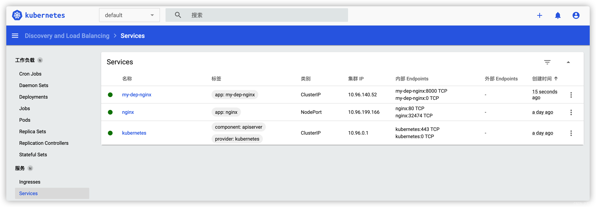
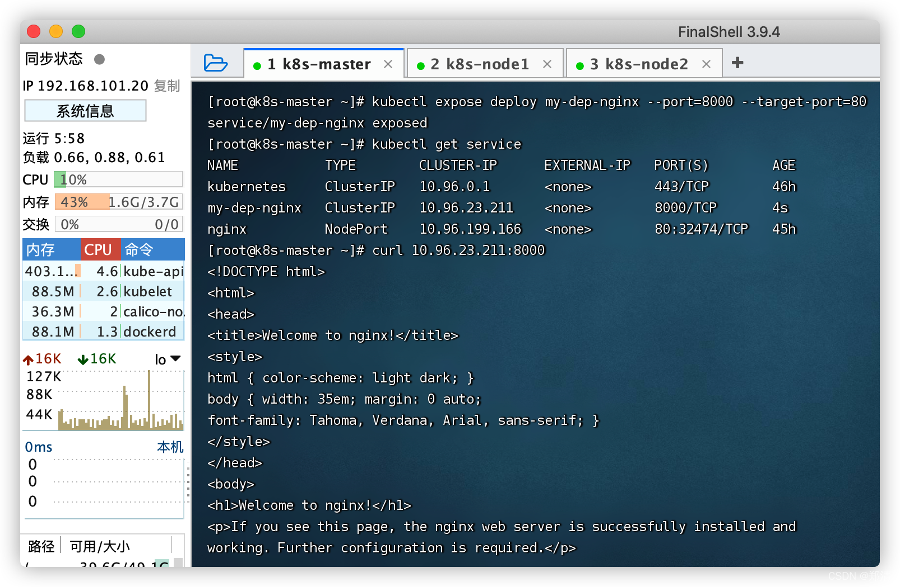
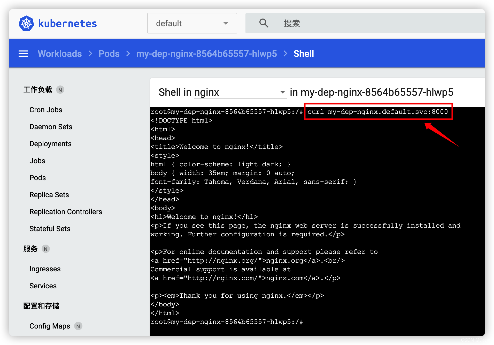

# 五、Service

> 将一组Pods公开为网络服务的抽象方法；Pod的服务发现与负载均衡。



###### 命令行

```shell
# 暴露Deploy  => 将目标服务端口80暴露为8000
kubectl expose deploy my-dep-nginx --port=8000 --target-port=80

# 查看已暴露的服务
kubectl get service

# 访问 -- ip方式
curl 10.96.23.211:8000

# 访问 -- service域名方式
# 进入容器 curl 服务名.命名空间.svc:8000
curl my-dep-nginx.default.svc:8000

# 删除已暴露的服务
kubectl delete service my-dep-nginx

# 使用标签检索Pod
kubectl get pod -l app=my-dep-nginx
```




###### 配置文件

```shell
cat <<EOF | sudo tee ./my-dep-nginx-service.yaml

apiVersion: v1
kind: Service
metadata:
  labels:
    app: my-dep-nginx
  name: my-dep-nginx
spec:
  selector:
    app: my-dep-nginx
  ports:
  - port: 8000
    protocol: TCP
    targetPort: 80
    
EOF

# 创建
kubectl apply -f my-dep-nginx-service.yaml
# 删除
kubectl delete -f my-dep-nginx-service.yaml
```

#### 1、ClusterIP

> 用于集群内部访问

##### a、命令行

```shell
# 等同于没有`--type`，即上面方式
kubectl expose deploy my-dep-nginx --port=8000 --target-port=80 --type=ClusterIP
# 删除
kubectl delete service my-dep-nginx
```

##### b、配置文件

```shell
cat <<EOF | sudo tee ./my-dep-nginx-service-clusterip.yaml

apiVersion: v1
kind: Service
metadata:
  labels:
    app: my-dep-nginx
  name: my-dep-nginx
spec:
  ports:
  - port: 8000
    protocol: TCP
    targetPort: 80
  selector:
    app: my-dep-nginx
  type: ClusterIP
  
EOF

# 创建
kubectl apply -f my-dep-nginx-service-clusterip.yaml
# 删除
kubectl delete -f my-dep-nginx-service-clusterip.yaml
```

#### 2、NodePort

> 用于集群外部访问，NodePort范围在 30000-32767 之间

##### a、命令行

```shell
kubectl expose deploy my-dep-nginx --port=8000 --target-port=80 --type=NodePort
# 删除
kubectl delete service my-dep-nginx
```

访问：`http://集群任意IP:端口`

##### b、配置文件

```shell
cat <<EOF | sudo tee ./my-dep-nginx-service-nodeport.yaml

apiVersion: v1
kind: Service
metadata:
  labels:
    app: my-dep-nginx
  name: my-dep-nginx
spec:
  ports:
  - port: 8000
    protocol: TCP
    targetPort: 80
  selector:
    app: my-dep-nginx
  type: NodePort

EOF

# 创建
kubectl apply -f my-dep-nginx-service-nodeport.yaml
# 删除
kubectl delete -f my-dep-nginx-service-nodeport.yaml
```
