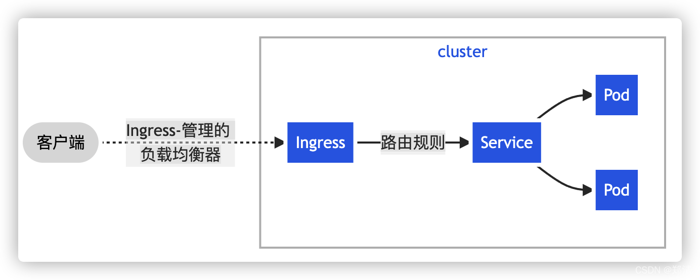
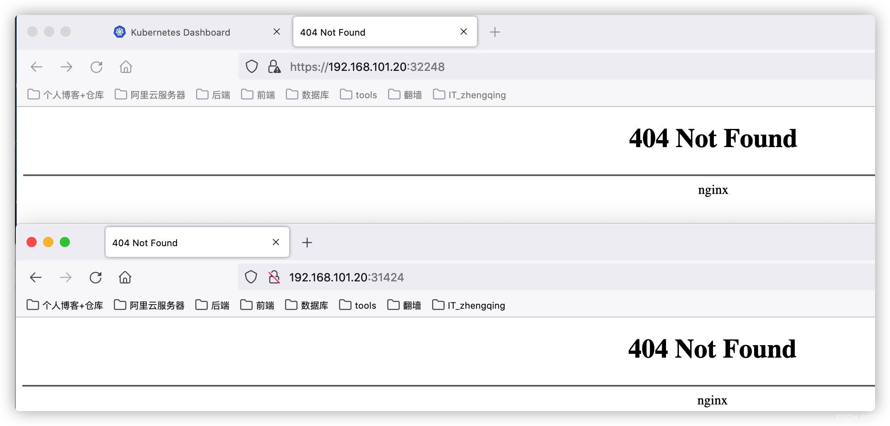
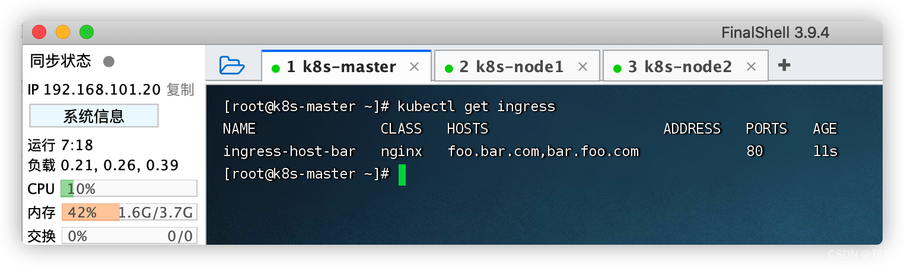
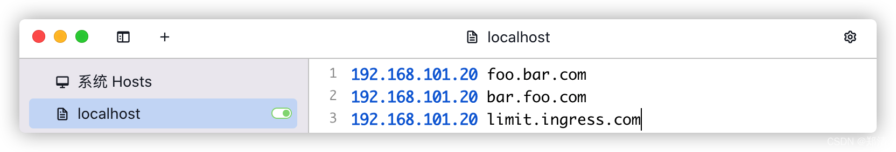
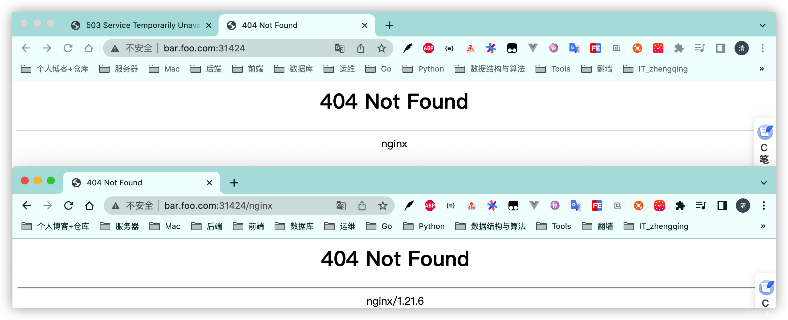
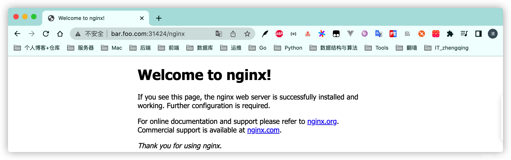
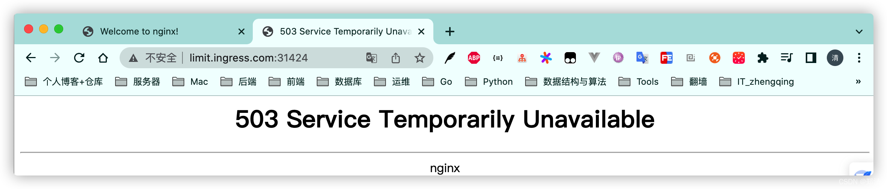

# 六、Ingress

> Service的统一网关入口
> [https://kubernetes.io/zh/docs/concepts/services-networking/ingress](https://kubernetes.io/zh/docs/concepts/services-networking/ingress)
> [https://github.com/kubernetes/ingress-nginx](https://github.com/kubernetes/ingress-nginx)



#### 1、安装

```shell
wget https://raw.githubusercontent.com/kubernetes/ingress-nginx/controller-v0.47.0/deploy/static/provider/baremetal/deploy.yaml

# 修改镜像 
# image: k8s.gcr.io/ingress-nginx/controller:v0.46.0@sha256:52f0058bed0a17ab0fb35628ba97e8d52b5d32299fbc03cc0f6c7b9ff036b61a
# 变更为
# image: registry.cn-hangzhou.aliyuncs.com/zhengqing/ingress-nginx-controller:v0.46.0
vim deploy.yaml

# 创建
kubectl apply -f deploy.yaml

# 查看安装是否安装完成
kubectl get pod -A

# 检查安装的结果
kubectl get pod,svc -n ingress-nginx

# 安装完成之后，查看Service暴露端口
kubectl get svc -A
```


访问

1. `https://集群任意IP:32248`
2. `http://集群任意IP:31424`



#### 2、使用

准备测试环境

```shell
cat <<EOF | sudo tee ./ingress-test.yaml

apiVersion: apps/v1
kind: Deployment
metadata:
  name: service1
spec:
  replicas: 2
  selector:
    matchLabels:
      app: service1
  template:
    metadata:
      labels:
        app: service1
    spec:
      containers:
      - name: service1
        image: registry.cn-hangzhou.aliyuncs.com/zhengqing/k8s-hello-server
        ports:
        - containerPort: 9000
---
apiVersion: apps/v1
kind: Deployment
metadata:
  labels:
    app: service2
  name: service2
spec:
  replicas: 2
  selector:
    matchLabels:
      app: service2
  template:
    metadata:
      labels:
        app: service2
    spec:
      containers:
      - image: nginx
        name: nginx
---
apiVersion: v1
kind: Service
metadata:
  labels:
    app: service2
  name: service2
spec:
  selector:
    app: service2
  ports:
  - port: 8000
    protocol: TCP
    targetPort: 80
---
apiVersion: v1
kind: Service
metadata:
  labels:
    app: service1
  name: service1
spec:
  selector:
    app: service1
  ports:
  - port: 8000
    protocol: TCP
    targetPort: 9000
    
EOF


# 创建
kubectl apply -f ingress-test.yaml
# 删除
# kubectl delete -f ingress-test.yaml
```

##### a、域名访问


```shell
cat <<EOF | sudo tee ./ingress-rule-host.yaml

apiVersion: networking.k8s.io/v1
kind: Ingress  
metadata:
  name: ingress-host-bar
spec:
  ingressClassName: nginx
  rules:
  - host: "foo.bar.com"
    http:
      paths:
      - pathType: Prefix
        path: "/"
        backend:
          service:
            name: service1
            port:
              number: 80
  - host: "bar.foo.com"
    http:
      paths:
      - pathType: Prefix
        path: "/nginx"      # 把请求会转给下面的服务，下面的服务一定要能处理这个路径，不能处理就是404
        backend:
          service:
            name: service2  # java，比如使用路径重写，去掉前缀nginx
            port:
              number: 80

EOF


# 创建
kubectl apply -f ingress-rule-host.yaml
# 删除
# kubectl delete -f ingress-rule-host.yaml

# 查看规则
kubectl get ingress
```



访问

> hosts域名切换工具 [https://github.com/oldj/SwitchHosts](https://github.com/oldj/SwitchHosts)



1. `foo.bar.com:31424`       => service1
2. `bar.foo.com:31424`       => service2 -- ingress层返回404
2. `bar.foo.com:31424/nginx` => service2 -- nginx层返回404



##### b、路径重写

> [https://kubernetes.github.io/ingress-nginx/examples/rewrite](https://kubernetes.github.io/ingress-nginx/examples/rewrite)

```shell
cat <<EOF | sudo tee ./ingress-rule-rewrite.yaml

apiVersion: networking.k8s.io/v1
kind: Ingress  
metadata:
  annotations:
    nginx.ingress.kubernetes.io/rewrite-target: /$2
  name: ingress-host-bar
spec:
  ingressClassName: nginx
  rules:
  - host: "foo.bar.com"
    http:
      paths:
      - pathType: Prefix
        path: "/"
        backend:
          service:
            name: service1
            port:
              number: 80
  - host: "bar.foo.com"
    http:
      paths:
      - pathType: Prefix
        path: "/nginx(/|$)(.*)"  # 把请求会转给下面的服务，下面的服务一定要能处理这个路径，不能处理就是404
        backend:
          service:
            name: service2       # java，比如使用路径重写，去掉前缀nginx
            port:
              number: 80

EOF


# 创建
kubectl apply -f ingress-rule-rewrite.yaml
# 删除
# kubectl delete -f ingress-rule-rewrite.yaml

# 查看规则
kubectl get ingress
```

访问 `bar.foo.com:31424/nginx` => `bar.foo.com:31424` 即访问nginx根路径


##### c、流量限制

> [https://kubernetes.github.io/ingress-nginx/user-guide/nginx-configuration/annotations/#rate-limiting](https://kubernetes.github.io/ingress-nginx/user-guide/nginx-configuration/annotations/#rate-limiting)

```shell
cat <<EOF | sudo tee ./ingress-rule-limit.yaml

apiVersion: networking.k8s.io/v1
kind: Ingress
metadata:
  name: ingress-limit-rate
  annotations:
    nginx.ingress.kubernetes.io/limit-rps: "1"
spec:
  ingressClassName: nginx
  rules:
  - host: "limit.ingress.com"
    http:
      paths:
      - pathType: Exact
        path: "/"
        backend:
          service:
            name: service2
            port:
              number: 80
              
EOF


# 创建
kubectl apply -f ingress-rule-limit.yaml
# 删除
# kubectl delete -f ingress-rule-limit.yaml

# 查看规则
kubectl get ingress
```

频繁访问 `limit.ingress.com:31424` 会出现503

