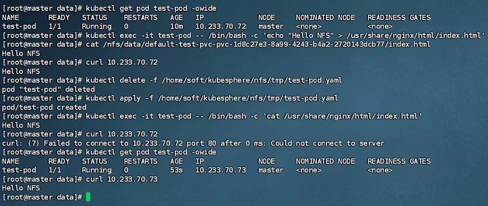

# 搭建NFS动态PV存储

> 以`NFS`作为存储层为例
> 节点之间互相同步数据

目标：K8s集群中搭建NFS动态PV存储并进行基本测试。这个过程自动化了PV的创建和管理，大大提升了存储资源分配的效率。

### 一、搭建NFS服务器

见 [NFS服务器搭建](07-存储抽象-PV&PVC-01-NFS服务器搭建.md)

### 二、部署NFS客户端 Provisioner（动态供应商） -- 配置动态供应的默认存储类`nfs-storage`

NFS动态PV的功能需要一个叫 `nfs-subdir-external-provisioner` 的组件（即Provisioner）来支持，它会根据PVC的请求自动创建PV和对应的NFS子目录。

> todo: 修改指定自己nfs服务端地址 eg: `192.168.101.20`

```shell
cat> /home/soft/kubesphere/nfs/storageclass.yaml  <<EOF

## 创建了一个存储类
apiVersion: storage.k8s.io/v1
kind: StorageClass
metadata:
  name: nfs-storage
  annotations:
    storageclass.kubernetes.io/is-default-class: "true"
provisioner: k8s-sigs.io/nfs-subdir-external-provisioner
parameters:
  archiveOnDelete: "true"  ## 删除pv的时候，pv的内容是否要备份

---
apiVersion: apps/v1
kind: Deployment
metadata:
  name: nfs-client-provisioner
  labels:
    app: nfs-client-provisioner
  # replace with namespace where provisioner is deployed
  namespace: default
spec:
  replicas: 1
  strategy:
    type: Recreate
  selector:
    matchLabels:
      app: nfs-client-provisioner
  template:
    metadata:
      labels:
        app: nfs-client-provisioner
    spec:
      serviceAccountName: nfs-client-provisioner
      containers:
        - name: nfs-client-provisioner
          image: registry.cn-hangzhou.aliyuncs.com/zhengqing/k8s-nfs-subdir-external-provisioner:v4.0.2
          # resources:
          #    limits:
          #      cpu: 10m
          #    requests:
          #      cpu: 10m
          volumeMounts:
            - name: nfs-client-root
              mountPath: /persistentvolumes
          env:
            - name: PROVISIONER_NAME
              value: k8s-sigs.io/nfs-subdir-external-provisioner
            - name: NFS_SERVER
              value: 192.168.101.20 ## TODO 指定自己nfs服务器地址
            - name: NFS_PATH  
              value: /nfs/data  ## TODO nfs服务器共享的目录
      volumes:
        - name: nfs-client-root
          nfs:
            server: 192.168.101.20
            path: /nfs/data
---
apiVersion: v1
kind: ServiceAccount
metadata:
  name: nfs-client-provisioner
  # replace with namespace where provisioner is deployed
  namespace: default
---
kind: ClusterRole
apiVersion: rbac.authorization.k8s.io/v1
metadata:
  name: nfs-client-provisioner-runner
rules:
  - apiGroups: [""]
    resources: ["nodes"]
    verbs: ["get", "list", "watch"]
  - apiGroups: [""]
    resources: ["persistentvolumes"]
    verbs: ["get", "list", "watch", "create", "delete"]
  - apiGroups: [""]
    resources: ["persistentvolumeclaims"]
    verbs: ["get", "list", "watch", "update"]
  - apiGroups: ["storage.k8s.io"]
    resources: ["storageclasses"]
    verbs: ["get", "list", "watch"]
  - apiGroups: [""]
    resources: ["events"]
    verbs: ["create", "update", "patch"]
---
kind: ClusterRoleBinding
apiVersion: rbac.authorization.k8s.io/v1
metadata:
  name: run-nfs-client-provisioner
subjects:
  - kind: ServiceAccount
    name: nfs-client-provisioner
    # replace with namespace where provisioner is deployed
    namespace: default
roleRef:
  kind: ClusterRole
  name: nfs-client-provisioner-runner
  apiGroup: rbac.authorization.k8s.io
---
kind: Role
apiVersion: rbac.authorization.k8s.io/v1
metadata:
  name: leader-locking-nfs-client-provisioner
  # replace with namespace where provisioner is deployed
  namespace: default
rules:
  - apiGroups: [""]
    resources: ["endpoints"]
    verbs: ["get", "list", "watch", "create", "update", "patch"]
---
kind: RoleBinding
apiVersion: rbac.authorization.k8s.io/v1
metadata:
  name: leader-locking-nfs-client-provisioner
  # replace with namespace where provisioner is deployed
  namespace: default
subjects:
  - kind: ServiceAccount
    name: nfs-client-provisioner
    # replace with namespace where provisioner is deployed
    namespace: default
roleRef:
  kind: Role
  name: leader-locking-nfs-client-provisioner
  apiGroup: rbac.authorization.k8s.io
  
EOF

# 创建
kubectl apply -f /home/soft/kubesphere/nfs/storageclass.yaml
# 删除
# kubectl delete -f /home/soft/kubesphere/nfs/storageclass.yaml

# 查看存储类
kubectl get sc
# NAME                    PROVISIONER                                   RECLAIMPOLICY   VOLUMEBINDINGMODE   ALLOWVOLUMEEXPANSION   AGE
# nfs-storage (default)   k8s-sigs.io/nfs-subdir-external-provisioner   Delete          Immediate           false                  7s

# 如果Provisioner Pod出现问题，查看日志排查问题
kubectl logs deployment/nfs-client-provisioner
```

### 三、创建PVC和Pod进行测试

#### 1、创建PVC -- 申请存储

```shell
mkdir -p /home/soft/kubesphere/nfs/tmp
cat> /home/soft/kubesphere/nfs/tmp/test-pvc.yaml <<EOF

apiVersion: v1
kind: PersistentVolumeClaim
metadata:
  name: test-pvc
  namespace: default  # 指定命名空间，与Provisioner、StorageClass相符
spec:
  accessModes:
    - ReadWriteMany  # NFS通常支持多节点读写(RWX)
  resources:
    requests:
      storage: 1Gi   # 请求1GiB的存储空间
  storageClassName: nfs-storage  # 引用前面创建的StorageClass名称
  
EOF

# 创建PVC
kubectl apply -f /home/soft/kubesphere/nfs/tmp/test-pvc.yaml
# kubectl delete -f /home/soft/kubesphere/nfs/tmp/test-pvc.yaml


# 查看PVC状态，应为 Bound
kubectl get pvc test-pvc
# NAME       STATUS   VOLUME                                     CAPACITY   ACCESS MODES   STORAGECLASS   VOLUMEATTRIBUTESCLASS   AGE
# test-pvc   Bound    pvc-1d8c27e3-8a99-4243-b4a2-2720143dcb77   1Gi        RWX            nfs-storage    <unset>                 2m42s

# 会看到一个自动创建的PV，状态也是 Bound，并且CLAIM字段指向 default/test-pvc
kubectl get pv
# NAME                                       CAPACITY   ACCESS MODES   RECLAIM POLICY   STATUS   CLAIM              STORAGECLASS   VOLUMEATTRIBUTESCLASS   REASON   AGE
# pvc-1d8c27e3-8a99-4243-b4a2-2720143dcb77   1Gi        RWX            Delete           Bound    default/test-pvc   nfs-storage    <unset>                          2m51s


# 查看动态创建的pv对应的数据目录，在NFS服务器的 /nfs/data/ 目录下，会看到一个根据命名规则新生成的目录（例如 default-test-pvc-pvc-<随机ID>）
ls /nfs/data/
# default-test-pvc-pvc-1d8c27e3-8a99-4243-b4a2-2720143dcb77
```

#### 2、创建测试Pod

```shell
cat> /home/soft/kubesphere/nfs/tmp/test-pod.yaml  <<EOF

apiVersion: v1
kind: Pod
metadata:
  name: test-pod
spec:
  containers:
    - name: nginx-zq
      image: registry.cn-hangzhou.aliyuncs.com/zhengqing/nginx:1.27.0
      volumeMounts:
        - name: nfs-storage
          mountPath: /usr/share/nginx/html  # 将PVC挂载到容器内的目录
  volumes:
    - name: nfs-storage
      persistentVolumeClaim:
        claimName: test-pvc  # 使用前面创建的PVC

EOF

# 创建Pod
kubectl apply -f /home/soft/kubesphere/nfs/tmp/test-pod.yaml
# 删除
# kubectl delete -f /home/soft/kubesphere/nfs/tmp/test-pod.yaml

# 查看Pod状态
kubectl get pod test-pod
# NAME       READY   STATUS    RESTARTS   AGE
# test-pod   1/1     Running   0          17s
kubectl get pod test-pod -owide
# NAME       READY   STATUS    RESTARTS   AGE   IP             NODE     NOMINATED NODE   READINESS GATES
# test-pod   1/1     Running   0          69s   10.233.70.72   master   <none>           <none>
kubectl describe pod test-pod
```

#### 3、数据持久化验证

```shell
# 写入数据：向Pod中挂载的目录写入一个文件。
kubectl exec -it test-pod -- /bin/bash -c 'echo "Hello NFS" > /usr/share/nginx/html/index.html'

# 在NFS服务器验证：到NFS服务器上，进入动态创建的PV对应目录（如 /data/nfs/default-test-pvc-...），检查是否存在 index.html 文件并包含你写入的内容。
cat /nfs/data/default-test-pvc-pvc-1d8c27e3-8a99-4243-b4a2-2720143dcb77/index.html
# 也可以直接访问nginx看下...
curl 10.233.70.72

# 数据持久性测试，删除这个测试Pod
kubectl delete -f /home/soft/kubesphere/nfs/tmp/test-pod.yaml
# 不要删除PVC，再重新创建这个Pod
kubectl apply -f /home/soft/kubesphere/nfs/tmp/test-pod.yaml
# 再次进入Pod查看 /usr/share/nginx/html/index.html，文件内容应该依然存在，证明数据已持久化存储。
kubectl exec -it test-pod -- /bin/bash -c 'cat /usr/share/nginx/html/index.html'
```


