# 七、存储抽象

> 以`NFS`作为存储层为例
> 节点之间互相同步数据

#### 1、环境准备

##### a、所有节点

```shell
# 所有机器安装
yum install -y nfs-utils
```

##### b、主节点

```shell
# nfs主节点
echo "/nfs/data/ *(insecure,rw,sync,no_root_squash)" > /etc/exports
mkdir -p /nfs/data

# 设置开机自启 & 现在启动  -- 远程绑定服务
systemctl enable rpcbind --now

# nfs服务
systemctl enable nfs-server --now

# 配置生效
exportfs -r

# 查看
exportfs
```


##### c、从节点

```shell
# 查看远程机器有哪些目录可以同步 -- 使用master机器ip地址
showmount -e 192.168.101.20

# 执行以下命令挂载 nfs 服务器上的共享目录到本机路径
mkdir -p /nfs/data

# 同步远程机器数据
mount -t nfs 192.168.101.20:/nfs/data /nfs/data
```

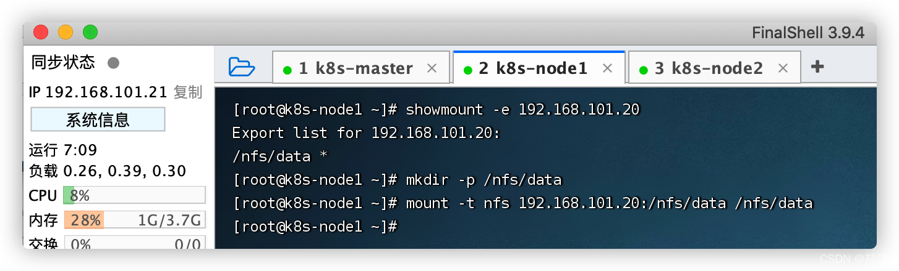

测试

```shell
# 在任意机器写入一个测试文件
echo "hello nfs server" > /nfs/data/test.txt

# 在其它机器查看数据
cat /nfs/data/test.txt
```

##### d、原生方式数据挂载

> master机器执行

```shell
# 先创建共享目录
mkdir -p /nfs/data/nginx-pv

cat <<EOF | sudo tee ./nginx-nfs.yaml

apiVersion: apps/v1
kind: Deployment
metadata:
  labels:
    app: nginx-pv-demo
  name: nginx-pv-demo
spec:
  replicas: 2
  selector:
    matchLabels:
      app: nginx-pv-demo
  template:
    metadata:
      labels:
        app: nginx-pv-demo
    spec:
      containers:
      - image: nginx
        name: nginx
        volumeMounts:
        - name: html
          mountPath: /usr/share/nginx/html
      volumes:
        - name: html
          nfs:
            server: 192.168.101.20 # 使用master机器ip地址
            path: /nfs/data/nginx-pv
            
EOF


# 创建
kubectl apply -f nginx-nfs.yaml
# 删除
# kubectl delete -f nginx-nfs.yaml

# 写入数据，然后访问测试
echo "hello nfs" > /nfs/data/nginx-pv/index.html
```

> tips: 如果删除服务，挂载的数据是不会删除的！

```shell
# 删除
kubectl delete -f nginx-nfs.yaml

# 查看挂载数据
cat /nfs/data/nginx-pv/index.html
```

#### 2、 PV&PVC -- 挂载目录

1. `PV`：持久卷（Persistent Volume），将应用需要持久化的数据保存到指定位置 ex: /nfs/data/nginx-pv
2. `PVC`：持久卷申明（Persistent Volume Claim），申明需要使用的持久卷规格 ex: 申请10MB

> ex: `pv01`给10MB `pv02`给1GB `pv03`给3GB；
> 1. 静态供应: 提前申请创建，而非要多大就动态创建多大。
> 2. 当一个pvc来申请10MB的时候，会给一个`pv01`的合适空间，而不是给`pv02`。
> 3. 如果删除pod和其下pvc时，关联`pv01`空间也会被回收。
> 4. 如果之后内容增长超过`pv0x`规定的空间大小将会报错。

##### a、创建pv池

> master机器执行

```shell
# nfs主节点创建3个文件夹
mkdir -p /nfs/data/01
mkdir -p /nfs/data/02
mkdir -p /nfs/data/03
```

创建PV

```shell
cat <<EOF | sudo tee ./pv.yaml

apiVersion: v1
kind: PersistentVolume
metadata:
  name: pv01-10m   # 注：小写
spec:
  capacity:
    storage: 10M  # 给10M空间
  accessModes:
    - ReadWriteMany   # 多节点可读可写
  storageClassName: nfs
  nfs:
    path: /nfs/data/01
    server: 192.168.101.20 # 使用master机器ip地址
---
apiVersion: v1
kind: PersistentVolume
metadata:
  name: pv02-1gi
spec:
  capacity:
    storage: 1Gi
  accessModes:
    - ReadWriteMany
  storageClassName: nfs
  nfs:
    path: /nfs/data/02
    server: 192.168.101.20
---
apiVersion: v1
kind: PersistentVolume
metadata:
  name: pv03-3gi
spec:
  capacity:
    storage: 3Gi
  accessModes:
    - ReadWriteMany
  storageClassName: nfs
  nfs:
    path: /nfs/data/03
    server: 192.168.101.20

EOF


# 创建
kubectl apply -f pv.yaml
# 删除
# kubectl delete -f pv.yaml

# 查看系统资源
kubectl get persistentvolume
```

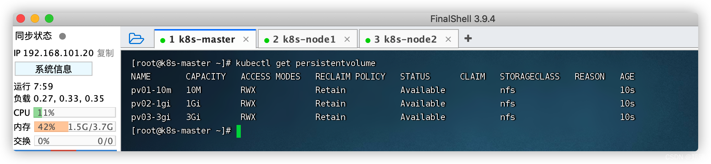

##### b、PVC创建与绑定

> master机器执行

创建PVC

```shell
cat <<EOF | sudo tee ./pvc.yaml

kind: PersistentVolumeClaim
apiVersion: v1
metadata:
  name: nginx-pvc
spec:
  accessModes:
    - ReadWriteMany
  resources:
    requests:
      storage: 200Mi
  storageClassName: nfs

EOF


# 应用
kubectl apply -f pvc.yaml

# 查看pv -- `CLAIM`会选择一个合适的空间`pv02`进行绑定 `default/nginx-pvc`
kubectl get pv

# 删除再查看 会发现`STATUS`值为`Released` 即空间被释放
kubectl delete -f pvc.yaml && kubectl get pv

# 再次应用会重新绑定 由于之前的`pv02`未释放，将会绑定`pv03`
kubectl apply -f pvc.yaml && kubectl get pv
```

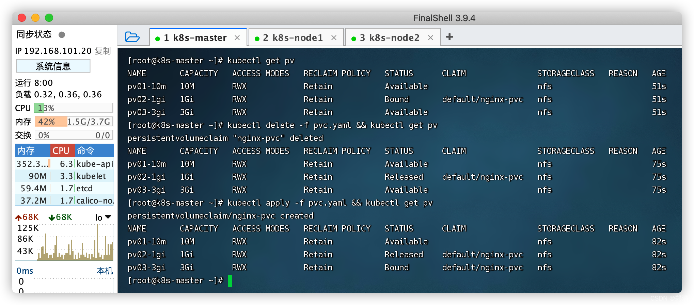

创建Pod绑定PVC

```shell
cat <<EOF | sudo tee ./pod-pvc.yaml

apiVersion: apps/v1
kind: Deployment
metadata:
  labels:
    app: nginx-deploy-pvc
  name: nginx-deploy-pvc
spec:
  replicas: 2
  selector:
    matchLabels:
      app: nginx-deploy-pvc
  template:
    metadata:
      labels:
        app: nginx-deploy-pvc
    spec:
      containers:
      - image: nginx
        name: nginx
        volumeMounts:
        - name: html
          mountPath: /usr/share/nginx/html
      volumes:
        - name: html
          persistentVolumeClaim:
            claimName: nginx-pvc

EOF


# 创建
kubectl apply -f pod-pvc.yaml
# 删除
# kubectl delete -f pod-pvc.yaml

# 查看pod正常启动
kubectl get pod

# 查看pvc,pv  --  `nginx-pvc`绑定挂载卷`pv03-3gi`
kubectl get pvc,pv

# 修改`pv03`查看内容是否变更
echo "hello 03" > /nfs/data/03/index.html
```

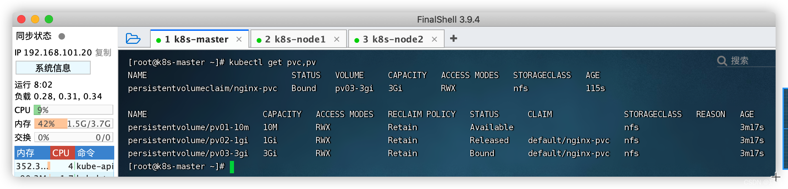
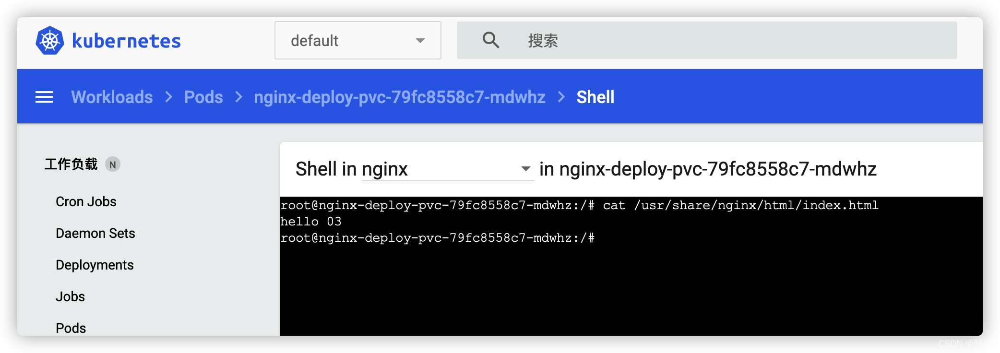

#### 3、ConfigMap -- 挂载配置文件

> 抽取应用配置，并且可以自动更新。
> redis示例

##### 1、将配置文件创建为配置集

```shell
# 创建redis配置文件
cat <<EOF | sudo tee ./redis.conf
appendonly yes
EOF

# 创建配置集，redis保存到k8s的etcd
kubectl create cm redis-conf --from-file=redis.conf

# 删除配置，创建好配置集，就不需要了...
rm -rf redis.conf

# 查看
kubectl get cm
kubectl get cm redis-conf -oyaml
```

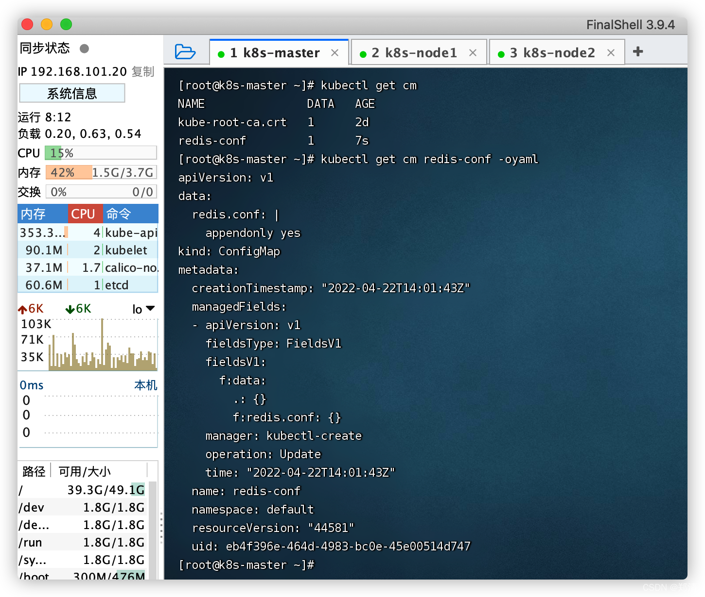

```yml
apiVersion: v1
data: # data是所有真正的数据
  redis.conf: |       # key：默认是文件名
    appendonly yes    # value：配置文件的内容
kind: ConfigMap
metadata:
  name: redis-conf
  namespace: default
```

##### 2、创建Pod

```shell
cat <<EOF | sudo tee ./pod-redis.yaml

apiVersion: v1
kind: Pod
metadata:
  name: redis
spec:
  containers:
  - name: redis
    image: redis
    command:
      - redis-server
      - "/redis-master/redis.conf"   # 指redis容器内部的位置
    ports:
    - containerPort: 6379
    volumeMounts:
    - mountPath: /data
      name: data
    - mountPath: /redis-master
      name: config
  volumes:
    - name: data
      emptyDir: {}
    - name: config
      configMap:
        name: redis-conf   # 对应上一步创建的`redis-conf`配置集
        items:
        - key: redis.conf
          path: redis.conf
            
EOF


# 创建
kubectl apply -f pod-redis.yaml
# 删除
# kubectl delete -f pod-redis.yaml
```

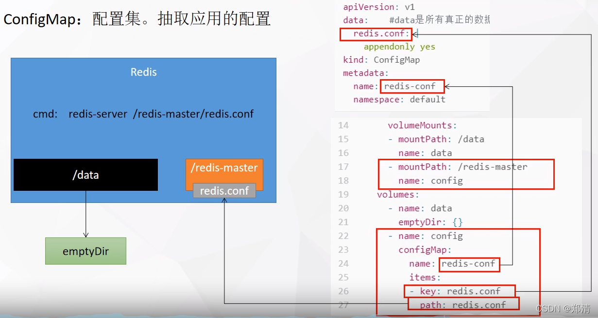

##### 3、查看

```shell
kubectl exec -it redis -- /bin/bash
cat /redis-master/redis.conf
```

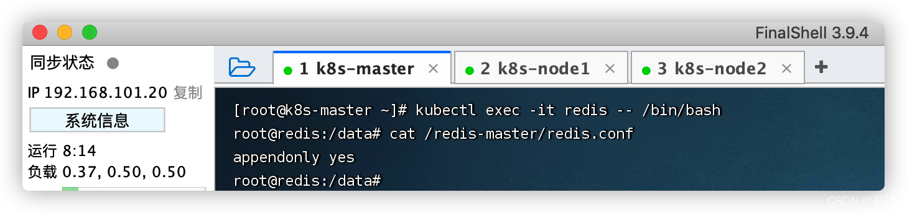

##### 4、修改ConfigMap

```shell
kubectl edit cm redis-conf
```


##### 5、检查配置是否更新

等一会儿查看配置，发现会自动将配置同步过来

```shell
kubectl exec -it redis -- /bin/bash
cat /redis-master/redis.conf

# 此配置需要redis重启之后才会生效 -- 原因：redis中间件自身无此配置热更新功能
redis-cli
127.0.0.1:6379> CONFIG GET appendonly
127.0.0.1:6379> CONFIG GET requirepass 
```

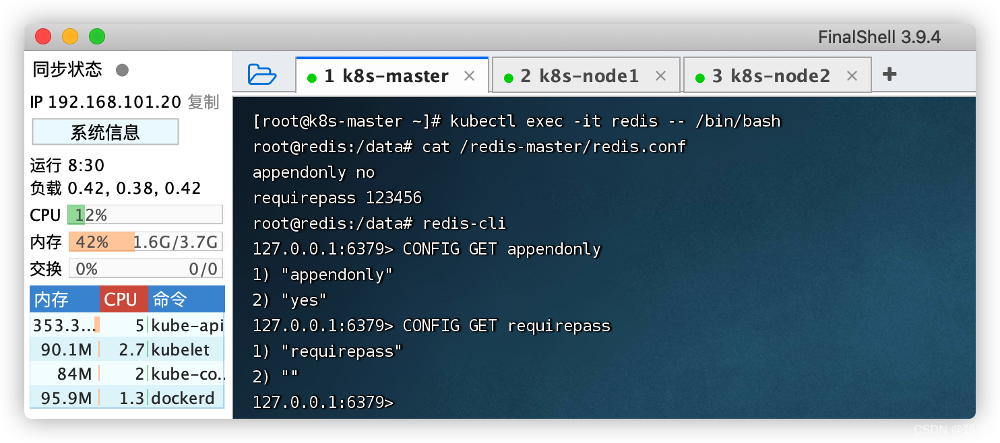
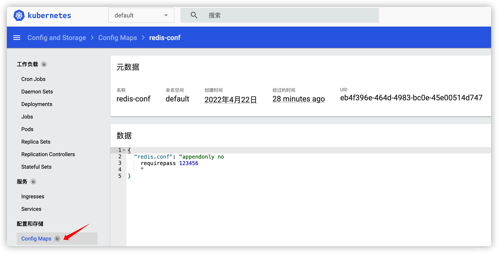

#### 4、Secret -- 保存密码等敏感数据

> Secret 对象类型用来保存敏感信息，ex：密码、OAuth令牌、SSH密钥。

```shell
# 命令格式
kubectl create secret docker-registry docker-secret-zhengqingya \
    --docker-server=镜像仓库服务器 \
    --docker-username=用户名 \
    --docker-password=密码 \
    --docker-email=邮箱地址

# ex:
kubectl create secret docker-registry docker-secret-zhengqingya \
    --docker-server=registry.cn-hangzhou.aliyuncs.com \
    --docker-username=zhengqingya \
    --docker-password=xxx \
    --docker-email=xxx@qq.com
  
# 查看
kubectl get secret
kubectl get secret docker-secret-zhengqingya -oyaml

# 对密码进行base64解密查看
echo 'emhxxxnLg==' | base64 --decode
```

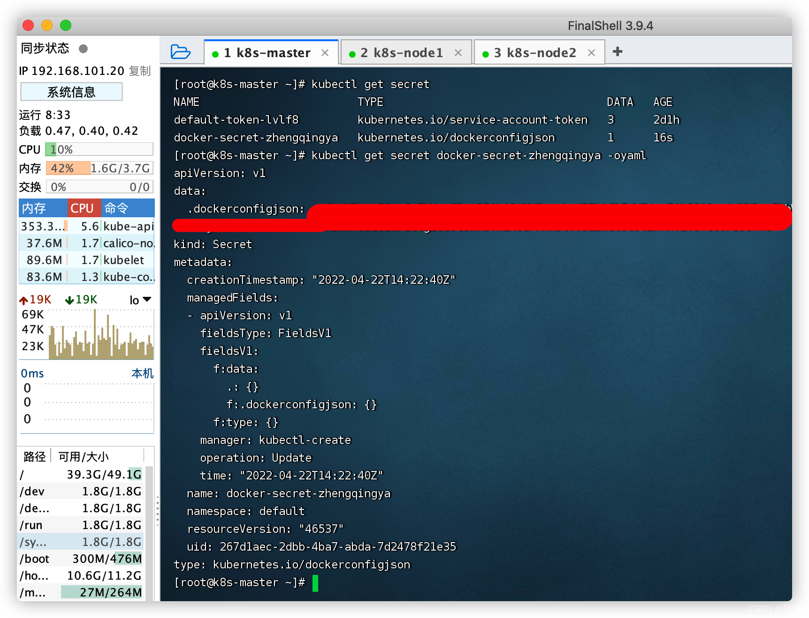

测试

```shell
cat <<EOF | sudo tee ./docker-secret-test.yaml

apiVersion: v1
kind: Pod
metadata:
  name: private-nginx
spec:
  containers:
  - name: private-nginx
    image: registry.cn-hangzhou.aliyuncs.com/zhengqing/nginx
  imagePullSecrets:
  - name: docker-secret-zhengqingya   # 使用自己的密钥信息
            
EOF


# 创建
kubectl apply -f docker-secret-test.yaml
# 删除
kubectl delete -f docker-secret-test.yaml
```

---

> 今日分享语句：
> 生活可以是甜的，也可以是苦的，但不能是没味的。你可以胜利，也可以失败，但你不能屈服。
