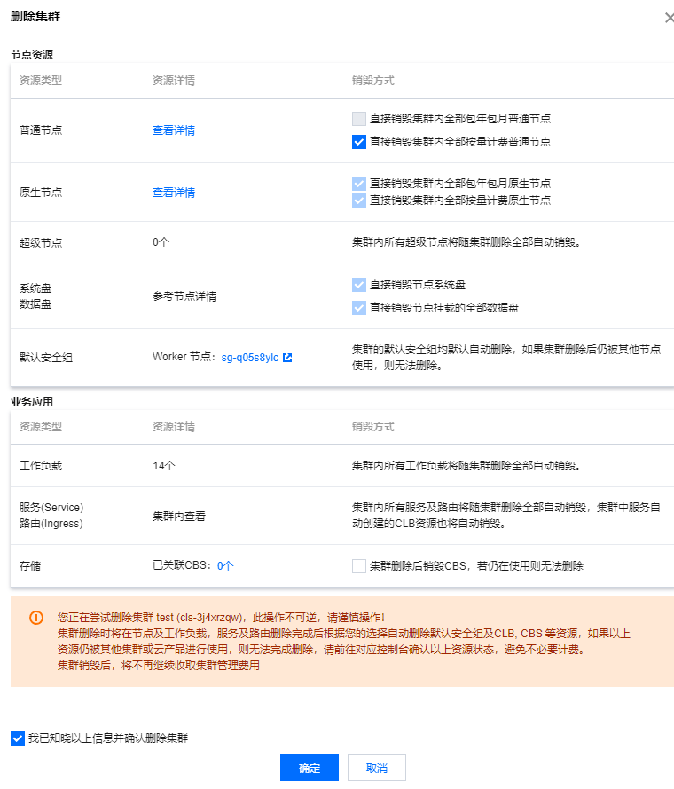

# 腾讯云TKE

https://console.cloud.tencent.com/tke2/cluster

> tips: 这里是用3台云机器按量收费，使用完之后记得删除相应资源，避免继续计费问题。

### 创建集群

> https://cloud.tencent.com/document/product/457/32189

> tips: 节点pod数量根据自己的情况配置哦，不然后面部署服务会报错：`FailedScheduling 0/3 nodes are available: 3 Too many pods.`

等待创建完成

完成

### 删除集群

> tips: 如果有保护，需要先关闭集群删除保护，再删除
> 如果是集群中创建的机器则会在删除集群时自动释放相关机器

