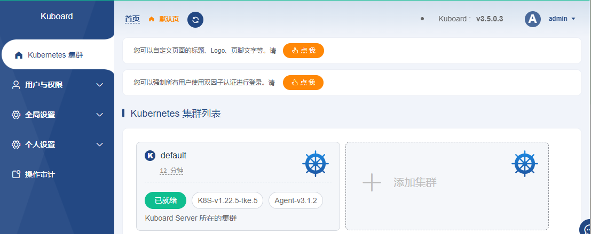

# K8S 安装 Kuboard v3

> 可参考： https://www.kuboard.cn
> 安装 Kuboard v3 - kubernetes => https://www.kuboard.cn/install/v3/install-in-k8s.html#%E5%AE%89%E8%A3%85

Kuboard 是基于 Kubernetes 的微服务管理界面。同时提供 Kubernetes 免费中文教程，入门教程。

```shell
# 安装
kubectl apply -f https://addons.kuboard.cn/kuboard/kuboard-v3.yaml

# tips: 腾讯云（以及其他云）托管 的 K8S 集群中  需额外执行命令
kubectl label nodes your-node-name k8s.kuboard.cn/role=etcd
# kubectl get nodes   查看节点名
# kubectl label nodes 10.0.0.12 k8s.kuboard.cn/role=etcd
kubectl delete daemonset kuboard-etcd -n kuboard
kubectl apply -f https://addons.kuboard.cn/kuboard/kuboard-v3.yaml

# 查看是否就绪
watch kubectl get pods -n kuboard
```

访问 Kuboard： `http://集群任意节点IP:30080`

- 用户名： admin
- 密码： Kuboard123




--- 

相关日志：

```shell
连接主机...
连接主机成功
Welcome to TencentOS 3 64bit
Version 3.1 20220921
tlinux3.1-64bit-5.4.119-19.0009-20220921
[root@VM-0-16-centos ~]# kubectl apply -f https://addons.kuboard.cn/kuboard/kuboard-v3.yaml
namespace/kuboard created
configmap/kuboard-v3-config created
serviceaccount/kuboard-boostrap created
clusterrolebinding.rbac.authorization.k8s.io/kuboard-boostrap-crb created
daemonset.apps/kuboard-etcd created
deployment.apps/kuboard-v3 created
service/kuboard-v3 created
[root@VM-0-16-centos ~]# kubectl get nodes
NAME        STATUS   ROLES    AGE   VERSION
10.0.0.16   Ready    <none>   15m   v1.22.5-tke.5
10.0.0.4    Ready    <none>   15m   v1.22.5-tke.5
10.0.0.9    Ready    <none>   15m   v1.22.5-tke.5
[root@VM-0-16-centos ~]# kubectl label nodes 10.0.0.16 k8s.kuboard.cn/role=etcd
node/10.0.0.16 labeled
[root@VM-0-16-centos ~]# kubectl delete daemonset kuboard-etcd -n kuboard
daemonset.apps "kuboard-etcd" deleted
[root@VM-0-16-centos ~]# kubectl apply -f https://addons.kuboard.cn/kuboard/kuboard-v3.yaml
namespace/kuboard unchanged
configmap/kuboard-v3-config unchanged
serviceaccount/kuboard-boostrap unchanged
clusterrolebinding.rbac.authorization.k8s.io/kuboard-boostrap-crb unchanged
daemonset.apps/kuboard-etcd created
deployment.apps/kuboard-v3 unchanged
service/kuboard-v3 unchanged
[root@VM-0-16-centos ~]# watch kubectl get pods -n kuboard
Every 2.0s: kubectl get pods -n kuboard                                                                                                                                                         VM-0-16-centos: Fri Nov  4 09:53:03 2022

NAME                               READY   STATUS    RESTARTS      AGE
kuboard-agent-2-589c6dd588-7wjwc   1/1     Running   2 (34s ago)   42s
kuboard-agent-7484bf754d-9thqd     1/1     Running   2 (34s ago)   42s
kuboard-etcd-klzrc                 1/1     Running   0             2m20s
kuboard-v3-5fc46b5557-skxrd        1/1     Running   1 (62s ago)   2m42s
```

# 卸载

```shell
# 卸载
kubectl delete -f https://addons.kuboard.cn/kuboard/kuboard-v3.yaml

# 清理遗留数据 -- 在 master 节点以及带有 k8s.kuboard.cn/role=etcd 标签的节点上执行
rm -rf /usr/share/kuboard
```
