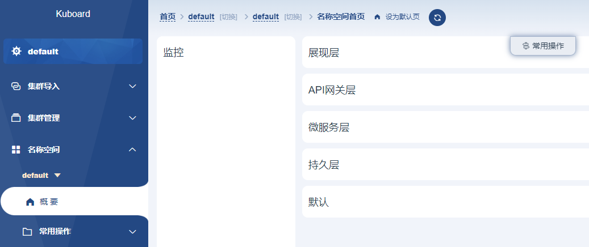
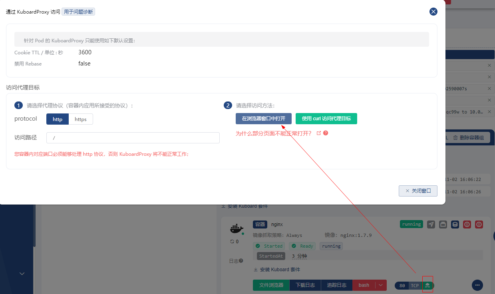
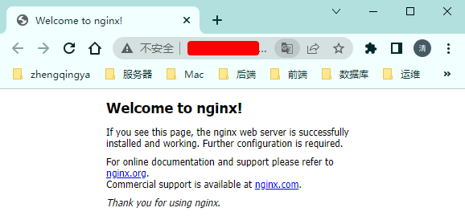

# 部署第一个程序

在k8s上部署一个实例的nginx应用程序

### 1、选择集群

点击一个`已就绪`的集群 ，选择使用`ServiceAccount kuboard-admin`并点击`default`名称空间 将切换到 default 名称空间首页

### 2、创建工作负载

点击左侧菜单的 `创建工作负载`，将打开工作负载编辑器

#### 2.1、基本信息

填写表单如下

| 字段名   | 填写内容   | 备注                                                    |
| -------- | ---------- | ------------------------------------------------------- |
| 服务类型 | Deployment |                                                         |
| 服务分层 | 展现层     | Kuboard使用这个字段确定将部署显示在微服务架构的哪个分层 |
| 服务名称 | nginx      | 服务分层的前缀 + 服务名 组成最终的 K8S Deployment name  |
| 副本数   | 1          | replicas                                                |

#### 2.2、添加工作容器

点击 容器信息 Tab 页，在 容器信息 Tab 页中点击 添加工作容器 按钮

填写表单如下

| 字段名   | 填写内容    | 备注                        |
| -------- | ----------- | --------------------------- |
| 容器名称 | nginx       |                             |
| 镜像     | nginx:1.7.9 |                             |
| 抓取策略 | Always      | 每次创建 Pod 都尝试抓取镜像 |
| Ports    | TCP : 80    | 该容器组监听 TCP 80 端口    |

#### 2.3 保存 -> 应用 -> 确定

查看应用部署结果

#### 2.4、测试访问

