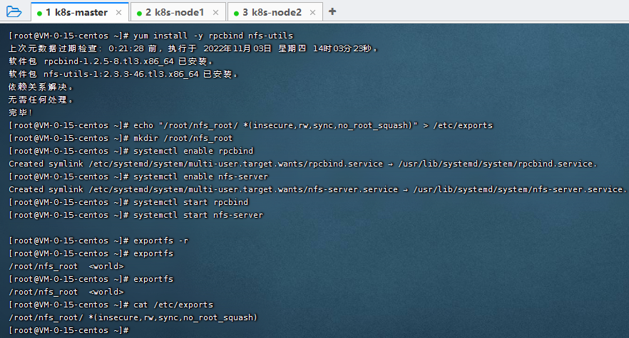
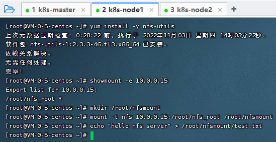
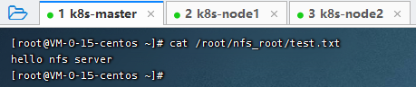
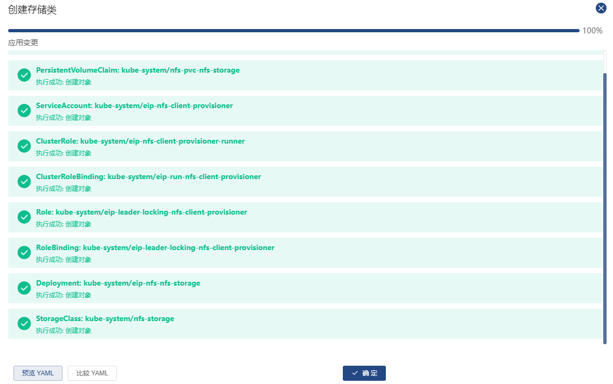
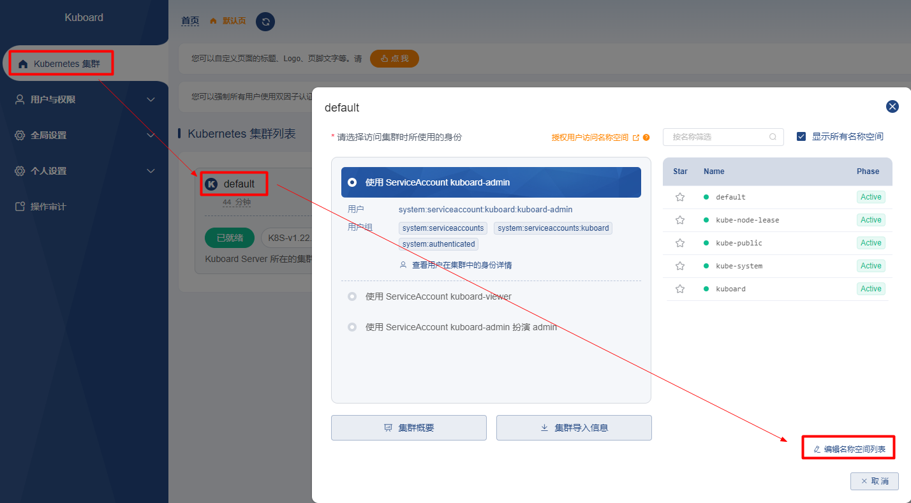

# 环境准备

| 机器        | 说明       |
|-----------| ---------- |
| 10.0.0.15 | k8s-master |
| 10.0.0.5  | k8s-node1  |
| 10.0.0.16 | k8s-node2  |

### 1、准备一个有效的存储类

这里使用 NFS 作为存储类

#### 1.1、`[主节点]` 搭建NFS Server

```shell
# 安装 nfs 服务器所需的软件包
yum install -y rpcbind nfs-utils


# 创建 exports 文件
echo "/root/nfs_root/ *(insecure,rw,sync,no_root_squash)" > /etc/exports


# 启动 nfs 服务
mkdir /root/nfs_root

systemctl enable rpcbind
systemctl enable nfs-server

systemctl start rpcbind
systemctl start nfs-server
exportfs -r

# 检查配置是否生效
exportfs
# 输出结果如下所示
# /root/nfs_root  <world>
```



#### 1.2、`[从节点]` 在客户端测试nfs

```shell
# 安装 nfs 客户端所需的软件包
yum install -y nfs-utils

# 执行以下命令检查 nfs 服务器端是否有设置共享目录
# showmount -e $(nfs服务器的IP)   -- tips: 使用内网IP
showmount -e 10.0.0.15
# 输出结果如下所示
# Export list for 10.0.0.15:
# /root/nfs_root *

# 执行以下命令挂载 nfs 服务器上的共享目录到本机路径 /root/nfsmount
mkdir /root/nfsmount
# mount -t nfs $(nfs服务器的IP):/root/nfs_root /root/nfsmount
mount -t nfs 10.0.0.15:/root/nfs_root /root/nfsmount
# 写入一个测试文件
echo "hello nfs server" > /root/nfsmount/test.txt
```



`[主节点]` 在 nfs 服务器上执行以下命令，验证文件写入成功

```shell
cat /root/nfs_root/test.txt
```



### 2、在Kuboard中创建 NFS 存储类

`集群管理` -> `概要` -> `创建存储类`




完成


### 3、创建 Kubernetes 名称空间

创建一个 Kubernetes 名称空间用于部署 SpringBlade，ex:`spring-blade`

`打开 Kuboard 首页` -> `选择一个已就绪的集群` -> `编辑名称空间列表` -> `创建名称空间`




