# 部署Nacos

### 1、部署nacos-mysql

#### 1.1、创建 StatefulSet

> `StatefulSet`: 有状态应用 ex: redis、mysql

`名称空间` -> `spring-blade` -> `常用操作` -> `创建工作负载`

###### ->`基本信息`

| 字段名称     | 字段值        | 备注                                         |
| ------------ | ------------- | -------------------------------------------- |
| 工作负载类型 | `StatefulSet` |                                              |
| 工作负载分层 | `持久层`      | 填写后将自动添加 `k8s.kuboard.cn/layer` 标签 |
| 工作负载名称 | `nacos-mysql` | 填写后将自动添加 `k8s.kuboard.cn/name` 标签  |
| 副本数       | `1`           |                                              |


###### -> `容器信息`

-> `添加工作容器`

| 字段名称    | 字段值                                                                                                          | 备注                                         |
|---------|--------------------------------------------------------------------------------------------------------------| -------------------------------------------- |
| 名称      | `mysql`                                                                                                      |                                              |
| 容器镜像    | `swr.cn-east-2.myhuaweicloud.com/blade/nacos-mysql:5.7`                                                         |                                              |
| 镜像拉取策略  | `始终拉取新镜像（Always）`                                                                                            |                                              |
| 环境变量    | `MYSQL_ALLOW_EMPTY_PASSWORD`=`1` `MYSQL_DATABASE`=`nacos_test` `MYSQL_USER`=`nacos` `MYSQL_PASSWORD`=`nacos` | 类型为 `值`，点击 `名值对` 按钮可添加一组 |
| 资源请求/限制 | 内存资源请求：`100Mi` 内存资源限制：`1000Mi`                                                                               |                                              |
| 容器端口    | `mysql` `3306`                                                                                               |                                              |


`健康检查` -> `容器启动检查探针` -> `启用`

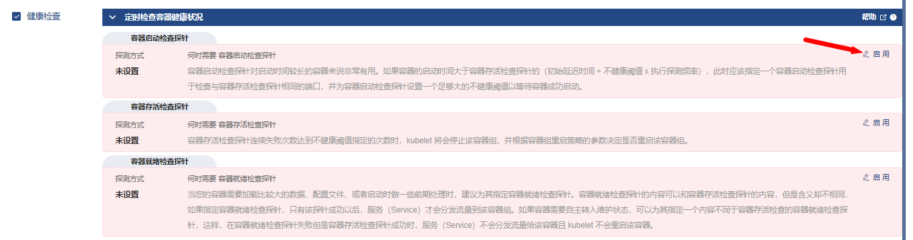

| 字段名称       | 字段值                             | 备注                                                         |
| -------------- | ---------------------------------- | ------------------------------------------------------------ |
| 探针类型       | `命令行`                           |                                                              |
| Command        | `mysql -h 127.0.0.1 -e 'select 1'` |                                                              |
| 初始延迟（秒） | `30`                               |                                                              |
| 不健康阈值     | `20`                               | 执行探测频率 * 不健康阈值 = 10 * 20 = 200秒， 容器创建 200 秒后，Command `mysql -h 127.0.0.1 -e 'select 1'` 如果仍未执行成功，kubelet 将认为该容器启动失败， 并强制重启该容器。 |


`健康检查` -> `容器存活检查探针` -> `启用`

| 字段名称       | 字段值            | 备注                                                         |
| -------------- | ----------------- | ------------------------------------------------------------ |
| 探针类型       | `命令行`          |                                                              |
| Command        | `mysqladmin ping` |                                                              |
| 初始延迟（秒） | `30`              |                                                              |
| 不健康阈值     | `3`               | 连续3此失败后，kubelet 将认为该容器已经不健康，并强制重启该容器 |

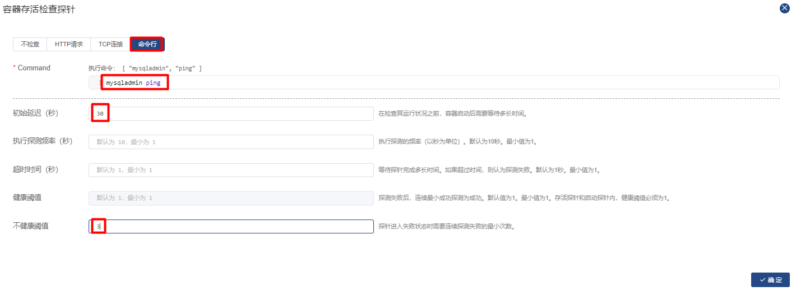

`健康检查` -> `容器就绪检查探针` -> `启用`

| 字段名称       | 字段值                             | 备注                                                         |
| -------------- | ---------------------------------- | ------------------------------------------------------------ |
| 探针类型       | `命令行`                           |                                                              |
| Command        | `mysql -h 127.0.0.1 -e 'select 1'` |                                                              |
| 初始延迟（秒） | `30`                               |                                                              |
| 健康阈值       | `2`                                | 探针连续执行成功 2 次以后，kubelet 认为该容器已就绪，并将其添加到对应 Service （如果有）的 Endpoint 中，Service 此时可以分发流量到该容器 |
| 不健康阈值     | `3`                                | 探针连续执行失败 3 此以后，kubelet 认为该容器已经不健康，并强制重启该容器 |

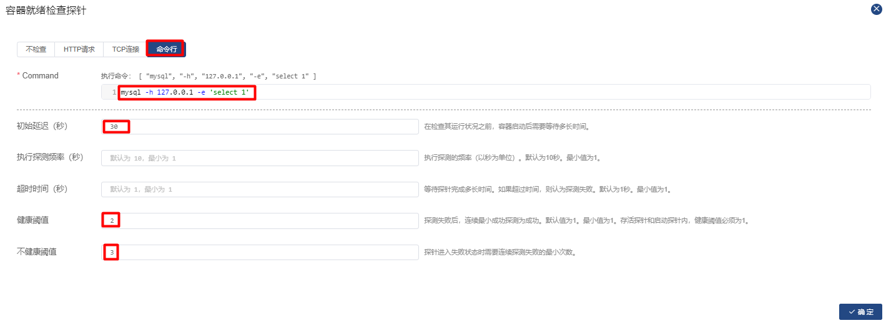

完成健康检查后如下：

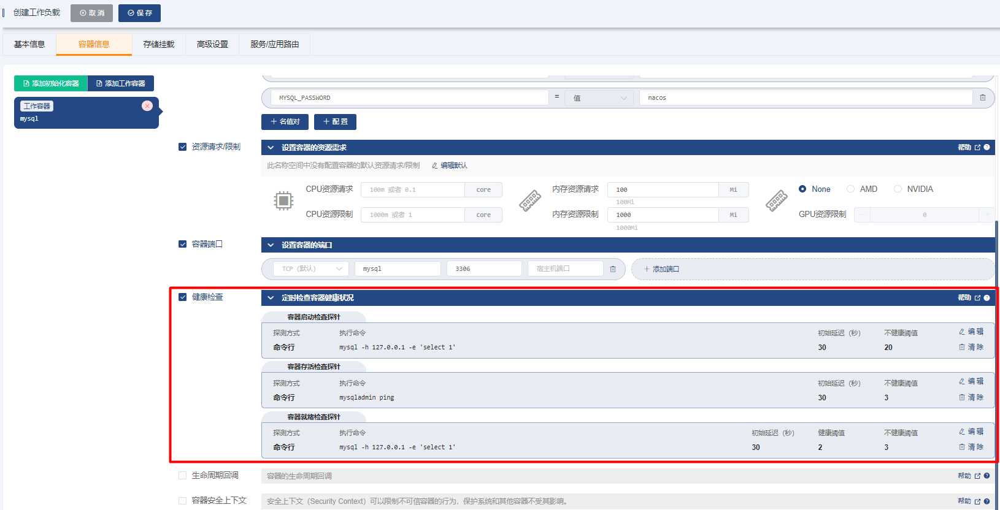

###### -> `存储挂载`

添加存储卷声明模板

| 字段名称               | 字段值             | 备注                                                         |
| ---------------------- | ------------------ | ------------------------------------------------------------ |
| 名称                   | `data`             |                                                              |
| 存储类                 | `cephfs-raspberry` | * 下拉选择，根据您集群环境的不同，此参数的值可以 不一样，但是对应的存储类必须为有效的存储类，并 能够动态提供存储卷 |
| 分配模式               | `动态分配`         |                                                              |
| 读写模式               | `可被多节点读写`   |                                                              |
| 总量                   | `2Gi`              |                                                              |
| mysql 容器中的挂载类型 | `读写`             |                                                              |
| mysql 容器中的挂载路径 | `/var/lib/mysql`   |                                                              |

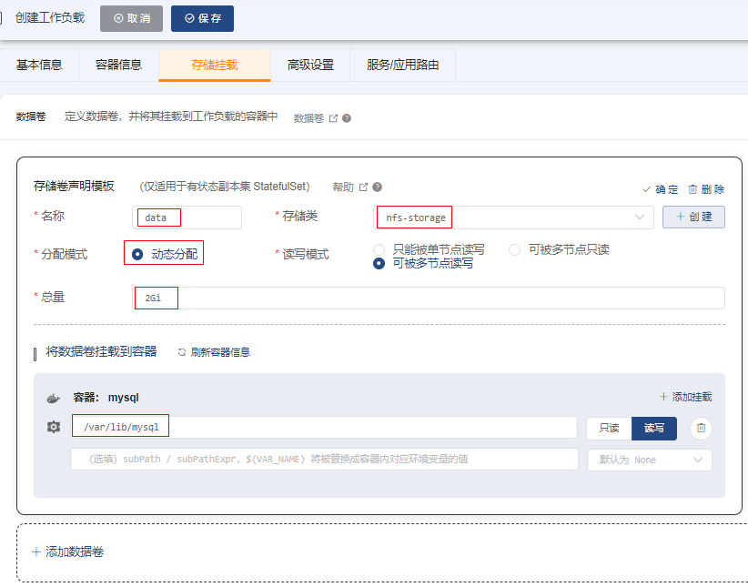

###### -> `高级设置`

| 字段名称       | 字段值                      | 备注                                                         |
| -------------- | --------------------------- | ------------------------------------------------------------ |
| 容器组管理策略 | `Parallel`                  | 不按容器组的序号顺序更新容器组。（此为测试环境，mysql 只部署 一个副本，不考虑主从的情况，否则此参数不能选择 `Parallel`） |
| 历史版本数量   | `10`                        |                                                              |
| 更新策略       | `滚动更新（RollingUpdate）` |                                                              |
| 分割点         | `0`                         | 从序号为 `0` 的容器组开始更新 StatefulSet 中的所有容器组     |


###### -> `服务/应用路由`

| 字段名称 | 字段值                      | 备注                                              |
| -------- | --------------------------- | ------------------------------------------------- |
| 服务类型 | `Headless`                  | 无头 Service，专用于 StatefulSet                  |
| 端口     | `mysql` `TCP` `3306` `3306` | 将容器的 `3306` 端口映射到 Service 的 `3306` 端口 |

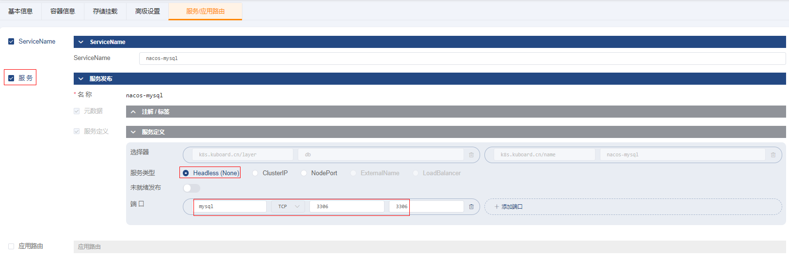

保存操作，并等候一定的时间，界面如下


> 失败事件说明：
> - `FailedSchedule`，原因是容器组所需要的存储卷声明尚未成功绑定，待存储类动态提供存储卷之后，容器组就立刻进入 `已调度` 的状态；
> - `Unhealthy`，点击 `追踪日志` 的按钮，可以看到，此 mysql 容器在第一次启动时会执行数据初始化的工作，因此启动过程耗时较长，
    > 整个启动过程中，kubelet 执行了 2 次失败的 `Startup probe failed` `容器启动检查探针`，
    > 只要这个次数在前面定义的 `容器启动检查探针` -> `不健康阈值` 的范围之内，kubelet 仍将继续等待该容器的启动，否则 kublet 将强制重启该容器。

#### 1.2、验证部署结果

进入 `bash` 界面

```shell
mysql
show databases;
```


### 2、部署nacos

#### 2.1、创建 StatefulSet

`名称空间` -> `spring-blade` -> `常用操作` -> `创建工作负载`

###### ->`基本信息`

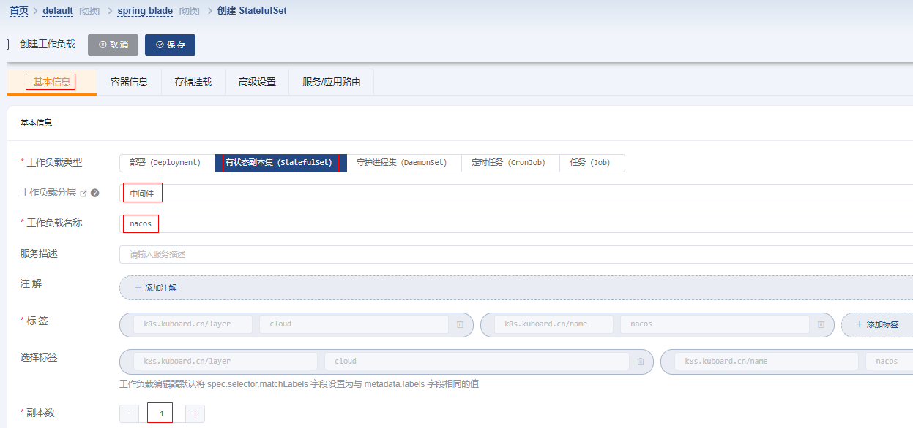

###### -> `容器信息`

| 字段名称            | 字段值                                                                                                                                                                                                                                                                                    | 备注                                      |
| ------------------- |----------------------------------------------------------------------------------------------------------------------------------------------------------------------------------------------------------------------------------------------------------------------------------------| ----------------------------------------- |
| 名称                | `nacos`                                                                                                                                                                                                                                                                                |                                           |
| 容器镜像            | `swr.cn-east-2.myhuaweicloud.com/blade/nacos-server:2.0.0`                                                                                                                                                                                                                                  |                                           |
| 镜像拉取策略        | `始终拉取新镜像（Always）`                                                                                                                                                                                                                                                                      |                                           |
| 环境变量            | `MODE` = `standalone` `PREFER_HOST_MODE` = `hostname` `SPRING_DATASOURCE_PLATFORM` = `mysql` `MYSQL_SERVICE_HOST` = `nacos-mysql-0.nacos-mysql` `MYSQL_SERVICE_DB_NAME` = `nacos_test` `MYSQL_SERVICE_PORT` = `3306` `MYSQL_SERVICE_USER` = `nacos` `MYSQL_SERVICE_PASSWORD` = `nacos` | 类型为 `值`，点击 `名值对` 按钮可添加一组 |
| 资源请求/限制       | 内存资源请求：`200Mi` 内存资源限制：`2048Mi`                                                                                                                                                                                                                                                         |                                           |
| 容器端口            | `client` `8848` `client-rpc` `9848` `raft-rpc` `9849`                                                                                                                                                                                                                                  |                                           |

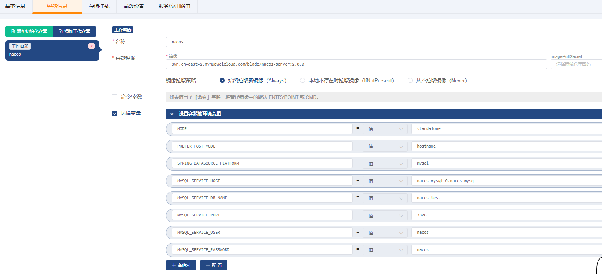

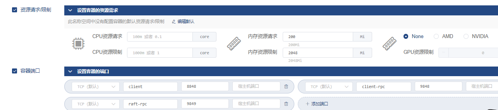

`健康检查` -> `容器启动检查探针` -> `启用`

| 字段名称       | 字段值                                                       | 备注                                                         |
| -------------- | ------------------------------------------------------------ | ------------------------------------------------------------ |
| 探针类型       | `HTTP请求`                                                   |                                                              |
| HttpGet        | 端口 `8848` 路径`/nacos/v1/ns/instance/list?serviceName=nacos` |                                                              |
| 初始延迟（秒） | `30`                                                         |                                                              |
| 不健康阈值     | `20`                                                         | 执行探测频率 * 不健康阈值 = 10 * 20 = 200秒，容器创建 200 秒后，HttpGet `http://${podIP}:8848/nacos/v1/ns/instance/list?serviceName=nacos` 如果仍未执行成功，kubelet 将认为该容器启动失败，并强制重启该容器。 |


`健康检查` -> `容器存活检查探针` -> `启用`

| 字段名称         | 字段值                                                       | 备注                                                         |
| ---------------- | ------------------------------------------------------------ | ------------------------------------------------------------ |
| 探针类型探针类型 | `HTTP请求`                                                   |                                                              |
| HttpGetCommand   | 端口 `8848` 路径 `/nacos/v1/ns/instance/list?serviceName=nacos` |                                                              |
| 初始延迟（秒）   | `30`                                                         |                                                              |
| 不健康阈值       | `3`                                                          | 连续3此失败后，kubelet 将认为该容器已经不健康，并强制重启该容器 |

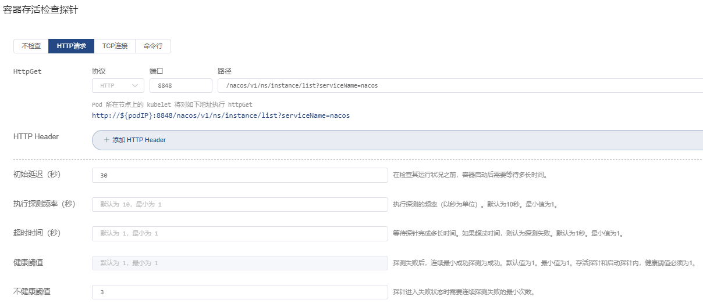

`健康检查` -> `容器就绪检查探针` -> `启用`

| 字段名称         | 字段值                                                       | 备注                                                         |
| ---------------- | ------------------------------------------------------------ | ------------------------------------------------------------ |
| 探针类型探针类型 | `HTTP请求`                                                   |                                                              |
| HttpGetCommand   | 端口 `8848` 路径 `/nacos/v1/ns/instance/list?serviceName=nacos` |                                                              |
| 初始延迟（秒）   | `30`                                                         |                                                              |
| 健康阈值         | `2`                                                          | 探针连续执行成功 2 次以后，kubelet 认为该容器已就绪，并将其添加到对应 Service （如果有）的 Endpoint 中，Service 此时可以分发流量到该容器 |
| 不健康阈值       | `3`                                                          | 探针连续执行失败 3 此以后，kubelet 认为该容器已经不健康，并强制重启该容器 |

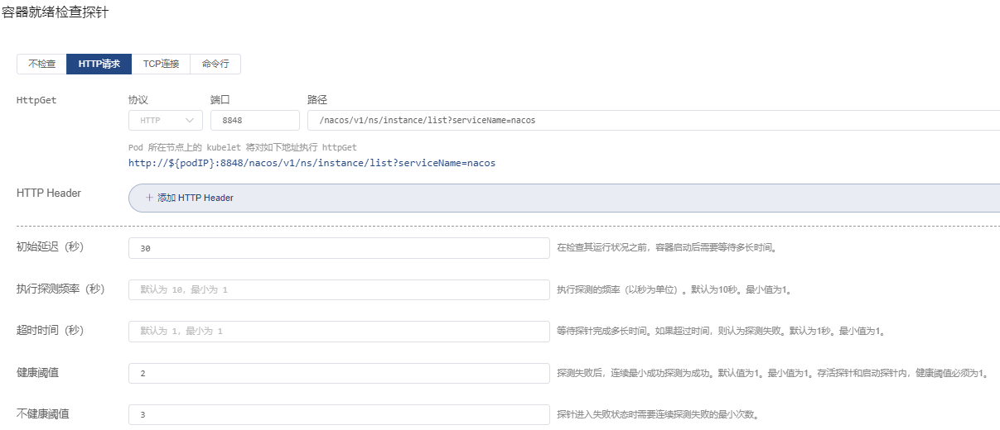

完成健康检查后如下：

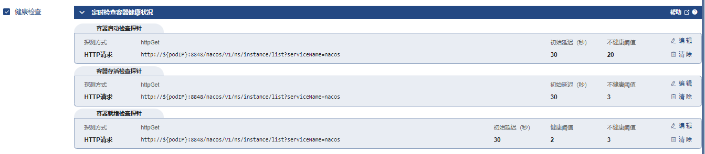

###### -> `存储挂载`

添加存储卷声明模板

| 字段名称              | 字段值             | 备注                                                                                       |
| --------------------- | ------------------ |------------------------------------------------------------------------------------------|
| 名称                  | `logs`             |                                                                                          |
| 存储类                | `cephfs-raspberry` | * 下拉选择，根据您集群环境的不同，此参数的值可以 不一样，但是对应的存储类必须为有效的存储类，并 能够动态提供存储卷                              |
| 分配模式              | `动态分配`         |                                                                                          |
| 读写模式              | `可被多节点读写`   |                                                                                          |
| 总量                  | `2Gi`              |                                                                                          |
| nacos容器中的挂载类型 | `读写`             |                                                                                          |
| nacos容器中的挂载路径 | `/home/nacos/logs` | Nacos 存储日志的位置。StatefuSet 的 `存储卷声明模板` 会为每个容器组分配一个存储卷声明，以便存在多个 nacos 副本时，每个副本的日志文件不会产生冲突。 |

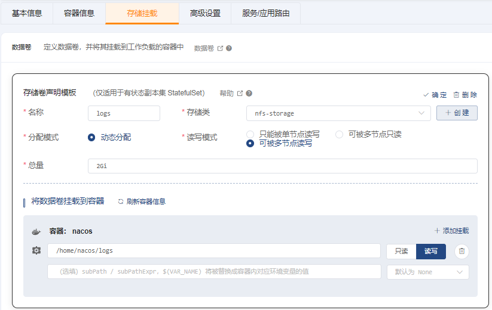

`添加数据卷` -> `创建`

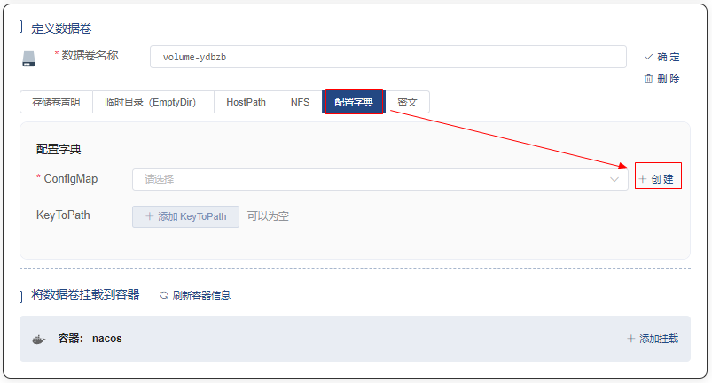

| 字段名称 | 字段值                                                       | 备注                                               |
| -------- | ------------------------------------------------------------ | -------------------------------------------------- |
| 名称     | nacos-config                                                 | 配置字典的名称                                     |
| 数据     | `custom.properties` #spring.security.enabled=false #management.security=false #security.basic.enabled=false #nacos.security.ignore.urls=/** #management.metrics.export.elastic.host=http://localhost:9200 # metrics for prometheus management.endpoints.web.exposure.include=*  # metrics for elastic search #management.metrics.export.elastic.enabled=false #management.metrics.export.elastic.host=http://localhost:9200  # metrics for influx #management.metrics.export.influx.enabled=false #management.metrics.export.influx.db=springboot #management.metrics.export.influx.uri=http://localhost:8086 #management.metrics.export.influx.auto-create-db=true #management.metrics.export.influx.consistency=one #management.metrics.export.influx.compressed=true | nacos的配置文件内容作为 `custom.properties` 的取值 |


保存后，可`名称空间` -> `spring-blade` -> `配置中心` -> `配置字典` 中管理刚才创建的配置字典。


继续完善StatefulSet的数据卷配置

| 字段名称                | 字段值                                    | 备注               |
| ----------------------- |----------------------------------------| ------------------ |
| 名称                    | `volume-ydbzb`                         | 自动生成的名称即可 |
| 数据卷类型              | `配置字典`                                 |                    |
| KeyToPath                | `custom.properties` -> `custom.properties`                |                    |
| nacos容器中的挂载类型   | `只读`                                   |                    |
| nacos容器中的挂载路径   | `/home/nacos/init.d/custom.properties` |                    |
| nacos容器中的挂载子路径 | `custom.properties`                    |                    |


###### -> `高级设置`

| 字段名称       | 字段值                      | 备注                                                         |
| -------------- | --------------------------- | ------------------------------------------------------------ |
| 容器组管理策略 | `Parallel`                  | 不按容器组的序号顺序更新容器组。（此为测试环境，mysql 只部署 一个副本，不考虑主从的情况，否则此参数不能选择 `Parallel`） |
| 历史版本数量   | `10`                        |                                                              |
| 更新策略       | `滚动更新（RollingUpdate）` |                                                              |
| 分割点         | `0`                         | 从序号为 `0` 的容器组开始更新 StatefulSet 中的所有容器组     |


###### -> `服务/应用路由`

| 字段名称 | 字段值                                                       | 备注                                                         |
| -------- | ------------------------------------------------------------ | ------------------------------------------------------------ |
| 服务类型 | `NodePort`                                                   | `NodePort` 类型的Service，可以将容器端口映射到集群中任意节点的节点端口 |
| 端口     | 端口名称： `nacos-client` 协 议：`TCP` 服务端口： `8848` 节点端口： `32000` 容器端口： `8848` | 将容器的 `8848` 端口映射到 Service 的 `8848` 端口以及任意节点的 `32000` 端口 |
| 会话保持 | `ClientIP` timeoutSeconds：`10800`                           |                                                              |

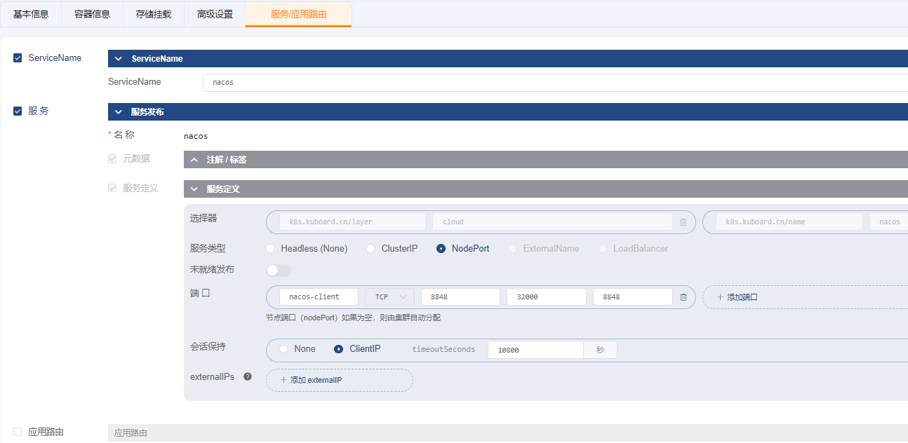

保存操作

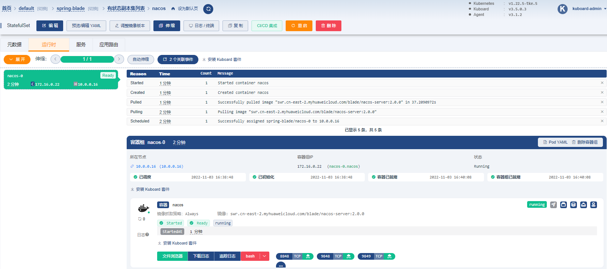

#### 2.2、验证部署结果

点击 容器端口 8848 后面对应的绿色图标，修改 `访问路径` 字段后，点击 `在浏览器窗口打开` 按钮，将会打开一个新的窗口


也可以访问 `http://任意节点IP地址:32000/nacos`

- 用户名：nacos
- 密码： nacos


### 3、导入配置到nacos

##### 3.1、导入配置

| 字段名   | 字段值                                                       | 备注                                                         |
| -------- | ------------------------------------------------------------ | ------------------------------------------------------------ |
| Data ID  | `blade.yaml`                                                 |                                                              |
| Group    | `DEFAULT_GROUP`                                              |                                                              |
| 配置格式 | `YAML`                                                       |                                                              |
| 配置内容 | 链接 https://gitee.com/smallc/SpringBlade/raw/v3.0.3/doc/nacos/blade.yaml 中的内容 | 在浏览器打开该链接，并将其内容复制粘贴到 `配置内容` 字段 |

| 字段名   | 字段值                                                       | 备注                                                         |
| -------- | ------------------------------------------------------------ | ------------------------------------------------------------ |
| Data ID  | `    blade-test.yaml`                                                 |                                                              |
| Group    | `DEFAULT_GROUP`                                              |                                                              |
| 配置格式 | `YAML`                                                       |                                                              |
| 配置内容 | 链接 https://gitee.com/smallc/SpringBlade/raw/v3.0.3/script/kuboard/blade-k8s.yaml 中的内容 | 在浏览器打开该链接，并将其内容复制粘贴到 `配置内容` 字段 |


##### 3.2、验证配置存储

在 Kuboard 中切换到 StatefulSet `nacos-mysql` 的详情页中，点击 `sh` 按钮，打开终端界面

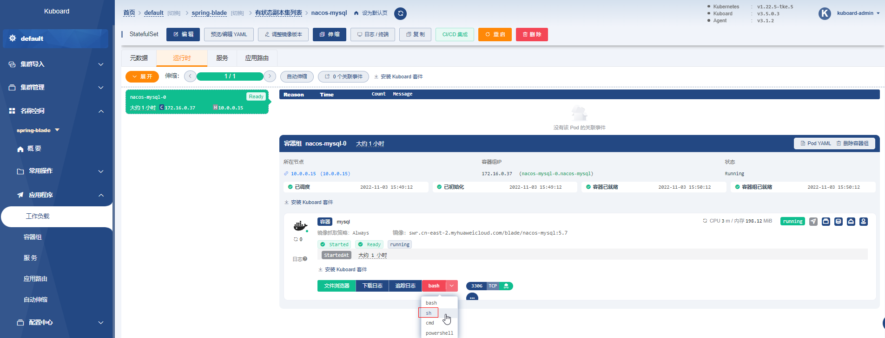

```shell
mysql
use nacos_test;
select data_id, group_id, gmt_create from config_info;
```


