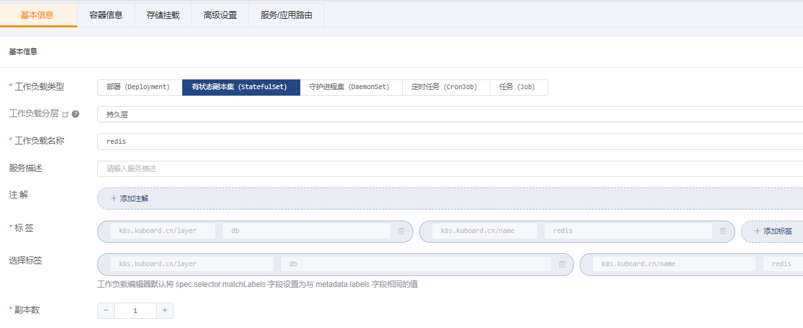
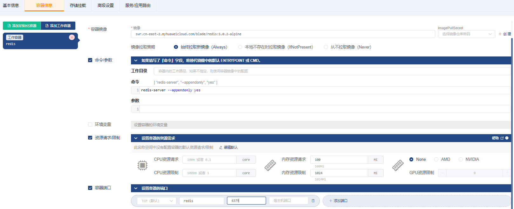
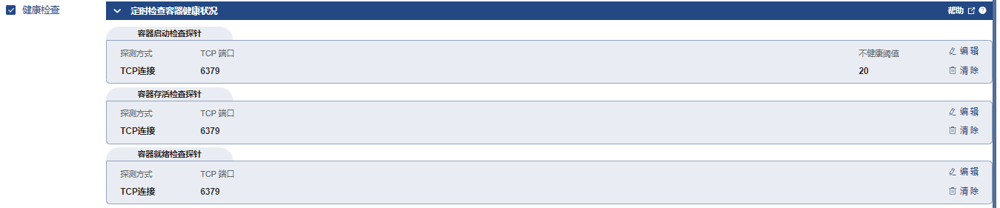
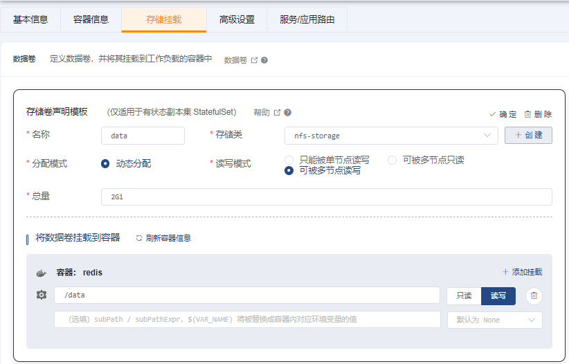
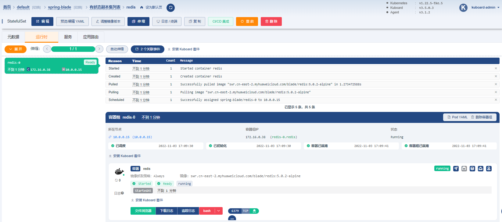

# 部署Redis

### 1、创建 StatefulSet

#### ->`基本信息`

#### ->`容器信息`

| 字段名称            | 字段值                                            | 备注 |
|-----------------|------------------------------------------------| ---- |
| 名称              | `redis`                                        |      |
| 容器镜像            | `swr.cn-east-2.myhuaweicloud.com/blade/redis:5.0.2-alpine` |      |
| 镜像拉取策略          | `始终拉取新镜像（Always）`                              |      |
| 命令参数            | 命令 `redis-server --appendonly yes`             |      |
| 资源请求/限制         | 内存资源请求：`100Mi` 内存资源限制：`1024Mi`                 |      |
| 容器端口            | `TCP` `redis` `6379`                           |      |
| 健康检查-->容器启动检查探针 | 探测方式： `TCP连接` TCP端口： `6379` 不健康阈值：`20`         |      |
| 健康检查-->容器存活检查探针 | 探测方式： `TCP连接` TCP端口： `6379`                    |      |
| 健康检查-->容器就绪检查探针 | 探测方式： `TCP连接` TCP端口： `6379`                    |      |

#### ->`存储挂载`

#### ->`高级设置`

#### ->`服务/应用路由`

保存操作

### 2、验证部署结果

