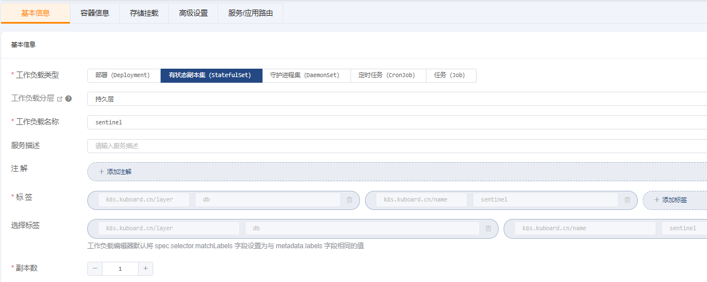
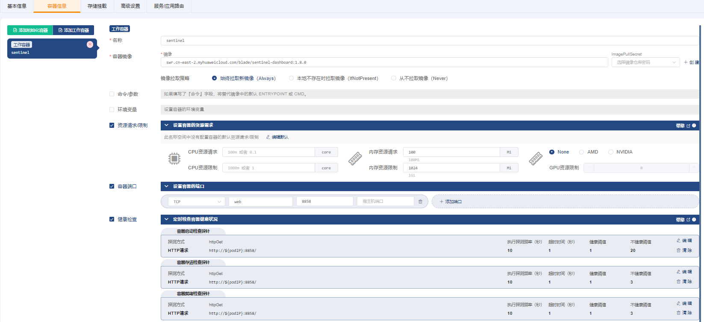
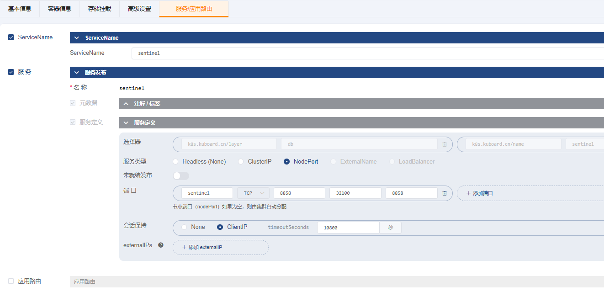

# 部署Sentinel

### 1、创建 StatefulSet

##### ->`基本信息`

##### ->`容器信息`

|                          |                                                                  |      |
| ------------------------ |------------------------------------------------------------------| ---- |
| 字段名称                 | 字段值                                                              | 备注 |
| 名称                     | `sentinel`                                                       |      |
| 容器镜像         | `swr.cn-east-2.myhuaweicloud.com/blade/sentinel-dashboard:1.8.0` |      |
| 镜像拉取策略             | `始终拉取新镜像（Always）`                                                |      |
| 资源请求/限制            | 内存资源请求：`100Mi` 内存资源限制：`1024Mi`                                   |      |
| 容器端口                 | `TCP` `web` `8858`                                               |      |
| 健康检查-->容器启动检查探针 | 探测方式： `HTTP请求` HTTP请求端口： `8858` HTTP请求路径：`/` 不健康阈值：`20`          |      |
| 健康检查-->容器存活检查探针 | 探测方式： `HTTP请求` HTTP请求端口： `8858` HTTP请求路径：`/`                     |      |
| 健康检查-->容器就绪检查探针 | 探测方式： `TCP连接` HTTP请求端口： `8858` HTTP请求路径：`/`                      |      |

##### ->`存储挂载`

无

##### ->`高级设置`

##### ->`服务/应用路由`

保存操作

### 2、验证部署结果

访问： `http://任意节点IP:32100`

- 用户名： sentinel
- 密码： sentinel

