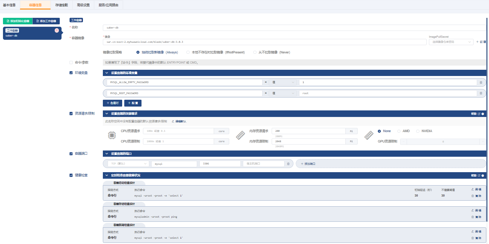
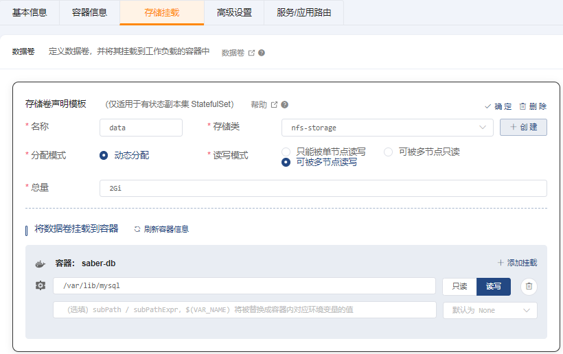
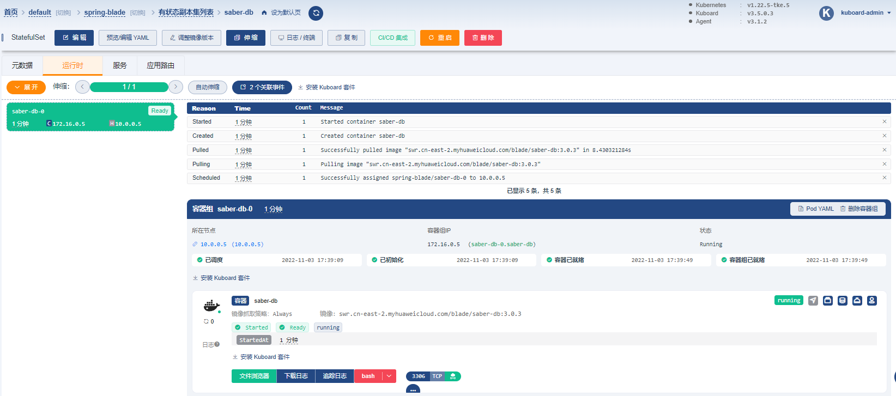

# 部署saber-db

### 1、创建 StatefulSet

#### ->`基本信息`


#### ->`容器信息`

| 字段名称                    | 字段值                                                                        | 备注                                          |
| --------------------------- |----------------------------------------------------------------------------| --------------------------------------------- |
| 名称                        | `saber-db`                                                                 |                                               |
| 容器镜像                    | `swr.cn-east-2.myhuaweicloud.com/blade/saber-db:3.0.3`                          |                                               |
| 镜像拉取策略                | `始终拉取新镜像（Always）`                                                          |                                               |
| 环境变量                    | `MYSQL_ALLOW_EMPTY_PASSWORD`=`1` `MYSQL_ROOT_PASSWORD`=`root`              | 类型为 `值`，点击 `名值对` 按钮可添加一组 |
| 资源请求/限制               | 内存资源请求：`200Mi` 内存资源限制：`2048Mi`                                             |                                               |
| 容器端口                    | `mysql` `3306`                                                             |                                               |
| 健康检查-->容器启动检查探针 | 探测方式： `命令行` 执行命令： `mysql -uroot -proot -e 'select 1'` 初始延迟：`30` 不健康阈值：`20` |                                               |
| 健康检查-->容器存活检查探针 | 探测方式： `命令行` 执行命令： `mysqladmin -uroot -proot ping`                          |                                               |
| 健康检查-->容器就绪检查探针 | 探测方式： `命令行` 执行命令： `mysql -uroot -proot -e 'select 1'`                      |                                               |



#### ->`存储挂载`



#### ->`高级设置`


#### ->`服务/应用路由`


保存操作



### 2、验证部署结果

点击`sh`按钮

```shell
mysql -uroot -proot
show databases;
use blade;
show tables;
```


