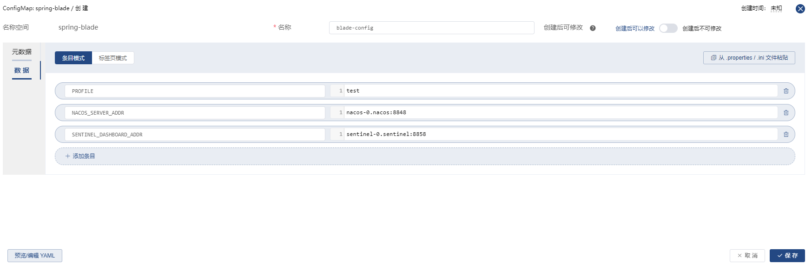
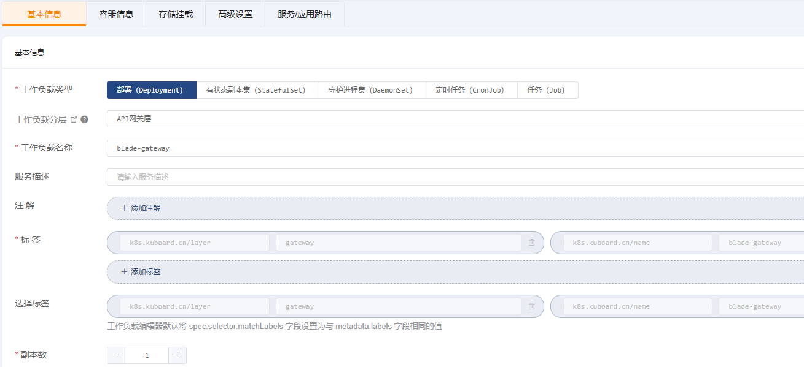
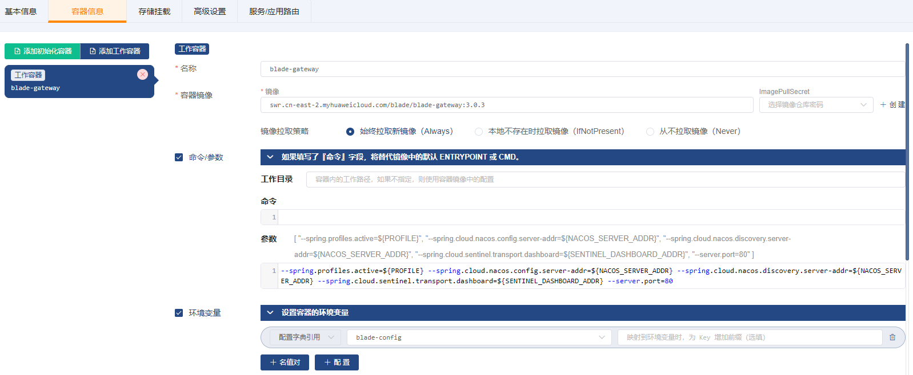
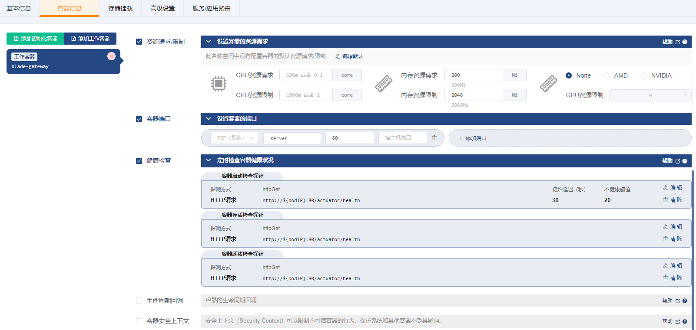
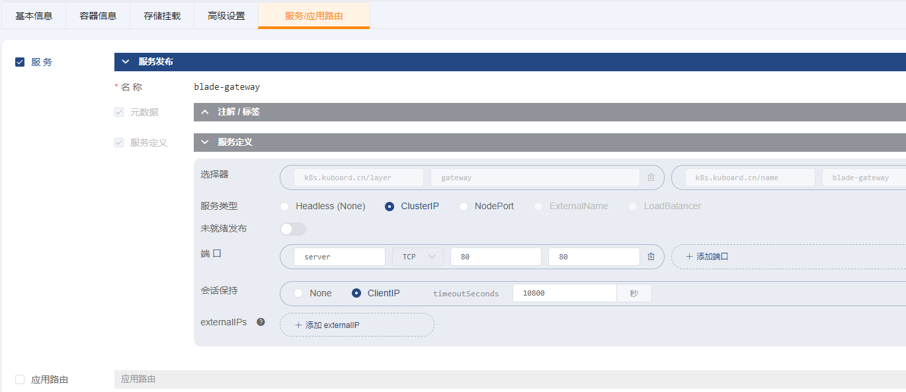
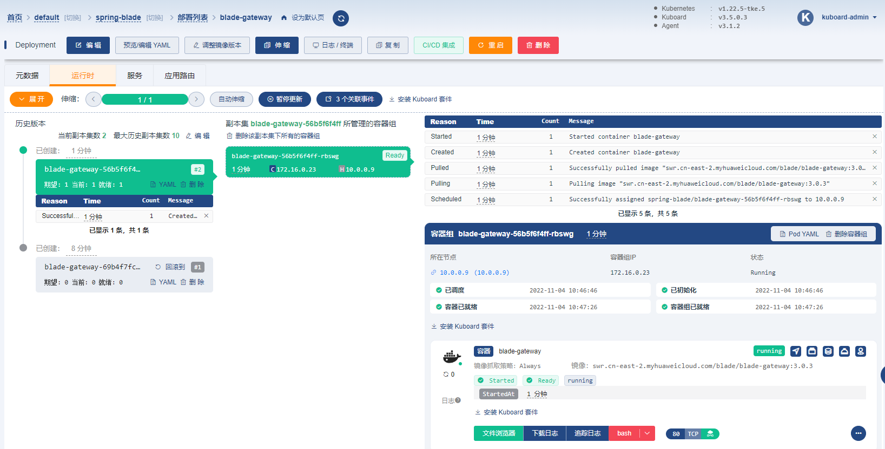
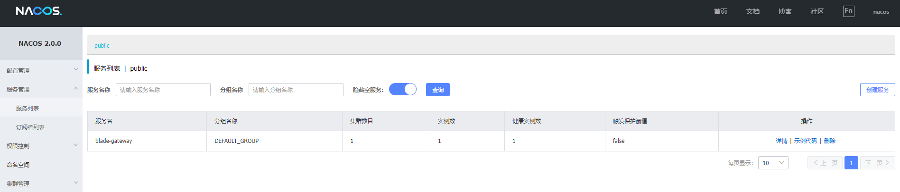

# 接口网关

### 1、创建配置字典 blade-config

`名称空间` -> `spring-blade` -> `配置中心` -> `配置字典` -> `创建 ConfigMap`

| 字段名 | 字段值                                                       | 备注                                                         |
| ------ | ------------------------------------------------------------ | ------------------------------------------------------------ |
| 名称   | `blade-config`                                               |                                                              |
| 数据   | `PROFILE` = `test` `NACOS_SERVER_ADDR` = `nacos-0.nacos:8848` `SENTINEL_DASHBOARD_ADDR` = `sentinel-0.sentinel:8858` | 这些参数将作为环境变量注入到 `blade-gateway` 以及 `blade-admin` 等微服务组件中，作为应用启动参数的一部分 |

### 2、创建 Deployment

`名称空间` -> `spring-blade` -> `常用操作` -> `创建工作负载`

##### ->`基本信息`

##### ->`容器信息`

| 字段名称                 | 字段值                                                                                                                                                                                                                                                          | 备注                                                         |
| ------------------------ |--------------------------------------------------------------------------------------------------------------------------------------------------------------------------------------------------------------------------------------------------------------| ------------------------------------------------------------ |
| 名称                     | `blade-gateway`                                                                                                                                                                                                                                              |                                                              |
| 容器镜像         | `swr.cn-east-2.myhuaweicloud.com/blade/blade-gateway:3.0.3`                                                                                                                                                                                                       |                                                              |
| 镜像拉取策略             | `始终拉取新镜像（Always）`                                                                                                                                                                                                                                            |                                                              |
| 命令参数                 | 参数`--spring.profiles.active=${PROFILE} --spring.cloud.nacos.config.server-addr=${NACOS_SERVER_ADDR} --spring.cloud.nacos.discovery.server-addr=${NACOS_SERVER_ADDR} --spring.cloud.sentinel.transport.dashboard=${SENTINEL_DASHBOARD_ADDR} --server.port=80` | 通过启动参数指定：spring的 profileNacos配置中心地址Nacos服务发现地址Sentinel地址服务端口 |
| 环境变量                 | `配置字典引用` `blade-config`                                                                                                                                                                                                                                      | 点击 `+ 配置` 按钮，可以添加一个配置字典的条目；此配置将 `blade-config` 配置字典中的每一个条目都映射成容器中的一个变量及变量值 |
| 资源请求/限制            | 内存资源请求：`200Mi` 内存资源限制：`2048Mi`                                                                                                                                                                                                                               |                                                              |
| 容器端口                 | `server` `80`                                                                                                                                                                                                                                                |                                                              |
| 健康检查-->容器启动检查探针 | 探测方式： `HTTP请求` HTTP请求端口： `80` HTTP请求路径： `/actuator/health` 初始延迟：`30` 不健康阈值： `20`                                                                                                                                                                             |                                                              |
| 健康检查-->容器存活检查探针 | 探测方式： `HTTP请求` HTTP请求端口： `80` HTTP请求路径： `/actuator/health`                                                                                                                                                                                                   |                                                              |
| 健康检查-->容器就绪检查探针 | 探测方式： `HTTP请求` HTTP请求端口： `80` HTTP请求路径： `/actuator/health`                                                                                                                                                                                                   |                                                              |

##### ->`存储挂载`

无

##### ->`高级设置`

无

##### ->`服务/应用路由`

| 字段名称 | 字段值                   | 备注                                                         |
| -------- | ------------------------ | ------------------------------------------------------------ |
| 服务类型 | `ClusterIP`              | ClusterIP，以便 `saber-web` 的 nginx 可以将 api 请求反向代理到 `http://blade-gateway:80` |
| 端口     | `server` `TCP` `80` `80` | 将容器的 `80` 端口映射到 Service 的 `80` 端口                |

保存操作

### 3、验证部署结果

追踪日志 或 查看nacos服务注册信息

