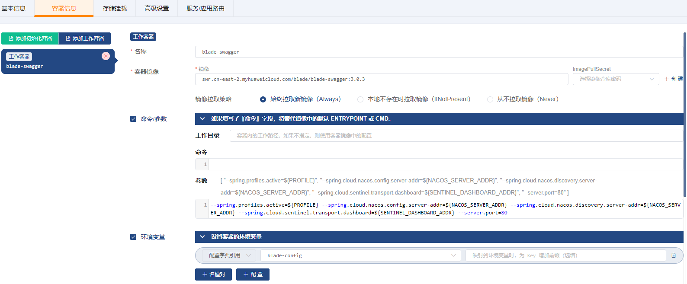
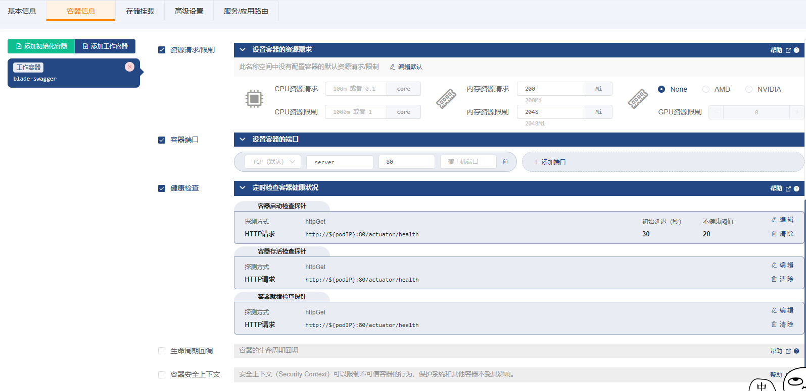
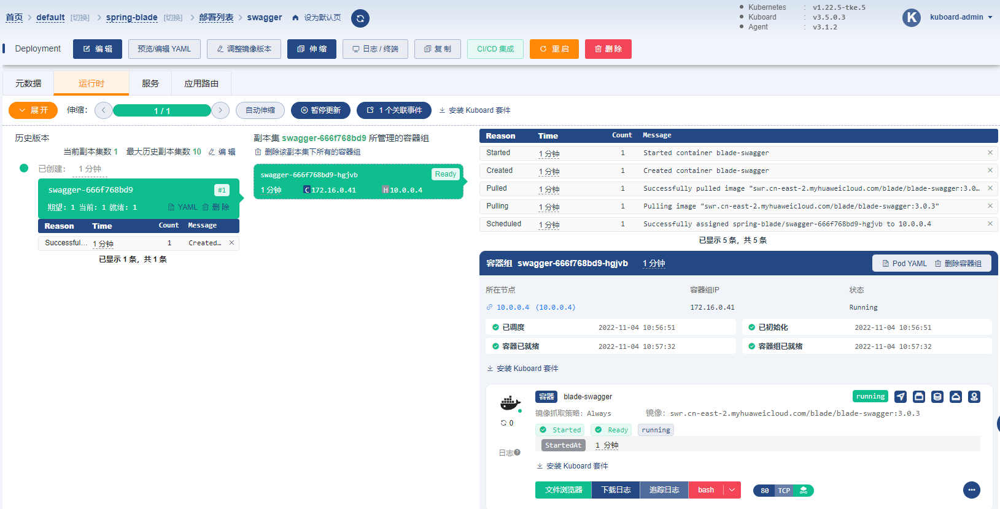
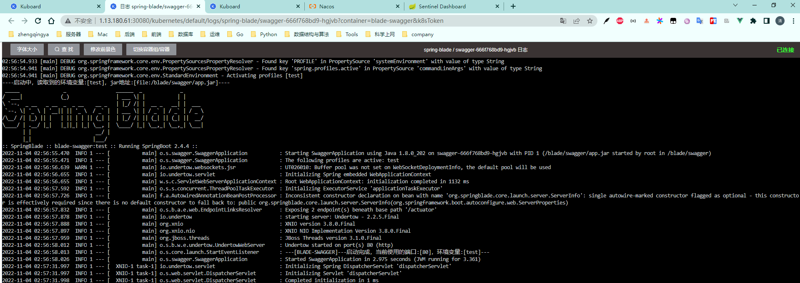

# 部署swagger

### 1、创建 Deployment

`名称空间` -> `spring-blade` -> `常用操作` -> `创建工作负载`

##### ->`基本信息`

##### ->`容器信息`

| 字段名称            | 字段值                                                                                                                                                                                                                                                          | 备注                                                         |
|-----------------|--------------------------------------------------------------------------------------------------------------------------------------------------------------------------------------------------------------------------------------------------------------| ------------------------------------------------------------ |
| 名称              | `swagger`                                                                                                                                                                                                                                                    |                                                              |
| 容器镜像            | `swr.cn-east-2.myhuaweicloud.com/blade/blade-swagger:3.0.3`                                                                                                                                                                                                       |                                                              |
| 镜像拉取策略          | `始终拉取新镜像（Always）`                                                                                                                                                                                                                                            |                                                              |
| 命令参数            | 参数`--spring.profiles.active=${PROFILE} --spring.cloud.nacos.config.server-addr=${NACOS_SERVER_ADDR} --spring.cloud.nacos.discovery.server-addr=${NACOS_SERVER_ADDR} --spring.cloud.sentinel.transport.dashboard=${SENTINEL_DASHBOARD_ADDR} --server.port=80` | 通过启动参数指定：spring的 profileNacos配置中心地址Nacos服务发现地址Sentinel地址服务端口 |
| 环境变量            | `配置字典引用` `blade-config`                                                                                                                                                                                                                                      | 点击 `+ 配置` 按钮，可以添加一个配置字典的条目；此配置将 `blade-config` 配置字典中的每一个条目都映射成容器中的一个变量及变量值 |
| 资源请求/限制         | 内存资源请求：`200Mi` 内存资源限制：`2048Mi`                                                                                                                                                                                                                               |                                                              |
| 容器端口            | `server` `80`                                                                                                                                                                                                                                                |                                                              |
| 健康检查-->容器启动检查探针 | 探测方式： `HTTP请求` HTTP请求端口： `80` HTTP请求路径： `/actuator/health` 初始延迟：`30` 不健康阈值： `20`                                                                                                                                                                             |                                                              |
| 健康检查-->容器存活检查探针 | 探测方式： `HTTP请求` HTTP请求端口： `80` HTTP请求路径： `/actuator/health`                                                                                                                                                                                                   |                                                              |
| 健康检查-->容器就绪检查探针 | 探测方式： `HTTP请求` HTTP请求端口： `80` HTTP请求路径： `/actuator/health`                                                                                                                                                                                                   |                                                              |

##### ->`存储挂载`

无

##### ->`高级设置`

无

##### ->`服务/应用路由`

无

保存操作

### 2、验证部署结果

追踪日志

