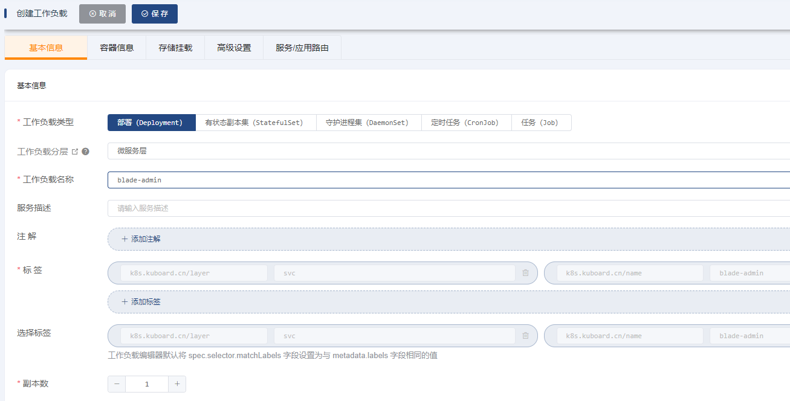
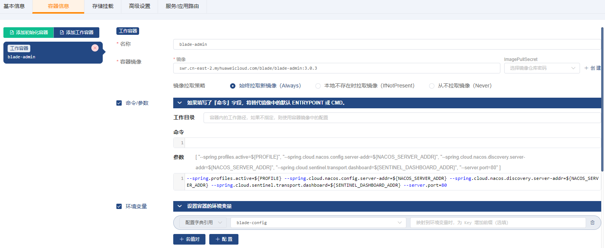
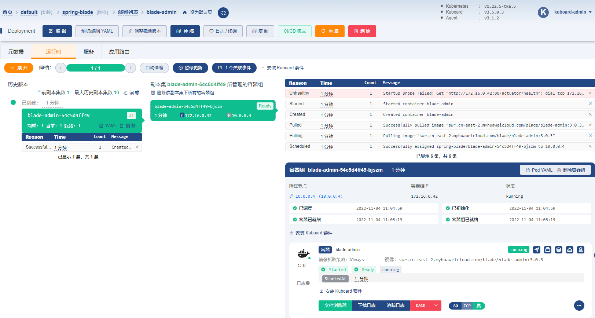
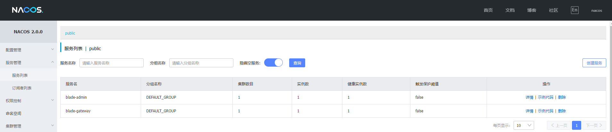
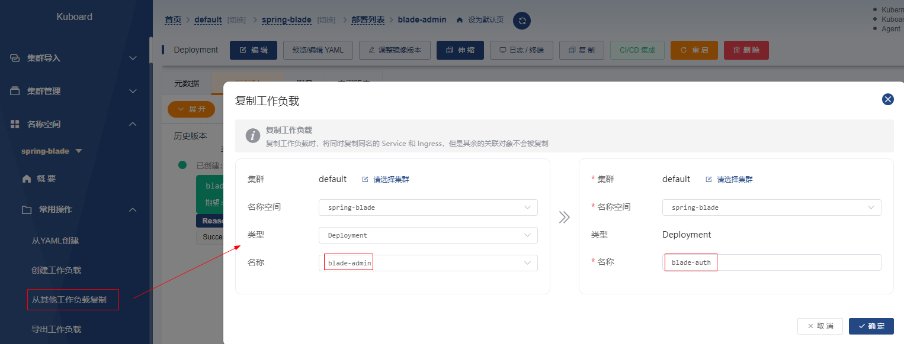
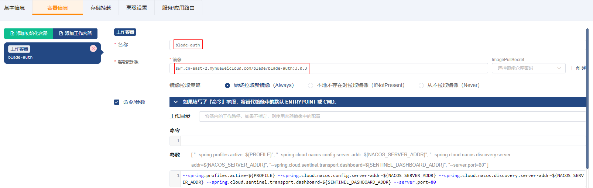
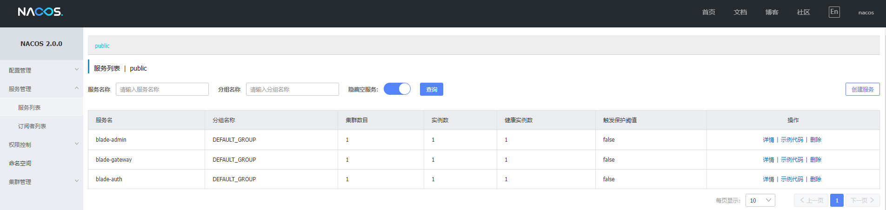
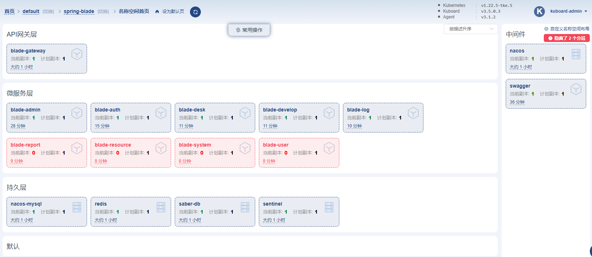

# 部署微服务层

SpringBlade 所需要部署的微服务有 9 个之多，包括有：

- blade-admin
- blade-auth
- blade-desk
- blade-develop
- blade-log
- blade-report
- blade-resource
- blade-system
- blade-user

每一个微服务在 K8S 里的部署参数相差不大，鉴于这个特点，在部署微服务时，我们将先 部署其中一个微服务 blade-admin，
然后再利用 Kuboard 中的 `复制工作负载` 的功能，从 `blade-admin` 复制以 部署其余 8 个微服务工作负载。

## 一、部署 blade-admin

### 1、创建 Deployment

`名称空间` -> `spring-blade` -> `常用操作` -> `创建工作负载`

##### ->`基本信息`

##### ->`容器信息`

| 字段名称            | 字段值                                                                                                                                                                                                                                                               | 备注                                                         |
|-----------------|-------------------------------------------------------------------------------------------------------------------------------------------------------------------------------------------------------------------------------------------------------------------| ------------------------------------------------------------ |
| 名称              | `blade-admin`                                                                                                                                                                                                                                                     |                                                              |
| 容器镜像            | `swr.cn-east-2.myhuaweicloud.com/blade/blade-admin:3.0.3`                                                                                                                                                                                                              |                                                              |
| 镜像拉取策略          | `始终拉取新镜像（Always）`                                                                                                                                                                                                                                                 |                                                              |
| 命令参数            | 命令不填写参数`--spring.profiles.active=${PROFILE} --spring.cloud.nacos.config.server-addr=${NACOS_SERVER_ADDR} --spring.cloud.nacos.discovery.server-addr=${NACOS_SERVER_ADDR} --spring.cloud.sentinel.transport.dashboard=${SENTINEL_DASHBOARD_ADDR} --server.port=80` | 通过启动参数指定：spring的 profileNacos配置中心地址Nacos服务发现地址Sentinel地址服务端口 |
| 环境变量            | `配置字典引用` `blade-config`                                                                                                                                                                                                                                           | 点击 `+ 配置` 按钮，可以添加一个配置字典的条目；此配置将 `blade-config` 配置字典中的每一个条目都映射成容器中的一个变量及变量值 |
| 资源请求/限制         | 内存资源请求：`200Mi` 内存资源限制：`2048Mi`                                                                                                                                                                                                                                    |                                                              |
| 容器端口            | `server` `80`                                                                                                                                                                                                                                                     |                                                              |
| 健康检查-->容器启动检查探针 | 探测方式： `HTTP请求` HTTP请求端口： `80` HTTP请求路径： `/actuator/health` 不健康阈值： `20`                                                                                                                                                                                            |                                                              |
| 健康检查-->容器存活检查探针 | 探测方式： `HTTP请求` HTTP请求端口： `80` HTTP请求路径： `/actuator/health`                                                                                                                                                                                                        |                                                              |
| 健康检查-->容器就绪检查探针 | 探测方式： `HTTP请求` HTTP请求端口： `80` HTTP请求路径： `/actuator/health`                                                                                                                                                                                                        |                                                              |

##### ->`存储挂载`

无

##### ->`高级设置`

无

##### ->`服务/应用路由`

无

保存操作

### 2、验证部署结果

追踪日志 或 查看nacos服务注册信息

---

## 二、部署其他微服务

### 1、复制并部署 blade-auth

`名称空间` -> `spring-blade` -> `常用操作` -> `从其他工作负载复制`

### 2、修改`容器信息`

| 字段名    | 字段值             | 备注                   |
|--------| ------------------ | ---------------------- |
| 工作容器名称 | `blade-auth`       | 原为 blade-admin       |
| 容器镜像   | `swr.cn-east-2.myhuaweicloud.com/blade/blade-auth:3.0.3` | 原为 swr.cn-east-2.myhuaweicloud.com/blade/blade-admin:3.0.3 |

保存操作

### 3、验证部署结果

追踪日志 或 查看nacos服务注册信息

### 4、复制并部署其他 7 个微服务

