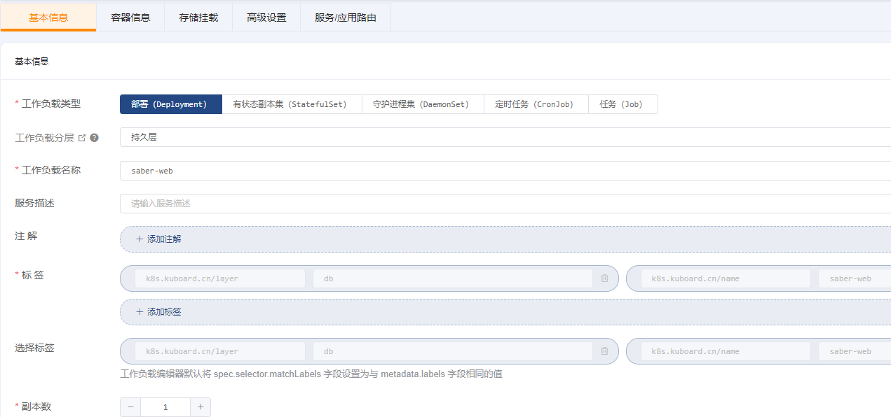
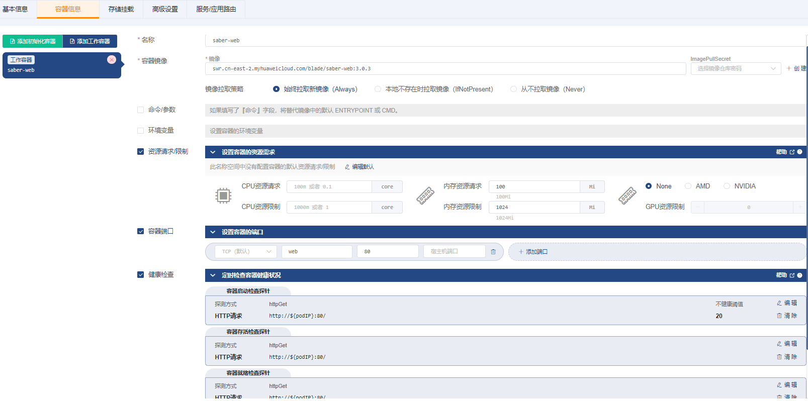
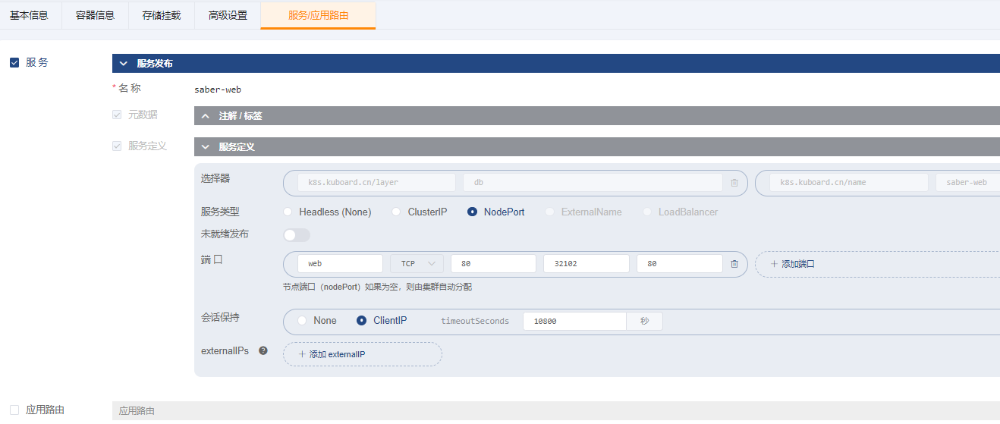
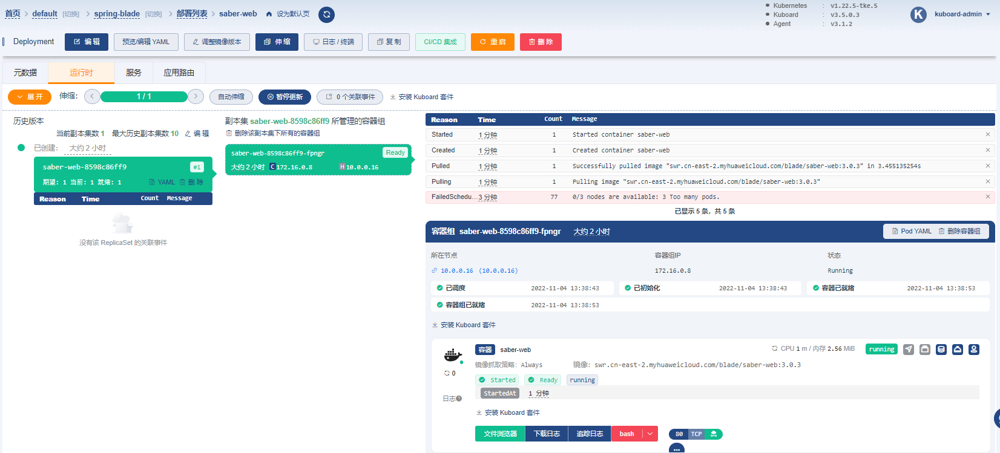
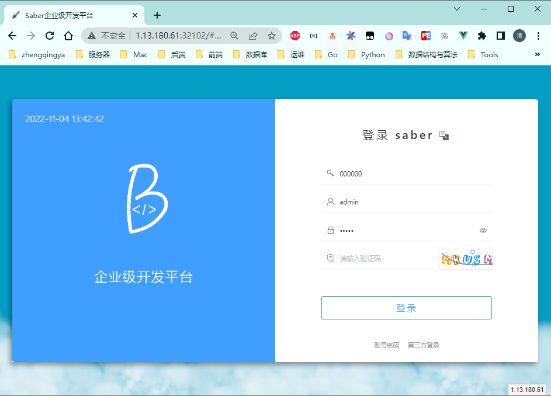

# 部署saber-web

### 1、创建 Deployment

`名称空间` -> `spring-blade` -> `常用操作` -> `创建工作负载`

##### ->`基本信息`

##### ->`容器信息`

| 字段名称            | 字段值                                                     | 备注 |
|-----------------|---------------------------------------------------------| ---- |
| 名称              | `saber-web`                                             |      |
| 容器镜像            | `swr.cn-east-2.myhuaweicloud.com/blade/saber-web:3.0.3`      |      |
| 镜像拉取策略          | `始终拉取新镜像（Always）`                                       |      |
| 资源请求/限制         | 内存资源请求：`100Mi` 内存资源限制：`1024Mi`                          |      |
| 容器端口            | `web` `80`                                              |      |
| 健康检查-->容器启动检查探针 | 探测方式： `HTTP请求` httpGet端口： `80` httpGet路径：`/` 不健康阈值：`20` |      |
| 健康检查-->容器存活检查探针 | 探测方式： `HTTP请求` httpGet端口： `80` httpGet路径：`/`            |      |
| 健康检查-->容器就绪检查探针 | 探测方式： `HTTP请求` httpGet端口： `80` httpGet路径：`/`            |      |

##### ->`存储挂载`

无

##### ->`高级设置`

无

##### ->`服务/应用路由`

保存操作

### 2、验证部署结果

访问: `http://任意节点IP:32102`

