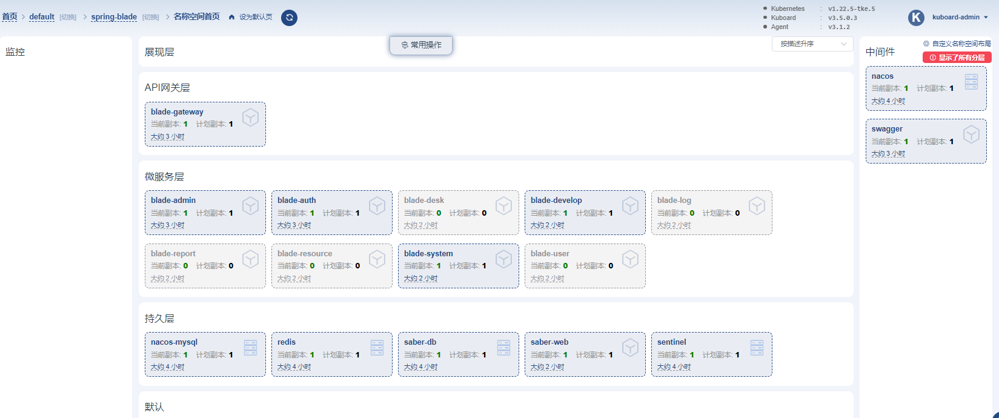
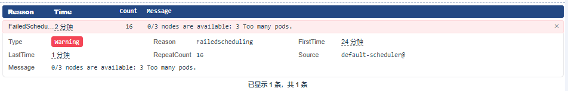

# 验证SpringBlade部署结果

| 软件        | URL                         |
| ----------- |-----------------------------|
| `nacos`     | `http://任意节点IP:32000/nacos` |
| `sentinel`  | `http://任意节点IP:32100`       |
| `saber-web` | `http://任意节点IP:32102`       |

### `名称空间` -> `spring-blade` -> `概要`

### 问题： `FailedScheduling 0/3 nodes are available: 3 Too many pods.`

腾讯云tke的节点pod数量限制

增大一点即可...

