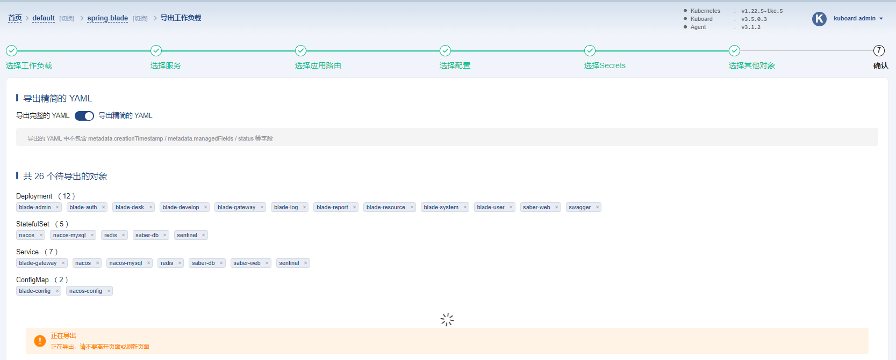
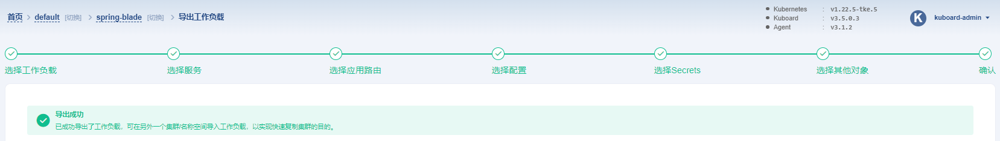
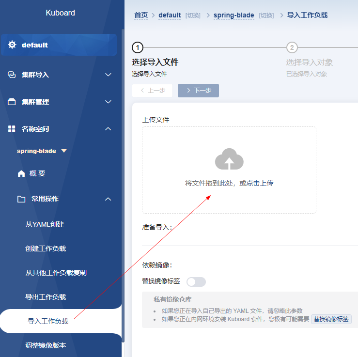
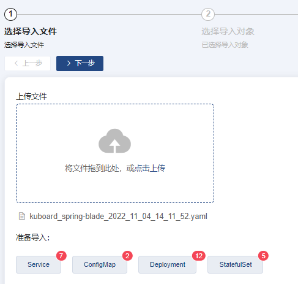
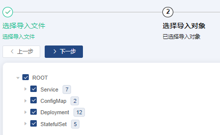
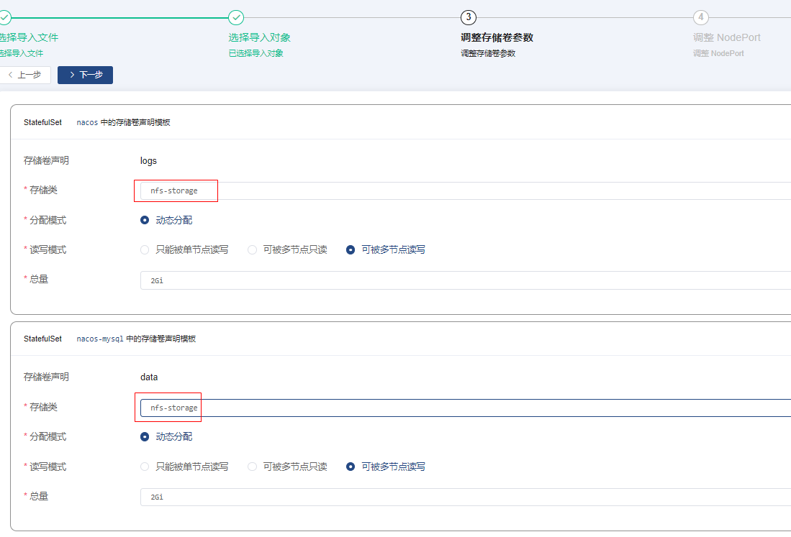
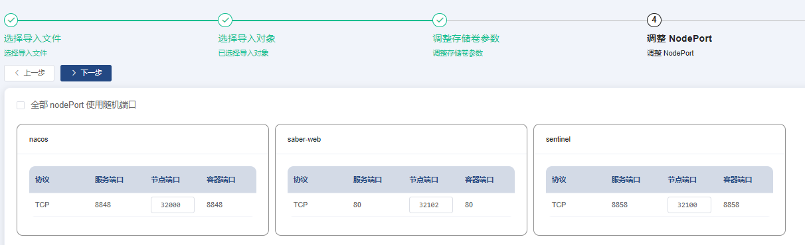
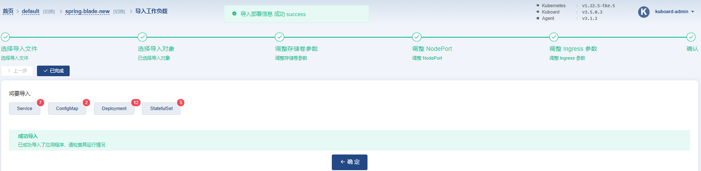

# 导入导出

### 1、导出YAML

`名称空间` -> `spring-blade` -> `常用操作` -> `导出工作负载` -> `选择工作负载` -> `勾选所有` -> `下一步` -> `部署` -> `伸缩`

将 目标副本数 调整为 0，然后点击 确定 按钮，执行完此操作后，所有 Deployment 的副本数都将被修改为 0。

- 在 `选择工作负载` 这一步骤中，勾选所有的条目
- 在 `选择配置` 这一步骤中，勾选 `blade-config` 和 `nacos-config` 这两个条目

### 2、导入YAML

> tips: 可新建一个名称空间进行测试哦 ^_^

`名称空间` -> `spring-blade` -> `常用操作` -> `导入工作负载`

`调整存储卷参数` -> 为所有的 `存储卷声明模板` 选择一个有效的 存储类

修改节点端口

后面下一步即可

完成

