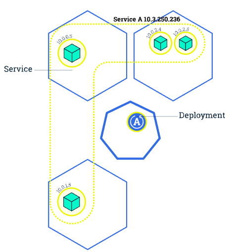
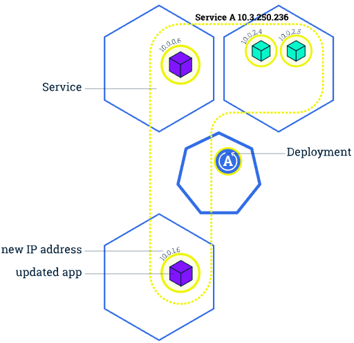
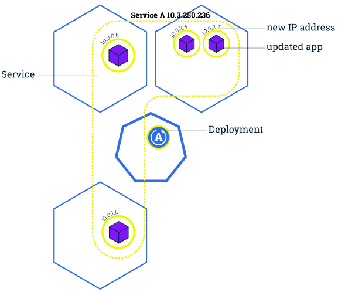
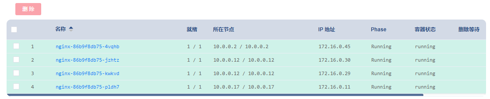

# 执行滚动更新

### 1、更新应用程序

用户期望应用程序始终可用，为此开发者/运维者在更新应用程序时要分多次完成。在 Kubernetes 中，这是通过 Rolling Update 滚动更新完成的。
Rolling Update滚动更新 通过使用新版本的 Pod 逐步替代旧版本的 Pod 来实现 Deployment 的更新，从而实现零停机。
新的 Pod 将在具有可用资源的 Node（节点）上进行调度。

> Kubernetes 更新多副本的 Deployment 的版本时，会逐步的创建新版本的 Pod，逐步的停止旧版本的 Pod，以便使应用一直处于可用状态。
> 这个过程中，Service 能够监视 Pod 的状态，将流量始终转发到可用的 Pod 上。

默认情况下，Rolling Update 滚动更新 过程中，Kubernetes 逐个使用新版本 Pod 替换旧版本 Pod（最大不可用 Pod 数为 1、最大新建 Pod 数也为 1）。
这两个参数可以配置为数字或百分比。
在Kubernetes 中，更新是版本化的，任何部署更新都可以恢复为以前的（稳定）版本。

### 2、滚动更新概述

1. 原本 Service A 将流量负载均衡到 4 个旧版本的 Pod （当中的容器为 绿色）上
   
2. 更新完 Deployment 部署文件中的镜像版本后，master 节点选择了一个 worker 节点，并根据新的镜像版本创建 Pod（紫色容器）。
   新 Pod 拥有唯一的新的 IP。同时，master 节点选择一个旧版本的 Pod 将其移除。
   此时，Service A 将新 Pod 纳入到负载均衡中，将旧Pod移除
   
3. 同步骤2，再创建一个新的 Pod 替换一个原有的 Pod
   
4. 如此 Rolling Update 滚动更新，直到所有旧版本 Pod 均移除，新版本 Pod 也达到 Deployment 部署文件中定义的副本数，则滚动更新完成
   

滚动更新允许以下操作：

- 将应用程序从准上线环境升级到生产环境（通过更新容器镜像）
- 回滚到以前的版本
- 持续集成和持续交付应用程序，无需停机

### 3、实战：更新 nginx Deployment

`调整镜像版本` -> `填写版本` -> `执行变更` -> `应用`

可观察到 Kubernetes 对 Nginx部署 执行滚动更新的过程

最终

