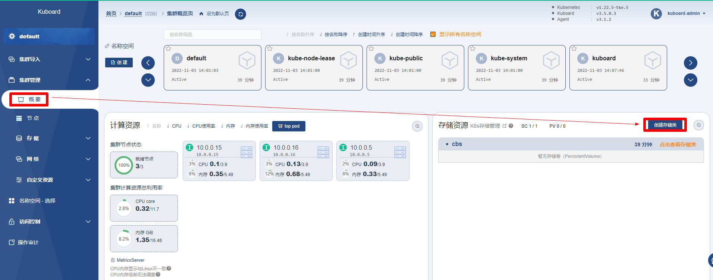
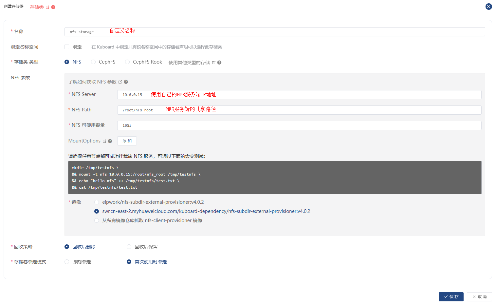
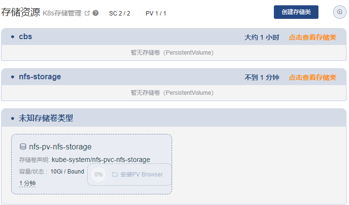
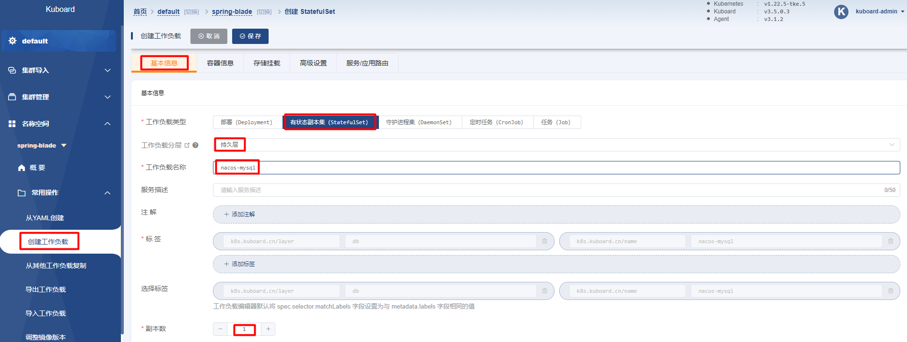
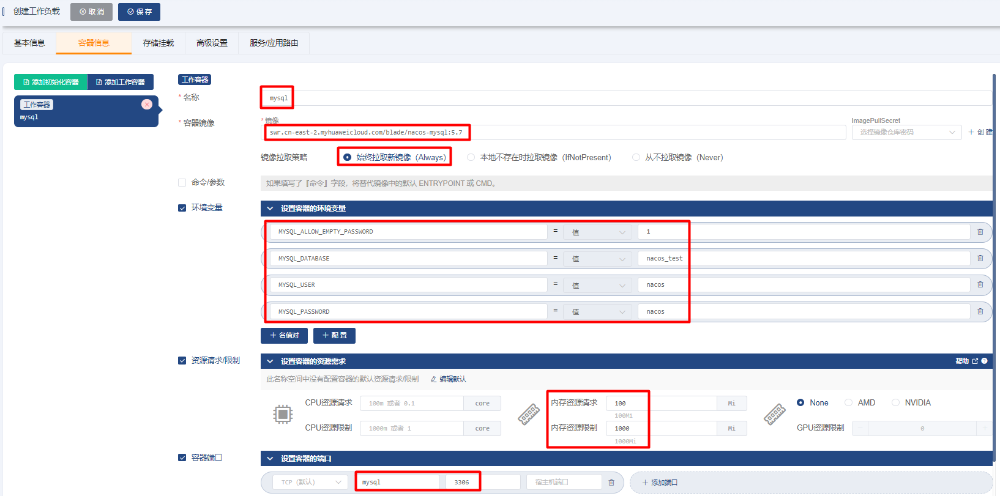
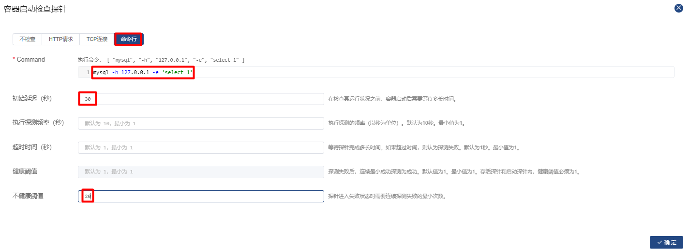
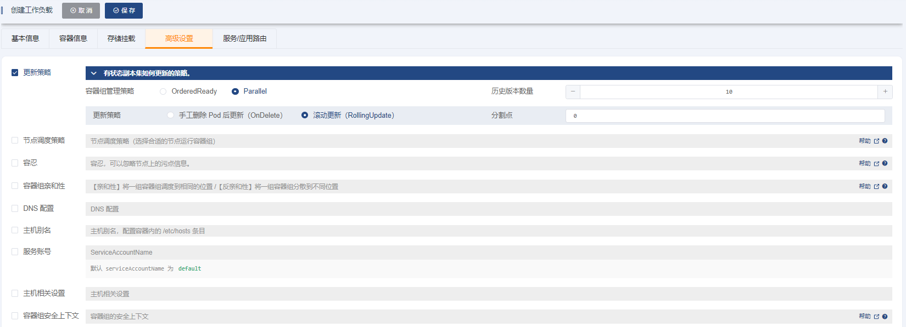
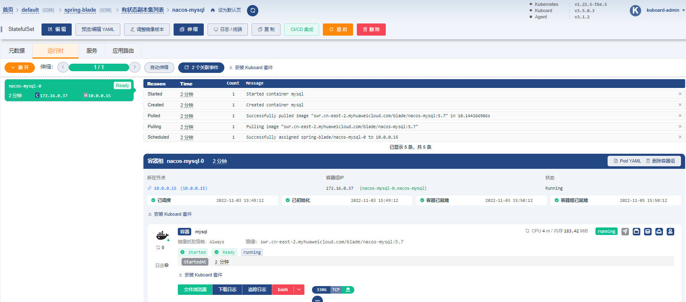
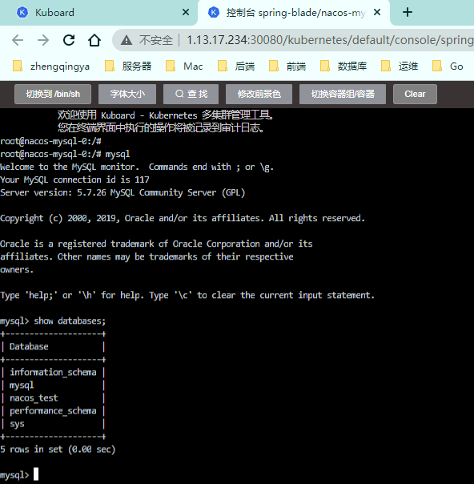

# 实战-部署微服务SpringBlade

> https://gitee.com/smallc/SpringBlade

| 机器        | 说明       |
|-----------| ---------- |
| 10.0.0.15 | k8s-master |
| 10.0.0.5  | k8s-node1  |
| 10.0.0.16 | k8s-node2  |

## 一、环境准备

### 1、准备一个有效的存储类

这里使用 NFS 作为存储类

#### 1.1、`[主节点]` 搭建NFS Server

```shell
# 安装 nfs 服务器所需的软件包
yum install -y rpcbind nfs-utils


# 创建 exports 文件
echo "/root/nfs_root/ *(insecure,rw,sync,no_root_squash)" > /etc/exports


# 启动 nfs 服务
mkdir /root/nfs_root

systemctl enable rpcbind
systemctl enable nfs-server

systemctl start rpcbind
systemctl start nfs-server
exportfs -r

# 检查配置是否生效
exportfs
# 输出结果如下所示
# /root/nfs_root  <world>
```


#### 1.2、`[从节点]` 在客户端测试nfs

```shell
# 安装 nfs 客户端所需的软件包
yum install -y nfs-utils

# 执行以下命令检查 nfs 服务器端是否有设置共享目录
# showmount -e $(nfs服务器的IP)   -- tips: 使用内网IP
showmount -e 10.0.0.15
# 输出结果如下所示
# Export list for 10.0.0.15:
# /root/nfs_root *

# 执行以下命令挂载 nfs 服务器上的共享目录到本机路径 /root/nfsmount
mkdir /root/nfsmount
# mount -t nfs $(nfs服务器的IP):/root/nfs_root /root/nfsmount
mount -t nfs 10.0.0.15:/root/nfs_root /root/nfsmount
# 写入一个测试文件
echo "hello nfs server" > /root/nfsmount/test.txt
```


`[主节点]` 在 nfs 服务器上执行以下命令，验证文件写入成功

```shell
cat /root/nfs_root/test.txt
```


### 2、在Kuboard中创建 NFS 存储类

`集群管理` -> `概要` -> `创建存储类`






完成



### 3、创建 Kubernetes 名称空间

创建一个 Kubernetes 名称空间用于部署 SpringBlade，ex:`spring-blade`

`打开 Kuboard 首页` -> `选择一个已就绪的集群` -> `编辑名称空间列表` -> `创建名称空间`


## 二、部署 SpringBlade

### 1、部署Nacos

#### 1.1、部署nacos-mysql

##### 1.1.1、创建 StatefulSet

> `StatefulSet`: 有状态应用 ex: redis、mysql

`名称空间` -> `spring-blade` -> `常用操作` -> `创建工作负载`

###### ->`基本信息`

| 字段名称     | 字段值        | 备注                                         |
| ------------ | ------------- | -------------------------------------------- |
| 工作负载类型 | `StatefulSet` |                                              |
| 工作负载分层 | `持久层`      | 填写后将自动添加 `k8s.kuboard.cn/layer` 标签 |
| 工作负载名称 | `nacos-mysql` | 填写后将自动添加 `k8s.kuboard.cn/name` 标签  |
| 副本数       | `1`           |                                              |



###### -> `容器信息`

-> `添加工作容器`

| 字段名称            | 字段值                                                       | 备注                                         |
| ------------------- | ------------------------------------------------------------ | -------------------------------------------- |
| 名称                | `mysql`                                                      |                                              |
| 容器镜像            | `从其他镜像仓库加载镜像（不使用用户名密码）`                 |                                              |
| 容器镜像-->镜像仓库 | `swr.cn-east-2.myhuaweicloud.com`                            |                                              |
| 容器镜像-->镜像路径 | `blade/nacos-mysql`                                          |                                              |
| 容器镜像-->镜像标签 | `5.7`                                                        |                                              |
| 镜像拉取策略        | `始终拉取新镜像（Always）`                                   |                                              |
| 环境变量            | `MYSQL_ALLOW_EMPTY_PASSWORD`=`1` `MYSQL_DATABASE`=`nacos_test` `MYSQL_USER`=`nacos` `MYSQL_PASSWORD`=`nacos` | 类型为 `值`，点击 `名值对` 按钮可添加一组 |
| 资源请求/限制       | 内存资源请求：`100Mi` 内存资源限制：`1000Mi`                 |                                              |
| 容器端口            | `mysql` `3306`                                               |                                              |



###### -> `健康检查`

`健康检查` -> `容器启动检查探针` -> `启用`


| 字段名称       | 字段值                             | 备注                                                         |
| -------------- | ---------------------------------- | ------------------------------------------------------------ |
| 探针类型       | `命令行`                           |                                                              |
| Command        | `mysql -h 127.0.0.1 -e 'select 1'` |                                                              |
| 初始延迟（秒） | `30`                               |                                                              |
| 不健康阈值     | `20`                               | 执行探测频率 * 不健康阈值 = 10 * 20 = 200秒， 容器创建 200 秒后，Command `mysql -h 127.0.0.1 -e 'select 1'` 如果仍未执行成功，kubelet 将认为该容器启动失败， 并强制重启该容器。 |



`健康检查` -> `容器存活检查探针` -> `启用`

| 字段名称       | 字段值            | 备注                                                         |
| -------------- | ----------------- | ------------------------------------------------------------ |
| 探针类型       | `命令行`          |                                                              |
| Command        | `mysqladmin ping` |                                                              |
| 初始延迟（秒） | `30`              |                                                              |
| 不健康阈值     | `3`               | 连续3此失败后，kubelet 将认为该容器已经不健康，并强制重启该容器 |


`健康检查` -> `容器就绪检查探针` -> `启用`

| 字段名称       | 字段值                             | 备注                                                         |
| -------------- | ---------------------------------- | ------------------------------------------------------------ |
| 探针类型       | `命令行`                           |                                                              |
| Command        | `mysql -h 127.0.0.1 -e 'select 1'` |                                                              |
| 初始延迟（秒） | `30`                               |                                                              |
| 健康阈值       | `2`                                | 探针连续执行成功 2 次以后，kubelet 认为该容器已就绪，并将其添加到对应 Service （如果有）的 Endpoint 中，Service 此时可以分发流量到该容器 |
| 不健康阈值     | `3`                                | 探针连续执行失败 3 此以后，kubelet 认为该容器已经不健康，并强制重启该容器 |


完成后如下


###### -> `存储挂载`

添加存储卷声明模板

| 字段名称               | 字段值             | 备注                                                         |
| ---------------------- | ------------------ | ------------------------------------------------------------ |
| 名称                   | `data`             |                                                              |
| 存储类                 | `cephfs-raspberry` | * 下拉选择，根据您集群环境的不同，此参数的值可以 不一样，但是对应的存储类必须为有效的存储类，并 能够动态提供存储卷 |
| 分配模式               | `动态分配`         |                                                              |
| 读写模式               | `可被多节点读写`   |                                                              |
| 总量                   | `2Gi`              |                                                              |
| mysql 容器中的挂载类型 | `读写`             |                                                              |
| mysql 容器中的挂载路径 | `/var/lib/mysql`   |                                                              |


###### -> `高级设置`

| 字段名称       | 字段值                      | 备注                                                         |
| -------------- | --------------------------- | ------------------------------------------------------------ |
| 容器组管理策略 | `Parallel`                  | 不按容器组的序号顺序更新容器组。（此为测试环境，mysql 只部署 一个副本，不考虑主从的情况，否则此参数不能选择 `Parallel`） |
| 历史版本数量   | `10`                        |                                                              |
| 更新策略       | `滚动更新（RollingUpdate）` |                                                              |
| 分割点         | `0`                         | 从序号为 `0` 的容器组开始更新 StatefulSet 中的所有容器组     |



###### -> `服务/应用路由`

| 字段名称 | 字段值                      | 备注                                              |
| -------- | --------------------------- | ------------------------------------------------- |
| 服务类型 | `Headless`                  | 无头 Service，专用于 StatefulSet                  |
| 端口     | `mysql` `TCP` `3306` `3306` | 将容器的 `3306` 端口映射到 Service 的 `3306` 端口 |


保存操作，并等候一定的时间，界面如下



> 失败事件说明：
> - `FailedSchedule`，原因是容器组所需要的存储卷声明尚未成功绑定，待存储类动态提供存储卷之后，容器组就立刻进入 `已调度` 的状态；
> - `Unhealthy`，点击 `追踪日志` 的按钮，可以看到，此 mysql 容器在第一次启动时会执行数据初始化的工作，因此启动过程耗时较长，
    > 整个启动过程中，kubelet 执行了 2 次失败的 `Startup probe failed` `容器启动检查探针`，
    > 只要这个次数在前面定义的 `容器启动检查探针` -> `不健康阈值` 的范围之内，kubelet 仍将继续等待该容器的启动，否则 kublet 将强制重启该容器。

##### 1.1.2、验证部署结果

进入 `bash` 界面

```shell
mysql
show databases;
```



#### 1.2、部署nacos

#### 1.3、导入配置到nacos

### 2、部署其它基础软件

### 3、部署微服务层

### 4、部署saber-web

### 5、验证SpringBlade部署结果

## 三、导入导出

### 1、

### 2、

### 3、

## 四、监控及日志

### 1、

### 2、

### 3、

