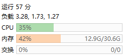

# 单节点通过KubeKey安装KubeSphere(v3.3.1)

### 安装

```shell
# 配置主机名
hostnamectl set-hostname master

# 准备
mkdir -p /home/soft/kubesphere
cd /home/soft/kubesphere

# 安装相关依赖项
yum -y install socat conntrack conntrack-tools ebtables ipset ipvsadm

# 下载 KubeKey
export KKZONE=cn
curl -sfL https://get-kk.kubesphere.io | VERSION=v2.3.0 sh -
chmod +x kk

# 开始安装
# ./kk create cluster [--with-kubernetes version] [--with-kubesphere version]
# ./kk create cluster --with-kubernetes v1.22.12 --with-kubesphere v3.3.1

# 创建配置文件
./kk create config -f config-sample.yaml --with-kubernetes v1.22.12 --with-kubesphere v3.3.1
# 安装
./kk create cluster -f config-sample.yaml


# 验证安装结果
kubectl logs -n kubesphere-system $(kubectl get pod -n kubesphere-system -l 'app in (ks-install, ks-installer)' -o jsonpath='{.items[0].metadata.name}') -f
```

- KubeSphere: http://IP:30880
- Jenkins: http://IP:30180
- Account: admin
- Password: P@88w0rd

### 卸载

```shell
./kk delete cluster
```

---

新版占用内存



