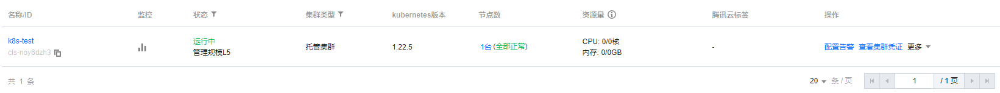
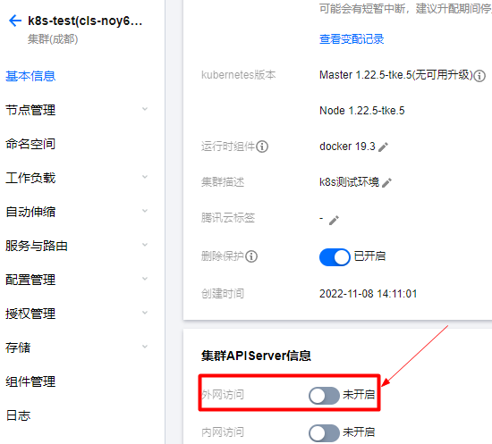
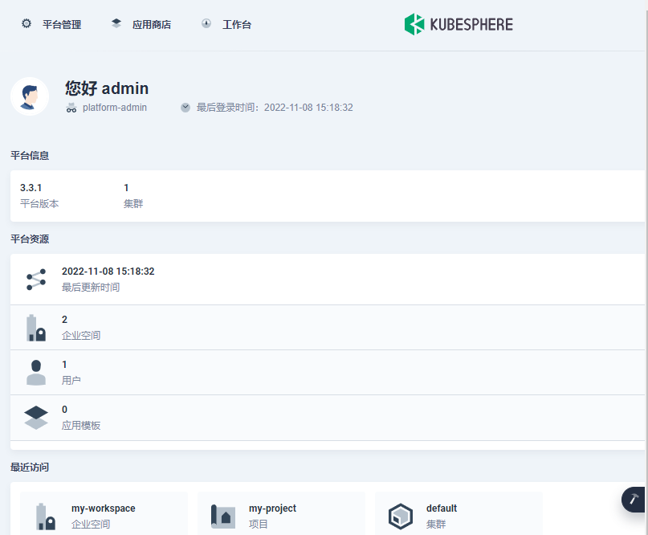

# 在腾讯云 TKE 安装 KubeSphere

### TKE配置

> tips: 我这里演示就在当前机器操作安装kubesphere，tke无需额外配置了...



`基本信息` -> `集群APIServer信息` -> 开启`外网访问`



### 安装 KubeSphere

```shell
# 使用 kubectl 执行以下命令安装 KubeSphere
kubectl apply -f https://github.com/kubesphere/ks-installer/releases/download/v3.3.1/kubesphere-installer.yaml

# 下载集群配置文件
wget https://github.com/kubesphere/ks-installer/releases/download/v3.3.1/cluster-configuration.yaml
```

`cluster-configuration.yaml`

> tips: 可参考 [config-sample.yaml](config/3.2.1/config-sample.yaml) 配置，开启部分功能，也可以在后期开启
> 我这里先开启如下

```yml
spec:
  devops: # (CPU: 0.47 Core, Memory: 8.6 G) Provide an out-of-the-box CI/CD system based on Jenkins, and automated workflow tools including Source-to-Image & Binary-to-Image.
    enabled: true             # Enable or disable the KubeSphere DevOps System.
  openpitrix: # An App Store that is accessible to all platform tenants. You can use it to manage apps across their entire lifecycle.
    store:
      enabled: true # Enable or disable the KubeSphere App Store.
```

```shell
# 部署
kubectl apply -f cluster-configuration.yaml

# 查看部署日志
kubectl logs -n kubesphere-system $(kubectl get pod -n kubesphere-system -l 'app in (ks-install, ks-installer)' -o jsonpath='{.items[0].metadata.name}') -f
```

### 访问

- Console: http://IP:30880
- Account: admin
- Password: P@88w0rd

