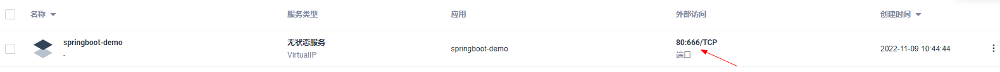

# 设置NodePort端口范围

用于集群外部访问，NodePort范围默认在 `30000-32767` 之间

> tips：tke中没有这个文件，无法操作...

修改master节点

```shell
vim /etc/kubernetes/manifests/kube-apiserver.yaml

# 添加参数
--service-node-port-range=1-32767
```


```shell
# 重启apiserver
# 获得 apiserver 的 pod 名字
export apiserver_pods=$(kubectl get pods --selector=component=kube-apiserver -n kube-system --output=jsonpath={.items..metadata.name})
# 删除 apiserver 的 pod
kubectl delete pod $apiserver_pods -n kube-system

# 验证结果
kubectl describe pod $apiserver_pods -n kube-system
```

检验

