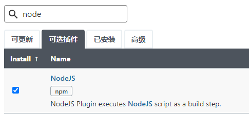
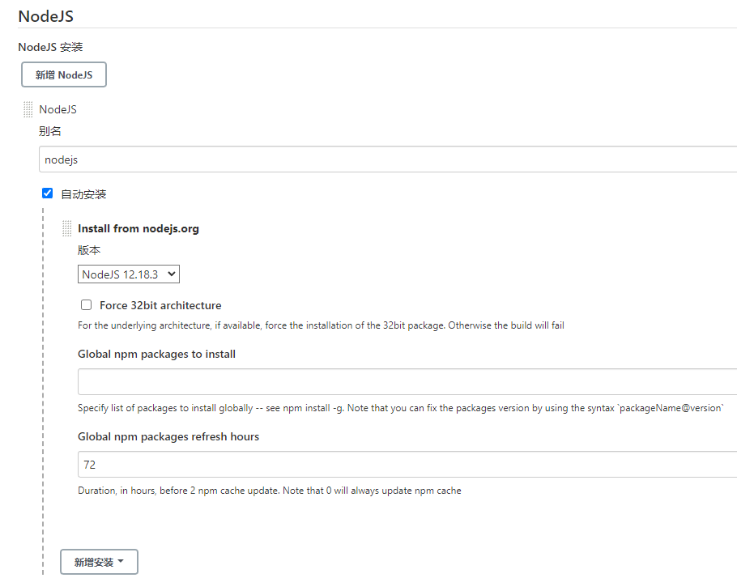

# nodejs升级

> 可参考：https://github.com/kubesphere/ks-devops/issues/465#issuecomment-1035992001

`Jenkinsfile`

```
pipeline {
    agent {
        kubernetes {
            inheritFrom 'nodejs base'
            containerTemplate {
                name 'nodejs'
                image 'node:12.18.3'
            }
        }
    }

    stages {
        stage('Run test') {
            agent none
            steps {
                container('nodejs') {
                    sh '''
                        node -v
                        npm -v
                        npm -g install npm@8.5.4
                        npm -v
                        npm install cnpm@7.1.0 -g --registry=https://registry.npm.taobao.org
                        cnpm -v
                    '''
                }
            }
        }
    }
}
```

---

下面是自己的解决思路，不可行...

---

### 1、进入jenkins安装相应插件

- 访问 `ip:30180`
- 账号：`admin`
- 密码：`P@88w0rd`



### 2、重启jenkins

- `ip:30180/restart`

### 3、全局工具配置


