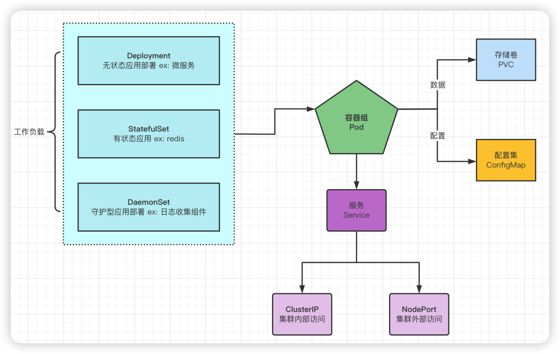

# 部署

> https://www.processon.com/view/63677056e0b34d524cc21f87

> 部署有状态副本集的时候，一般是先创建相关配置，再去创建工作负载，然后在工作负载中去创建关联挂载的数据存储卷。

### 一、工作负载 - 应用部署方式

#### 1、Deployment

无状态应用部署 ex: 微服务

#### 2、StatefulSet

有状态应用 ex: redis

#### 3、DaemonSet

守护型应用部署 ex: 日志收集组件

#### 4、Job

定时任务部署 ex: 垃圾清理组件

### 二、应用的数据挂载（数据、配置文件）

### 三、服务 - Service （应用访问方式）

Pod的服务发现与负载均衡。

#### 1、ClusterIP

用于集群内部访问

#### 2、NodePort

用于集群外部访问，NodePort范围在 30000-32767 之间

### Ingress

Service的统一网关入口